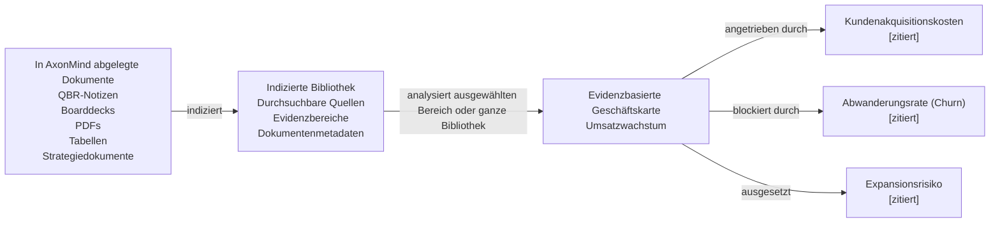

<p align="center">
  
</p>

<h1 align="center">AxonMind Open</h1>

<p align="center">
  <a href="README.md">English</a> | <a href="README.zh.md">简体中文</a> | <a href="README.it.md">Italiano</a> | <a href="README.fr.md">Français</a> | <strong>Deutsch</strong> | <a href="README.es.md">Español</a> | <a href="README.ja.md">日本語</a> | <a href="README.ko.md">한국어</a>
</p>

<p align="center">
  <strong>AxonMind ordnet jedes abgelegte Dokument einem evidenzbasierten geschäftlichen Wissensgraphen zu.</strong>
</p>

<p align="center">
  Rust-Engine · CLI · TypeScript-Typen · React-Hooks · Tauri-Demo
</p>

AxonMind Open ist das Open-Source-Projekt von AxonMind, das geschäftliche Dokumente indiziert, KPIs, Treiber (Drivers), Risiken (Risks), Entscheidungen (Decisions) und stützende Evidenz (Evidence) extrahiert und diese in einem typisierten Wissensgraphen verbindet, den Sie abfragen können. Anstatt eine Datei isoliert zu analysieren, erstellt AxonMind eine Wissensdatenbankbibliothek aus allen abgelegten Dokumenten. Von dort aus können Sie einen ausgewählten Bereich oder die gesamte Bibliothek analysieren, um herauszufinden, wie geschäftliche Konzepte zusammenhängen.

Jede Beziehung ist durch Quellennachweise belegt, sodass Benutzer überprüfen können, warum AxonMind annimmt, dass ein KPI von einem anderen Konzept angetrieben, blockiert, beeinflusst oder mit ihm verbunden wird. Das Ergebnis ist eine lokale, nachvollziehbare Geschäftskarte anstelle einer Black-Box-Zusammenfassung.

AxonMind ist für den Aufbau von Local-First Business Intelligence, Dokumentenintelligenz, Betriebs-Dashboards und Agenten-Workflows konzipiert, bei denen Erklärbarkeit wichtig ist.

> **Status:** Rust-Engine und CLI sind bereit für die öffentliche Erkundung. Aktuelle Validierung: `cargo check`, `cargo test`, `cargo fmt`, `cargo clippy`, `bun run typecheck`, `bun run test`, `bun run build` und der `.app`-Bundle-Build laufen in diesem Workspace alle erfolgreich durch.

## Warum ausprobieren

- **Bibliothekszentrierte Dokumentenintelligenz.** Legen Sie Dokumente in einem lokalen Workspace ab, indizieren Sie sie einmal und analysieren Sie ausgewählte Dateien, Ordner oder die gesamte Dokumentenbibliothek, während Ihr geschäftlicher Kontext wächst.
- **Evidenzbasierter Graphaufbau.** Kanten erfordern Evidenzreferenzen in der Speicherschicht. Wenn AxonMind nicht auf den Quelltext verweisen kann, wird die Beziehung nicht erstellt.
- **Standardmäßig lokal.** Workspaces liegen in SQLite mit einem In-Memory-`petgraph`-Cache. Für den Standard-Regelextraktor ist kein Account, keine gehostete Steuerungsebene (Control Plane) oder Cloud-Abhängigkeit erforderlich.
- **Sofort über die CLI nutzbar.** Indizieren Sie das enthaltene Beispieldokument und fragen Sie in weniger als einer Minute einen echten Graphen ab.
- **Einbettbare Architektur.** Nutzen Sie die Rust-Engine direkt, rufen Sie die CLI auf, führen Sie den MCP-Server für KI-Agenten aus oder verbinden Sie eine React/Tauri-UI über die TypeScript-Transportschnittstelle.
- **LLM optional.** Die deterministische Extraktion funktioniert direkt nach der Installation. Optionale LLM-Anbieter können die Extraktion bereichern, wenn Sie ein umfassenderes freies Denken wünschen.

## Was es macht

AxonMind verwandelt eine wachsende Wissensbibliothek in eine geschäftliche Beziehungslandkarte.

Legen Sie zuerst Dokumente in einem Workspace ab. AxonMind indiziert sie in einer lokalen Bibliothek, wobei Quellverweise und durchsuchbarer Text erhalten bleiben. Wählen Sie dann den Analysebereich: ein Dokument, eine ausgewählte Gruppe von Dokumenten oder die gesamte Bibliothek. AxonMind analysiert diesen Bereich, um KPIs, Risiken, Entscheidungen, Treiber, Blockaden und evidenzbasierte Beziehungen dazwischen zu finden.

```text
In AxonMind abgelegte Dokumente        indizierte Bibliothek        evidenzbasierte Geschäftskarte
-------------------------------        ---------------------        ------------------------------
QBR-Notizen, Boarddecks, PDFs,    ->   durchsuchbare Quellen   ->   Umsatzwachstum (Revenue Growth)
Tabellen, Strategiedokumente           Evidenzbereiche                    | angetrieben durch -> Kundenakquisitionskosten [zitiert]
                                       Dokumentenmetadaten                | blockiert durch -> Abwanderungsrate (Churn)   [zitiert]
                                                                          | ausgesetzt -> Expansionsrisiko                [zitiert]
```



In der Praxis hilft Ihnen AxonMind dabei, geschäftliche Fragen dokumentenübergreifend zu stellen, anstatt sie einzeln durchzulesen:

- Welche KPIs werden angetrieben, blockiert oder sind gefährdet?
- Welche Dokumente enthalten die Belege für eine Beziehung?
- Welche Entscheidungen, Risiken oder Annahmen tauchen in der Bibliothek immer wieder auf?
- Wie verbindet sich eine Metrik mit einer anderen über Berichte, Notizen, Decks und Pläne hinweg?

Sie können dann:

- sich auf einen KPI konzentrieren und dessen Treiber, Blockaden, Risiken und zugehörige Belege untersuchen
- den Graphen mit SQLite FTS5 durchsuchen oder eine argumentationsbasierte Dokumentensuche nutzen
- den Wissensgraphen über den integrierten MCP-Server für KI-Agenten freigeben
- den Graphenzustand als JSON exportieren oder importieren
- die Engine hinter Ihrer eigenen Produkt-UI einbetten
- eine lokale Tauri-Demo-App mit Brain Map-, Dokumenten-, Bildaufnahme- und Side-by-Side-Inspektor-Ansichten ausführen

**Nicht im Umfang enthalten:** Gehostetes SaaS, Abrechnung, Cloud-Synchronisierung, SSO, RBAC, Teamverwaltung oder eine verwaltete Steuerungsebene.

## Schnellstart

Das Repository enthält eine Beispiel-Geschäftsbewertung in `fixtures/sample.md`. Erstellen und durchsuchen Sie einen Graphen ohne API-Schlüssel und ohne Konfigurationsdatei:

```bash
# 1. Erstellen Sie einen lokalen Workspace.
cargo run -p axonmind_cli -- init --workspace ./demo

# 2. Indizieren Sie die Beispieldokumentbibliothek.
cargo run -p axonmind_cli -- index ./fixtures --workspace ./demo

# Erwartetes Ergebnis:
# Indexed: 1 files, 4 nodes, 5 edges, 3 evidence, 0 skipped, 0 errors

# 3. Fokussieren Sie den Beispiel-KPI.
cargo run -p axonmind_cli -- query --workspace ./demo focus-kpi kpi.revenue_growth

# 4. Durchsuchen Sie den Graphen oder geben Sie JSON zurück.
cargo run -p axonmind_cli -- search "revenue" --workspace ./demo
cargo run -p axonmind_cli -- query --workspace ./demo --json focus-kpi kpi.revenue_growth

# 5. Führen Sie eine argumentationsbasierte Suche aus oder starten Sie den MCP-Server.
cargo run -p axonmind_cli -- query --workspace ./demo reasoning-search "what drives revenue?"
cargo run -p axonmind_cli -- mcp --workspace ./demo

# 6. Graphstatistiken inspizieren oder zwei exportierte Snapshots vergleichen.
cargo run -p axonmind_cli -- graph-stats --workspace ./demo
cargo run -p axonmind_cli -- graph-diff before.json after.json
```

Der Standard-Regelextraktor erkennt KPIs aus Überschriften und erstellt Treiber-/Blockaden-Kanten, wenn benannte KPIs im selben Absatz mit verknüpfenden Begriffen wie „influences“ oder „blocks“ erscheinen. Dokumente ohne diese Muster können KPI-Knoten ohne Beziehungen erzeugen; das ist normal. Verwenden Sie die optionale LLM-Extraktion, wenn Sie eine umfassendere Beziehungserkennung aus freiem Text benötigen.

## Demo-App

AxonMind Open enthält eine lokale Tauri-Demo-App zum Ausprobieren der React-Oberflächen mit der Engine.

```bash
bun install
bun run tauri:dev
```

Wenn der Entwicklungsserver bereits läuft und Sie ihn sauber neu starten möchten, verwenden Sie:

```bash
pkill -f "tauri dev"; pkill -f "axonmind-host"; bun tauri dev
```

Bauen Sie das macOS `.app`-Bundle:

```bash
bun run tauri:build
```

Die Demo funktioniert im reinen Regelmodus ohne API-Schlüssel. Für eine LLM-gestützte Brain Map, eine reichhaltigere Extraktion oder Bildtranskription fügen Sie einen Anbieter-Schlüssel in den App-Einstellungen hinzu oder führen Sie einen kompatiblen lokalen Modellserver aus.

Unterstützte Cloud-Anbieter sind Anthropic, OpenAI, Google Gemini, Groq, DeepSeek und OpenRouter. Unterstützte lokale Serverpfade sind Ollama, LM Studio, llama.cpp, Jan und vLLM.

## Bauen und Testen

```bash
cargo fmt --all -- --check
cargo check --workspace
cargo test --workspace
cargo clippy --workspace

bun install
bun run typecheck
bun run test
bun run build
bun run tauri:build
```

Die aktuelle lokale Validierung deckt 193 Rust-Tests und 19 TypeScript-Tests ab.

## Optionale Features

Der Standard-Engine-Build verwendet eine deterministische Regelextraktion und hat keine optionalen Systemabhängigkeiten.

### LLM-Extraktion

Aktivieren Sie eine reichhaltigere Extraktion mit:

```bash
cargo build -p axonmind_engine --features llm
```

Cloud-Anbieter können mit API-Schlüsseln konfiguriert werden. Wenn Sie einen umgebungsvariablengesteuerten Start verwenden, sind dies gängige Variablennamen:

| Anbieter | Umgebungsvariable |
|---|---|
| Anthropic | `ANTHROPIC_API_KEY` |
| OpenAI | `OPENAI_API_KEY` |
| Google Gemini | `GEMINI_API_KEY` |
| Groq | `GROQ_API_KEY` |
| DeepSeek | `DEEPSEEK_API_KEY` |
| OpenRouter | `OPENROUTER_API_KEY` |

Bei der Erstellung mit `--features llm` können Bilddateien auch über den aktiven Anbieter transkribiert und vor der Indizierung in strukturiertes Markdown konvertiert werden.

### Umgebungseinstellungen

Kopieren Sie die Vorlage und legen Sie die Werte für Ihre lokale Umgebung fest:

```bash
cp env_example .env
# oder
cp env_example .env.local
```

Aktuelle Codex-Standardwerte in `env_example`:

- `AXONMIND_CODEX_MODEL=gpt-5.4-mini`
- `AXONMIND_CODEX_INTELLIGENCE=low`

Warum `env_example` nur diese beiden Variablen enthält:

- Sie sind die Codex-Standardüberschreibungen, die derzeit direkt von diesem Repository gelesen werden.
- `AXONMIND_CODEX_MODEL` wird an Codex weitergegeben (`-m`) und akzeptiert jeden gültigen Modell-String, sodass neue Modellnamen normalerweise keine Änderungen am Rust-Code erfordern.
- `AXONMIND_CODEX_INTELLIGENCE` unterstützt derzeit `minimal`, `low`, `medium`, `high` und `xhigh`. Wenn Codex in Zukunft eine völlig neue Argumentationsebene hinzufügt, muss diese Zuordnung möglicherweise im Code aktualisiert werden.

Optionale Codex-UI-Modellvorschläge können mit einer JSON-Datei namens `codex_session_options.json` im App-Konfigurationsverzeichnis konfiguriert werden:

- macOS/Linux: `$XDG_CONFIG_HOME/axonmind-open/codex_session_options.json` (oder `~/.config/axonmind-open/codex_session_options.json`)
- Windows: `%APPDATA%\\axonmind-open\\codex_session_options.json`

Verwenden Sie `codex_session_options.example.json` als Vorlage.

Hinweis: AxonMind liest Prozessumgebungsvariablen derzeit direkt aus und lädt `.env` oder `.env.local` nicht automatisch. Laden/exportieren Sie diese Variablen in Ihrer Shell oder Ihrem Runner, bevor Sie die App starten.

Lokale Anbieter benötigen keinen API-Schlüssel, wenn ihr Server bereits läuft:

| Tool | Standardport |
|---|---|
| Ollama | `11434` |
| LM Studio | `1234` |
| llama.cpp | `8080` |
| Jan | `1337` |
| vLLM | `8000` |

### OCR-Bildaufnahme

AxonMind PR4 fügt die Bildaufnahme für `jpg`, `jpeg`, `png`, `bmp`, `webp`, `tiff`, `tif` und `gif` hinzu.

Es werden nun zwei Pfade unterstützt:

1. `--features llm` mit einem aktiven Anbieter: Bilddateien werden über den Vision-Pfad des Anbieters in Markdown transkribiert und dann wie andere analysierte Dokumente indiziert.
2. `--features ocr`: lokaler Tesseract-Fallback für Umgebungen, in denen Sie OCR ohne einen visionsfähigen Anbieter wünschen.

Aktivieren Sie lokales Tesseract-OCR mit:

```bash
cargo build -p axonmind_engine --features ocr
```

Bauen Sie mit beiden verfügbaren Pfaden, wenn Sie zuerst die Anbieter-Transkription und lokales OCR als Fallback wünschen:

```bash
cargo build -p axonmind_engine --features "llm ocr"
```

Wenn eine Bildaufnahme ohne einen aktiven LLM-Anbieter und ohne das `ocr`-Feature versucht wird, gibt AxonMind einen klaren Fehler zurück, anstatt stillschweigend ein leeres Dokument zu erstellen.

Nicht jeder Anbieter-Adapter unterstützt die Bildtranskription. Wenn ein konfigurierter Anbieter meldet, dass Bild-OCR auf diesem Pfad nicht unterstützt wird, verwenden Sie einen visionsfähigen Anbieter oder aktivieren Sie den lokalen `ocr`-Fallback.

Der Tauri-Inspektor zeigt geparstes Markdown/Text für verarbeitete Bilder genau wie für andere Binärformate an. Für bereits indizierte Dateien bevorzugt er zwischengespeicherte pageindex-Abschnitte und fällt auf einen Vorschau-Parser zurück, falls noch keine zwischengespeicherten Abschnitte vorhanden sind.

## Personalisierte Optimierung

AxonMind ist so konzipiert, dass es an Ihre eigene Geschäftssprache angepasst werden kann, ohne die Engine neu schreiben zu müssen. Beginnen Sie mit Prompts, wenn Sie andere Brain Map-Kategorien, Namensstile, Gruppierungsprioritäten oder Fachvokabular wünschen. Ändern Sie Kerntypen nur dann, wenn der Graph selbst neue Knoten- oder Kantentypen unterstützen soll.

### Brain Map-Kategorien anpassen

Die LLM-gestützte Brain Map-Zusammenfassung wird aus Prompt-Fragmenten in `crates/axonmind_engine/src/extract/prompts/` zusammengestellt:

| Fragment | Verwendung zur Anpassung von |
|---|---|
| `categorize.system.md` | Die allgemeine Rolle und der Domänenrahmen für den Kartenorganisator |
| `categorize.rules.md` | Kategorieanzahl, Gruppierungsregeln, Überschriftenknoten-Regeln und Namenseinschränkungen |
| `categorize.optimization.md` | Qualitätspräferenzen wie 4-8 Kategorien, saubere Labels und verbundene Gruppen |
| `categorize.output.md` | Der vom Parser erwartete JSON-Antwortvertrag |

Erstellen Sie für einen bestimmten Workspace Überschreibungsdateien unter `<workspace>/prompts/` mit denselben Fragment-Schlüsseln:

```text
<workspace>/prompts/categorize.system.md
<workspace>/prompts/categorize.rules.md
<workspace>/prompts/categorize.optimization.md
<workspace>/prompts/categorize.output.md
```

Workspace-Prompt-Überschreibungen gewinnen gegenüber den integrierten Prompts. Das Löschen einer Überschreibung setzt das Fragment auf den integrierten Standardwert zurück.

### Extraktionsverhalten anpassen

- Ändern Sie die LLM-Extraktionsanweisungen in `crates/axonmind_engine/src/extract/openai.rs` und `crates/axonmind_engine/src/extract/seeyoo.rs`, wenn das Modell andere geschäftliche Konzepte extrahieren soll, während das bestehende Graphvokabular beibehalten wird.
- Ändern Sie die deterministische Regelextraktion in `crates/axonmind_engine/src/extract/rules.rs`, wenn das verhaltenslose LLM-Verhalten andere Überschriften, Ausdrücke, Metriken oder Beziehungssprachen erkennen soll.
- Ändern Sie die Normalisierungs-Aliase in `crates/axonmind_engine/src/extract/normalize.rs`, wenn Ihre Dokumente andere Wörter für bestehende `NodeKind`- oder `EdgeKind`-Werte verwenden.

### Graphvokabular ändern

Wenn Sie erstklassige Knoten- oder Kantentypen hinzufügen, entfernen oder umbenennen müssen, aktualisieren Sie die Kerntaxonomie in `crates/axonmind_core/src/node.rs` und `crates/axonmind_core/src/edge.rs`. Aktualisieren Sie dann alle Extraktor-Normalisierungen, die UI-Anzeigelogik, TypeScript-Verträge, Fixtures und Tests, die von diesen Typen abhängen.

Faustregel: Wenn die bestehenden Kategorien stimmen, aber die Gruppierung falsch erscheint, passen Sie die Prompts an. Wenn die Dokumente unterschiedliche Formulierungen für dieselben Konzepte verwenden, passen Sie die Normalisierung an. Wenn das Produkt Konzepte benötigt, die der Graph derzeit nicht darstellen kann, ändern Sie die Kerntaxonomie.

## Repository-Layout

```text
crates/
  axonmind_core/    Domänentypen, Evidenzmodell, Vertrauensmodell
  axonmind_engine/  Speicher, Aufnahme, Extraktion, Abfragen, Worker
  axonmind_tauri/   Optionaler Tauri v2-Adapter
  axonmind_cli/     CLI-Binärdatei
  seeyoo_llm/       Multi-Provider-LLM-Client

packages/
  @axonmind/types   Aus Rust-Typen generierte TypeScript-Verträge
  @axonmind/react   React-Provider, Hooks, Graph-Adapter, UI-Komponenten

migrations/         SQLite-Schema-Migrationen
fixtures/           Beispieldokumente für Schnellstart und Tests
src-tauri/          Minimaler lokaler Demo-Host
```

## Enthaltene Funktionen

| Funktion | Detail |
|---|---|
| Graph-Speicher | SQLite-basierter Speicher mit WAL-Modus und `petgraph`-Cache |
| Aufnahme | Markdown, Text, PDF, DOCX, Tabellenkalkulationen, HTML und Bilddateien mit optionaler OCR/Transkription |
| Extraktion | Deterministische Regeln standardmäßig; optionale LLM-Extraktion und Bildtranskription |
| Bereichsanalyse | Analyse eines Dokuments, ausgewählter Dokumente oder der gesamten indizierten Bibliothek |
| Abfragen | KPI-Fokus, KPI-Erklärung, Evidenzsuche, Auswirkungsradius, Entscheidungsverfolgung, Aktionsvorschläge, Graphsuche, Argumentationssuche |
| Graph-Vergleich | Typisierter Vorher/Nachher-Vergleich zweier Graph-Snapshots – hinzugefügte, geänderte und entfernte Knoten und Kanten mit geänderten Feldlisten |
| Graphstatistiken | Knotenanzahl pro Typ und Gesamtkantenanzahl über Engine-Methode, CLI und MCP-Tool |
| Evidenz | Beziehungszitate und Quellbereiche sind erstklassige Graphdaten |
| Worker | Infrastruktur für KPI-Erkennung und KPI-Neuberechnung |
| SDK | Generierte TypeScript-Typen, React-Hooks, Tauri-Transport |
| Integration | Standard-MCP-Server (Model Context Protocol) für KI-Agenten |
| Demo | Lokale Tauri-App mit Brain Map, Dokumentenliste, Graph-Vergleichs-Modal, Bildaufnahme, Side-by-Side-Inspektor und Einstellungen |

## Wichtige Invarianten

- Jede Kante erfordert mindestens eine Evidenzreferenz.
- Alle Schreibvorgänge laufen über `GraphMutation`.
- `search_index` wird bei Mutationen manuell synchronisiert, nicht durch SQLite-Trigger.
- Aufgenommene Dateien werden in `blobs/<sha256>` kopiert, sodass die Neuberechnung nicht vom ursprünglichen Pfad abhängt.

## Bekannte Einschränkungen

- Der Standard-Regelextraktor ist bewusst konservativ gehalten. Verwenden Sie die LLM-Extraktion für eine reichhaltigere Erkennung von Beziehungen in freiem Text.
- DMG-Paketierung ist nicht Teil des Standard-`tauri:build`-Skripts; das validierte Desktop-Build-Ziel ist das macOS `.app`-Bundle.
- Die CLI-Sitzungsauthentifizierung für Claude Code und Antigravity ist experimentell, da diese Anbieter zusätzliche endpunktspezifische Header erfordern können.

## Status der CLI-Sitzungsauthentifizierung

- Getestet: Der anmelde-/sitzungsbasierte LLM-Anbieterpfad der Codex-CLI funktioniert in der Tauri-App.
- PR4: Der Codex-Anbieterpfad unterstützt nun Bildanhänge für die Bildtranskription während der Aufnahme.
> Das für Codex ausgewählte Standardmodell ist `gpt-5.4-mini` und die Standard-Intelligenzstufe ist `low`. OpenAI und Codex können die verfügbaren Modelle jederzeit ändern, daher lesen Sie bitte die Codex-CLI-Dokumentation für die neuesten Informationen. Modellüberschreibungen verwenden `AXONMIND_CODEX_MODEL` (Pass-Through), und Intelligenzüberschreibungen verwenden `AXONMIND_CODEX_INTELLIGENCE` (`minimal|low|medium|high|xhigh`), wie in `env_example` gezeigt.

## Seitenindizierungsfunktionen

### Re-Indizierung ist für bestehende Dateien erforderlich

Die `page_*`-Tabellen (page_sections, page_section_fts) werden von `pageindex::index_document` ausgefüllt, das am Ende jeder Aufnahme über `run_ingest_tail` ausgeführt wird. Dokumente, die vor dieser Sitzung indiziert wurden, haben keine Zeilen in diesen Tabellen – daher gibt „Search Contents“ (Inhalte suchen) für sie nichts zurück.

Die Veralterungsprüfung in `index_document` bestätigt dies: Sie sucht nach `page_tree_sha` für jedes Dokument und erstellt und speichert den Abschnittsbaum, falls dieser fehlt (was bei allen bereits vorhandenen Dokumenten der Fall ist). Es reicht also aus, die Aufnahme erneut auszulösen.

### Was in der UI zu tun ist

In der Ansicht Processed Files (Verarbeitete Dateien): Wählen Sie alle Dokumente aus → Regenerate selected (Ausgewählte regenerieren). Dies liest aus dem bereits gespeicherten Blob (kein erneuter Upload erforderlich), analysiert die Datei neu, baut den Abschnittsbaum neu auf und speichert ihn. Wenn kein KI-Anbieter verbunden ist, sind textbasierte Dokumente weiterhin schnell und bleiben regelbasiert; Bilddateien erfordern entweder einen aktiven LLM-Anbieter oder ein Build mit `--features ocr`.

Alternativ pro Dokument: Die Schaltfläche Regenerate (Regenerieren) in der Spalte Actions (Aktionen) macht dasselbe für jeweils eine Datei.

### Was von der CLI aus zu tun ist

`axonmind index <pfad> --workspace <verzeichnis>`

Ohne `--skip-unchanged` nimmt dies alle Dateien neu auf und füllt den Seitenindex. Mit `--skip-unchanged` bricht es bei unveränderten Dateien vorzeitig ab und erreicht den pageindex-Hook nie – verwenden Sie dieses Flag also nicht für diesen Zweck.

### Was nicht berührt wird

Für textbasierte Dokumente wird der Abschnittsbaum rein aus der analysierten Dokumentenstruktur aufgebaut – keine LLM-Extraktion beteiligt, es sei denn, `pageindex_enrich = true` (Standardwert ist false). Die erneute Aufnahme vorhandener Textdateien ohne KI-Anbieter ist also günstig: Parsen aus Blob → Überschriftenbaum bauen → Schreiben in SQLite FTS. Bilddateien sind die Ausnahme: Sie erfordern eine Anbietertranskription oder OCR, bevor diese geparste Struktur existiert. Die Graphknoten und -kanten werden ebenfalls neu upsertiert, aber das ist leichtgewichtig (sie existieren bereits, also sind es meist No-Ops).

### Regeneration und Generierung mit KI können lange dauern

**Was Zeit kostet.** Die Regeneration hat drei LLM-Phasen:

1. Entitätsextraktion – ein API-Aufruf pro Dokument (schnell, ~2s)
2. Beziehungsextraktion – ein API-Aufruf pro Entitätspaar pro Absatz (Zeile 196-216). Wenn ein Absatz 8 Entitäten erwähnt, sind das 28 Aufrufe. Ein Dokument mit 5 solchen Absätzen entspricht 140 Aufrufen. Bei ~2s/Aufruf sind das allein ~5 Minuten pro Dokument.
3. Semantische Verknüpfung – ein weiterer Aufruf

Die N²-Entitätspaar-Schleife ist der dominierende Kostenfaktor. Die UI warnt bereits vor „Regenerating… (AI, may take a while)“, zeigt aber nicht an, wie viele Aufrufe tatsächlich in der Warteschlange stehen.

**Woran man erkennt, ob es hängt oder arbeitet.** Es arbeitet, wenn Ihr API-Anbieter-Dashboard laufende Anfragen anzeigt. Es hängt, wenn:
- Mehr als 2 Minuten lang keine API-Aktivität stattfindet
- Der App-Prozess keine CPU verbraucht

Praktische Optionen im Moment:

- Laufen lassen. Wenn die Dateien entitätsdichte Dokumente sind, sind 5–10 Minuten pro Dokument normal.
- Deaktivieren Sie zuerst den Anbieter und regenerieren Sie dann. Gehen Sie zu Settings (Einstellungen), trennen Sie den API-Schlüssel und regenerieren Sie dann. Die Regelextraktion dauert nur Millisekunden – der pageindex-Abschnittsbaum wird neu aufgebaut (was alles ist, was Sie tatsächlich für Search Contents benötigen) und es werden keine LLM-Aufrufe getätigt. Verbinden Sie den Anbieter danach wieder (aber mit den Kosten einer geringeren Qualität).
- CLI-Alternative für Bulk-Backfill ohne LLM-Kosten:
# Kein LLM-Schlüssel in der Konfiguration → Nur-Regel + pageindex, sehr schnell
`axonmind index <pfad> --workspace <verzeichnis>`

### Zukünftige Verbesserung erwähnenswert (TODO)

Ein dedizierter Befehl zum Wiederaufbau des Seitenindexes – analog zum bestehenden rebuild-search-index –, der durch document_cache läuft, jeden Blob liest und page_* füllt, ohne Graphentabellen überhaupt zu berühren. Das wäre der sauberste Backfill-Pfad, existiert aber noch nicht.

## TODO
1. End-to-End-Test der LLM-Anbieterpfade von Claude Code und Antigravity.
2. Der oben erwähnte dedizierte Befehl rebuild-page-index.

## Beitrag

### 🚀 Beitragsrichtlinie
**Wir akzeptieren derzeit keine öffentlichen Code-Beiträge (Pull Requests) zu diesem Repository.** Dies ermöglicht es uns, das klare geistige Eigentum an der Codebasis für den kommerziellen Vertrieb von Axonmind zu wahren.

### Wie man beiträgt
Wir begrüßen und schätzen die Beteiligung der Community in anderen Formen: **Fehlerberichte (Bug Reports)**, **Funktionsanfragen (Feature Requests)** und **Dokumentation**.
> Bitte prüfen Sie die [GitHub Issues](https://github.com/seeyooHK/axonmind-open/issues), um zu sehen, ob ein Thema bereits diskutiert wird.

Details siehe [CONTRIBUTING.md](CONTRIBUTING.md).

## Lizenz

[AGPL-3.0-or-later](LICENSE)
