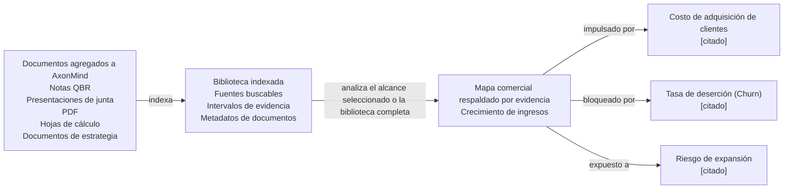

<p align="center">
  
</p>

<h1 align="center">AxonMind Open</h1>

<p align="center">
  <a href="README.md">English</a> | <a href="README.zh.md">简体中文</a> | <a href="README.it.md">Italiano</a> | <a href="README.fr.md">Français</a> | <a href="README.de.md">Deutsch</a> | <strong>Español</strong> | <a href="README.ja.md">日本語</a> | <a href="README.ko.md">한국어</a>
</p>

<p align="center">
  <strong>AxonMind mapea cada documento que agregues a un grafo de conocimiento empresarial respaldado por evidencia.</strong>
</p>

<p align="center">
  Motor Rust · CLI · Tipos de TypeScript · Hooks de React · Demostración de Tauri
</p>

AxonMind Open es el proyecto de código abierto de AxonMind, que indexa documentos comerciales, extrae KPI, impulsores (drivers), riesgos, decisiones y evidencia de respaldo, y luego los conecta en un grafo de conocimiento tipado que puedes consultar. En lugar de analizar un archivo de forma aislada, AxonMind construye una biblioteca de base de conocimientos a partir de todos los documentos que agregues a ella. Desde allí, puedes analizar un alcance seleccionado o toda la biblioteca para descubrir cómo se relacionan los conceptos comerciales entre sí.

Cada relación está respaldada por evidencia de origen, por lo que los usuarios pueden inspeccionar por qué AxonMind cree que un KPI está impulsado por, bloqueado por, influenciado por o conectado a otro concepto. El resultado es un mapa comercial local y rastreable en lugar de un resumen de caja negra.

AxonMind está diseñado para crear inteligencia empresarial local-first, inteligencia de documentos, paneles operativos y flujos de trabajo de agentes donde la explicabilidad es importante.

> **Estado:** El motor Rust y la CLI están listos para la exploración pública. Validación actual: `cargo check`, `cargo test`, `cargo fmt`, `cargo clippy`, `bun run typecheck`, `bun run test`, `bun run build` y la compilación del paquete `.app` pasan con éxito en este espacio de trabajo.

## Por qué probarlo

- **Inteligencia de documentos basada en biblioteca.** Agrega documentos a un espacio de trabajo local, indexa una sola vez y analiza archivos seleccionados, carpetas o la biblioteca de documentos completa a medida que crece tu contexto empresarial.
- **Construcción de grafos basada en evidencia.** Los bordes (edges) requieren referencias de evidencia en la capa de almacenamiento. Si AxonMind no puede señalar el texto original, no crea la relación.
- **Local por defecto.** Los espacios de trabajo residen en SQLite con un caché `petgraph` en memoria. No se requiere cuenta, plano de control alojado o dependencia de la nube para el extractor de reglas por defecto.
- **Útil de inmediato desde la CLI.** Indexa el documento de muestra incluido y consulta un grafo real en menos de un minuto.
- **Arquitectura integrable.** Usa el motor Rust directamente, llama a la CLI o conecta una interfaz de usuario React/Tauri a través de la interfaz de transporte TypeScript.
- **LLM opcional.** La extracción determinista funciona sin necesidad de configuración adicional. Los proveedores opcionales de LLM pueden enriquecer la extracción cuando desees un razonamiento libre más amplio.

## Qué hace

AxonMind transforma una biblioteca de conocimientos en crecimiento en un mapa de relaciones comerciales.

Primero, agrega documentos a un espacio de trabajo. AxonMind los indexa en una biblioteca local, preservando las referencias de origen y el texto buscable. Luego elige el alcance del análisis: un documento, un grupo seleccionado de documentos o todo lo que hay en la biblioteca. AxonMind analiza ese alcance para encontrar KPI, riesgos, decisiones, impulsores, bloqueadores y relaciones respaldadas por evidencia entre ellos.

```text
documentos agregados a AxonMind        biblioteca indexada           mapa comercial respaldado por evidencia
-------------------------------        -------------------           ---------------------------------------
Notas QBR, presentaciones, PDF,   ->   fuentes buscables      ->     Crecimiento de ingresos (Revenue Growth)
hojas de cálculo, docs estrategia      intervalos de evidencia              | impulsado por -> Costo adquisición clientes [citado]
                                       metadatos de doc                     | bloqueado por -> Tasa de deserción (Churn)  [citado]
                                                                            | expuesto a    -> Riesgo de expansión        [citado]
```



En la práctica, AxonMind te ayuda a plantear preguntas comerciales a través de documentos en lugar de volver a leerlos uno por uno:

- ¿Qué KPI están siendo impulsados, bloqueados o puestos en riesgo?
- ¿Qué documentos contienen la evidencia de una relación?
- ¿Qué decisiones, riesgos o suposiciones siguen apareciendo en la biblioteca?
- ¿Cómo se conecta una métrica con otra en informes, notas, presentaciones y planes?

Luego puedes:

- Concentrarte en un KPI e inspeccionar sus impulsores, bloqueadores, riesgos y evidencia relacionada
- Buscar en todo el grafo con SQLite FTS5
- Exportar o importar el estado del grafo como JSON
- Integrar el motor detrás de la interfaz de usuario de tu propio producto
- Ejecutar una aplicación de demostración de Tauri local con vistas de Brain Map, documentos e inspector

**Fuera de alcance:** SaaS alojado, facturación, sincronización en la nube, SSO, RBAC, gestión de equipos o un plano de control administrado.

## Inicio rápido

El repositorio incluye una revisión comercial de muestra en `fixtures/sample.md`. Construye y consulta un grafo sin clave de API y sin archivo de configuración:

```bash
# 1. Crea un espacio de trabajo local.
cargo run -p axonmind_cli -- init --workspace ./demo

# 2. Indexa la biblioteca de documentos de muestra.
cargo run -p axonmind_cli -- index ./fixtures --workspace ./demo

# Resultado esperado:
# Indexed: 1 files, 4 nodes, 5 edges, 3 evidence, 0 skipped, 0 errors

# 3. Concéntrate en el KPI de muestra.
cargo run -p axonmind_cli -- query --workspace ./demo focus-kpi kpi.revenue_growth

# 4. Busca en el grafo o devuelve JSON.
cargo run -p axonmind_cli -- search "revenue" --workspace ./demo
cargo run -p axonmind_cli -- query --workspace ./demo --json focus-kpi kpi.revenue_growth
```

El extractor de reglas predeterminado detecta los KPI a partir de los encabezados y crea bordes de impulsores/bloqueadores cuando los KPI nombrados aparecen en el mismo párrafo con palabras de enlace como "influences" o "blocks". Los documentos sin esos patrones pueden producir nodos KPI sin relaciones; eso es de esperarse. Usa la extracción opcional de LLM cuando necesites un descubrimiento de relaciones más rico a partir de texto libre.

## Aplicación de demostración

AxonMind Open incluye una aplicación de demostración de Tauri local para probar las superficies de React con el motor.

```bash
bun install
bun run tauri:dev
```

Si el servidor de desarrollo ya se está ejecutando y deseas reiniciarlo limpiamente, usa:

```bash
pkill -f "tauri dev"; pkill -f "axonmind-host"; bun tauri dev
```

Construye el paquete macOS `.app`:

```bash
bun run tauri:build
```

La demostración funciona en modo solo de reglas sin una clave de API. Para un Brain Map respaldado por LLM y una extracción más rica, agrega una clave de proveedor en la configuración de la aplicación o ejecuta un servidor de modelos local compatible.

Los proveedores de la nube compatibles incluyen Anthropic, OpenAI, Google Gemini, Groq, DeepSeek y OpenRouter. Las rutas de servidores locales compatibles incluyen Ollama, LM Studio, llama.cpp, Jan y vLLM.

## Compilación y pruebas

```bash
cargo fmt --all -- --check
cargo check --workspace
cargo test --workspace
cargo clippy --workspace

bun install
bun run typecheck
bun run test
bun run build
bun run tauri:build
```

La validación local actual cubre 159 pruebas de Rust y 19 pruebas de TypeScript.

## Características opcionales

La compilación del motor por defecto utiliza la extracción de reglas deterministas y no tiene dependencias opcionales del sistema.

### Extracción de LLM

Habilita una extracción más rica con:

```bash
cargo build -p axonmind_engine --features llm
```

Los proveedores de la nube se pueden configurar con claves de API. Si usas el inicio basado en variables de entorno, estos son los nombres de variables comunes:

| Proveedor | Variable de entorno |
|---|---|
| Anthropic | `ANTHROPIC_API_KEY` |
| OpenAI | `OPENAI_API_KEY` |
| Google Gemini | `GEMINI_API_KEY` |
| Groq | `GROQ_API_KEY` |
| DeepSeek | `DEEPSEEK_API_KEY` |
| OpenRouter | `OPENROUTER_API_KEY` |

### Configuración del entorno

Copia la plantilla y establece los valores para tu entorno local:

```bash
cp env_example .env
# o
cp env_example .env.local
```

Valores predeterminados actuales de Codex en `env_example`:

- `AXONMIND_CODEX_MODEL=gpt-5.4-mini`
- `AXONMIND_CODEX_INTELLIGENCE=low`

Por qué `env_example` solo incluye estas dos variables:

- Son las anulaciones predeterminadas de Codex que actualmente lee este repositorio directamente.
- `AXONMIND_CODEX_MODEL` se pasa a Codex (`-m`) y acepta cualquier cadena de modelo válida, por lo que los nuevos nombres de modelos generalmente no requieren cambios en el código de Rust.
- `AXONMIND_CODEX_INTELLIGENCE` actualmente admite `minimal`, `low`, `medium`, `high` y `xhigh`. Si Codex agrega un nivel de razonamiento completamente nuevo en el futuro, esta asignación puede necesitar una actualización de código.

Las sugerencias opcionales del modelo de la interfaz de usuario de Codex se pueden configurar con un archivo JSON llamado `codex_session_options.json` en el directorio de configuración de la aplicación:

- macOS/Linux: `$XDG_CONFIG_HOME/axonmind-open/codex_session_options.json` (o `~/.config/axonmind-open/codex_session_options.json`)
- Windows: `%APPDATA%\\axonmind-open\\codex_session_options.json`

Usa `codex_session_options.example.json` como plantilla.

Nota: AxonMind actualmente lee las variables de entorno del proceso directamente y no carga automáticamente `.env` o `.env.local`. Carga/exporta estas variables en tu shell o ejecutor antes de iniciar la aplicación.

Los proveedores locales no requieren una clave de API cuando su servidor ya se está ejecutando:

| Herramienta | Puerto predeterminado |
|---|---|
| Ollama | `11434` |
| LM Studio | `1234` |
| llama.cpp | `8080` |
| Jan | `1337` |
| vLLM | `8000` |

### Ingesta de imágenes OCR

Habilita el OCR de imágenes a través de Tesseract local:

```bash
cargo build -p axonmind_engine --features ocr
```

Las extensiones de imagen admitidas incluyen `jpg`, `jpeg`, `png`, `bmp`, `webp`, `tiff`, `tif` y `gif`. Si se intenta la ingesta de imágenes sin la característica `ocr`, AxonMind devuelve un error claro en lugar de producir silenciosamente un documento vacío.

## Optimización personalizada

AxonMind está diseñado para adaptarse a tu propio lenguaje comercial sin tener que volver a escribir el motor. Comienza con las instrucciones (prompts) cuando desees diferentes categorías de Brain Map, estilos de nomenclatura, prioridades de agrupación o vocabulario de dominio. Cambia los tipos principales solo cuando necesites que el grafo admita nuevos tipos de nodos o bordes.

### Ajustar las categorías de Brain Map

El resumen de Brain Map impulsado por LLM se ensambla a partir de fragmentos de instrucciones en `crates/axonmind_engine/src/extract/prompts/`:

| Fragmento | Úsalo para personalizar |
|---|---|
| `categorize.system.md` | El rol general y el marco de dominio para el organizador del mapa |
| `categorize.rules.md` | Recuento de categorías, reglas de agrupación, reglas de nodos principales y restricciones de nomenclatura |
| `categorize.optimization.md` | Preferencias de calidad, como 4-8 categorías, etiquetas limpias y grupos conectados |
| `categorize.output.md` | El contrato de respuesta JSON esperado por el analizador |

Para un espacio de trabajo específico, crea archivos de anulación en `<workspace>/prompts/` usando las mismas claves de fragmento:

```text
<workspace>/prompts/categorize.system.md
<workspace>/prompts/categorize.rules.md
<workspace>/prompts/categorize.optimization.md
<workspace>/prompts/categorize.output.md
```

Las anulaciones de instrucciones del espacio de trabajo ganan a las instrucciones integradas, y eliminar una anulación devuelve ese fragmento al valor predeterminado integrado.

### Ajustar el comportamiento de extracción

- Cambia las instrucciones de extracción de LLM en `crates/axonmind_engine/src/extract/openai.rs` y `crates/axonmind_engine/src/extract/seeyoo.rs` cuando desees que el modelo extraiga diferentes conceptos comerciales manteniendo el vocabulario de grafo existente.
- Cambia la extracción de reglas deterministas en `crates/axonmind_engine/src/extract/rules.rs` cuando desees que el comportamiento sin LLM reconozca diferentes encabezados, frases, métricas o lenguaje de relaciones.
- Cambia los alias de normalización en `crates/axonmind_engine/src/extract/normalize.rs` cuando tus documentos usen palabras diferentes para los valores existentes de `NodeKind` o `EdgeKind`.

### Cambiar el vocabulario del grafo

Si necesitas agregar, eliminar o renombrar tipos de nodos o bordes de primera clase, actualiza la taxonomía principal en `crates/axonmind_core/src/node.rs` y `crates/axonmind_core/src/edge.rs`. Luego actualiza cualquier normalización del extractor, lógica de visualización de la interfaz de usuario, contratos de TypeScript, accesorios y pruebas que dependan de esos tipos.

Como regla general: si las categorías existentes son correctas pero la agrupación parece incorrecta, ajusta las instrucciones. Si los documentos usan palabras diferentes para los mismos conceptos, ajusta la normalización. Si el producto necesita conceptos que el grafo no puede representar actualmente, cambia la taxonomía principal.

## Diseño del repositorio

```text
crates/
  axonmind_core/    Tipos de dominio, modelo de evidencia, modelo de confianza
  axonmind_engine/  Almacenamiento, ingesta, extracción, consultas, trabajadores
  axonmind_tauri/   Adaptador opcional de Tauri v2
  axonmind_cli/     Binario de la CLI
  seeyoo_llm/       Cliente LLM de múltiples proveedores

packages/
  @axonmind/types   Contratos de TypeScript generados a partir de tipos de Rust
  @axonmind/react   Proveedor de React, hooks, adaptador de grafo, componentes de interfaz de usuario

migrations/         Migraciones de esquema de SQLite
fixtures/           Documentos de muestra para inicio rápido y pruebas
src-tauri/          Host de demostración local mínimo
```

## Capacidades incluidas

| Capacidad | Detalle |
|---|---|
| Almacenamiento de grafos | Almacén respaldado por SQLite con modo WAL y caché `petgraph` |
| Ingesta | Markdown, texto, PDF, DOCX, hojas de cálculo, HTML, OCR de imagen opcional |
| Extracción | Reglas deterministas por defecto; extracción de LLM opcional |
| Análisis de alcance | Analiza un documento, documentos seleccionados o la biblioteca indexada completa |
| Consultas | Enfoque de KPI, búsqueda de grafos, búsqueda de evidencia, radio de impacto, rastreo de decisiones, sugerencia de acciones |
| Evidencia | Las citas de relaciones y los intervalos de origen son datos de grafos de primera clase |
| Trabajadores | Infraestructura de descubrimiento de KPI y recálculo de KPI |
| SDK | Tipos de TypeScript generados, hooks de React, transporte de Tauri |
| Demostración | Aplicación local de Tauri con Brain Map, lista de documentos, inspector y configuración |

## Invariantes clave

- Cada borde requiere al menos una referencia de evidencia.
- Todas las escrituras pasan por `GraphMutation`.
- `search_index` se sincroniza manualmente en la mutación, no por disparadores de SQLite.
- Los archivos ingeridos se copian en `blobs/<sha256>` para que el recálculo no dependa de la ruta original.

## Limitaciones conocidas

- El extractor de reglas predeterminado es intencionalmente conservador. Usa la extracción de LLM para un descubrimiento de relaciones más rico en prosa libre.
- El empaquetado DMG no forma parte del script `tauri:build` predeterminado; el objetivo de compilación de escritorio validado es el paquete macOS `.app`.
- La autenticación de sesión de la CLI de Claude Code y Antigravity es experimental porque esos proveedores pueden requerir encabezados específicos del extremo adicionales.

## Estado de autenticación de sesión de la CLI

- Probado: la ruta del proveedor LLM basada en inicio de sesión/sesión de la CLI de Codex funciona en la aplicación Tauri.
> El modelo predeterminado seleccionado para Codex es `gpt-5.4-mini` y el nivel de inteligencia predeterminado es `low`. OpenAI y Codex pueden cambiar los modelos disponibles en cualquier momento, así que consulta la documentación de la CLI de Codex para obtener la información más reciente. Las anulaciones de modelos usan `AXONMIND_CODEX_MODEL` (paso directo) y las anulaciones de inteligencia usan `AXONMIND_CODEX_INTELLIGENCE` (`minimal|low|medium|high|xhigh`) como se muestra en `env_example`.

## Características de indexación de páginas

### Se requiere volver a indexar para los archivos existentes

Las tablas `page_*` (page_sections, page_section_fts) son completadas por `pageindex::index_document`, que se ejecuta al final de cada ingesta a través de `run_ingest_tail`. Los documentos que se indexaron antes de esta sesión no tienen filas en esas tablas, por lo que "Search Contents" (Buscar contenido) no devuelve nada para ellos.

La comprobación de caducidad en `index_document` lo confirma: busca `page_tree_sha` para cada documento y, si falta (como ocurre con todos los documentos preexistentes), construye y almacena el árbol de secciones. Por lo tanto, volver a activar la ingesta es suficiente.

### Qué hacer en la interfaz de usuario

En la vista Processed Files (Archivos procesados): selecciona todos los documentos → Regenerate selected (Regenerar seleccionados). Esto lee del blob ya almacenado (no se requiere volver a cargarlo), vuelve a analizar el archivo, reconstruye el árbol de secciones y lo almacena. Si no hay ningún proveedor de IA conectado, es rápido: solo extracción de reglas, sin llamadas a LLM.

Alternativamente, por documento: el botón Regenerate en la columna Actions hace lo mismo para un archivo a la vez.

### Qué hacer desde la CLI

`axonmind index <ruta> --workspace <dir>`

Sin `--skip-unchanged`, esto vuelve a ingerir todos los archivos y completa el índice de la página. Con `--skip-unchanged` se cancela antes para los archivos sin cambios y nunca llega al gancho de pageindex, así que no uses ese indicador para este propósito.

### Qué no toca esto

El árbol de secciones se construye puramente a partir de la estructura del documento analizado; no interviene ninguna extracción de LLM a menos que `pageindex_enrich = true` (que por defecto es false). Por lo tanto, volver a ingerir archivos existentes sin un proveedor de IA es económico: analizar desde el blob → construir el árbol de encabezados → escribir en SQLite FTS. Los nodos y bordes del grafo también se vuelven a actualizar (upsert), pero eso es ligero (ya existen, por lo que son en su mayoría no-ops).

### La regeneración y generación con IA pueden tardar mucho

**Qué está consumiendo el tiempo.** La regeneración tiene tres fases de LLM:

1. Extracción de entidades: una llamada a la API por documento (rápida, ~2 s)
2. Extracción de relaciones: una llamada a la API por par de entidades por párrafo (líneas 196-216). Si un párrafo menciona 8 entidades, son 28 llamadas. Un documento con 5 párrafos de este tipo representa 140 llamadas. A ~2 s/llamada, eso es ~5 minutos por documento solo.
3. Vinculación semántica: una llamada más

El bucle N² de pares de entidades es el costo dominante. La interfaz de usuario ya advierte "Regenerating… (AI, may take a while)" pero no muestra cuántas llamadas están realmente en cola.

**Cómo saber si está bloqueado o funcionando.** Está funcionando si el panel de control de tu proveedor de API muestra solicitudes en curso. Está bloqueado si:
- No hay actividad de la API durante más de 2 minutos
- El proceso de la aplicación no utiliza CPU

Opciones prácticas en este momento:

- Déjalo ejecutarse. Si los archivos son documentos densos en entidades, se esperan de 5 a 10 minutos por cada uno.
- Desactiva el proveedor primero, luego regenera. Ve a Settings (Configuración), desconecta la clave de la API y luego regenera. La extracción de reglas solo tarda milisegundos; el árbol de secciones de pageindex se reconstruye (que es todo lo que realmente necesitas para Buscar contenido) y no se realizan llamadas a LLM. Vuelve a conectar el proveedor después (pero con los costos de una menor calidad).
- Alternativa de CLI para relleno masivo sin costo de LLM:
# Sin clave de LLM en la configuración → solo reglas + pageindex, muy rápido
`axonmind index <ruta> --workspace <dir>`

### Vale la pena señalar una mejora futura (TODO)

Un comando de reconstrucción de índice de página dedicado, análogo al rebuild-search-index existente, que recorra document_cache, lea cada blob y complete page_* sin tocar las tablas de grafos en absoluto. Ese sería el camino de relleno más limpio, pero aún no existe.

## TODO
1. Probar los caminos de los proveedores LLM Claude Code y Antigravity de extremo a extremo.
2. El comando dedicado rebuild-page-index mencionado anteriormente.

## Contribución

### 🚀 Política de contribución
**No aceptamos contribuciones de código públicas (pull requests) para este repositorio en este momento.** Esto nos permite mantener una propiedad clara de la propiedad intelectual de la base de código para la distribución comercial de Axonmind.

### Cómo contribuir
Seguimos recibiendo y valorando la participación de la comunidad en otras formas: **Informes de errores**, **Solicitudes de funciones** y **Documentación**.
> Consulta las [GitHub Issues](https://github.com/seeyooHK/axonmind-open/issues) para ver si ya se está discutiendo un tema.

Ver detalles en [CONTRIBUTING.md](CONTRIBUTING.md).

## Licencia

[AGPL-3.0-or-later](LICENSE)
