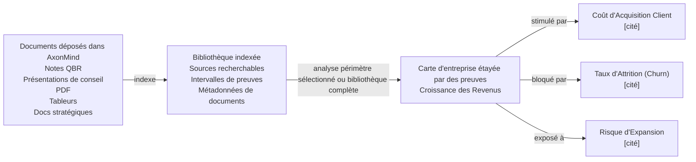

<p align="center">
  
</p>

<h1 align="center">AxonMind Open</h1>

<p align="center">
  <a href="README.md">English</a> | <a href="README.zh.md">简体中文</a> | <a href="README.it.md">Italiano</a> | <strong>Français</strong> | <a href="README.de.md">Deutsch</a> | <a href="README.es.md">Español</a> | <a href="README.ja.md">日本語</a> | <a href="README.ko.md">한국어</a>
</p>

<p align="center">
  <strong>AxonMind cartographie chaque document déposé dans un graphe de connaissances d'entreprise étayé par des preuves.</strong>
</p>

<p align="center">
  Moteur Rust · CLI · Types TypeScript · Hooks React · Démo Tauri
</p>

AxonMind Open est le projet open-source d'AxonMind, qui indexe les documents d'entreprise, extrait les KPI, les facteurs clés (drivers), les risques, les décisions et les preuves de soutien, puis les connecte dans un graphe de connaissances typé que vous pouvez requêter. Au lieu d'analyser un fichier de manière isolée, AxonMind construit une bibliothèque de base de connaissances à partir de tous les documents que vous y déposez. À partir de là, vous pouvez analyser un périmètre sélectionné ou l'ensemble de la bibliothèque pour découvrir comment les concepts d'entreprise sont liés les uns aux autres.

Chaque relation est étayée par des preuves sources, de sorte que les utilisateurs peuvent vérifier pourquoi AxonMind estime qu'un KPI est stimulé par, bloqué par, influencé par ou connecté à un autre concept. Le résultat est une carte d'entreprise locale et traçable plutôt qu'un résumé boîte noire.

AxonMind est conçu pour créer de la business intelligence locale-first, de l'intelligence documentaire, des tableaux de bord opérationnels et des workflows d'agents où l'explicabilité est essentielle.

> **Statut :** Le moteur Rust et le CLI sont prêts pour l'exploration publique. Validation actuelle : `cargo check`, `cargo test`, `cargo fmt`, `cargo clippy`, `bun run typecheck`, `bun run test`, `bun run build` et la construction du bundle `.app` passent tous avec succès dans ce workspace.

## Pourquoi l'essayer

- **Intelligence documentaire basée sur une bibliothèque.** Déposez des documents dans un espace de travail local, indexez-les une seule fois et analysez les fichiers sélectionnés, les dossiers ou la bibliothèque de documents complète à mesure que votre contexte d'affaires se développe.
- **Construction de graphe axée sur les preuves.** Les arêtes nécessitent des références de preuves au niveau de la couche de stockage. Si AxonMind ne peut pas pointer vers le texte source, il ne crée pas la relation.
- **Local par défaut.** Les espaces de travail résident dans SQLite avec un cache `petgraph` en mémoire. Aucun compte, plan de contrôle hébergé ou dépendance au cloud n'est requis pour l'extracteur de règles par défaut.
- **Utile immédiatement depuis le CLI.** Indexez le document d'exemple inclus et interrogez un vrai graphe en moins d'une minute.
- **Architecture intégrable.** Utilisez le moteur Rust directement, appelez le CLI ou connectez une interface utilisateur React/Tauri via l'interface de transport TypeScript.
- **LLM optionnel.** L'extraction déterministe fonctionne immédiatement. Des fournisseurs LLM optionnels peuvent enrichir l'extraction lorsque vous souhaitez un raisonnement plus large en texte libre.

## Ce qu'il fait

AxonMind transforme une bibliothèque de connaissances en pleine croissance en une carte des relations d'affaires.

Tout d'abord, déposez les documents dans un espace de travail. AxonMind les indexe dans une bibliothèque locale, préservant les références des sources et le texte recherchable. Choisissez ensuite le périmètre d'analyse : un document, un groupe de documents sélectionné ou tout ce qui se trouve dans la bibliothèque. AxonMind analyse ce périmètre pour trouver les KPI, les risques, les décisions, les facteurs clés (drivers), les bloqueurs et les relations étayées par des preuves entre eux.

```text
documents déposés dans AxonMind        bibliothèque indexée          carte d'entreprise étayée par des preuves
-------------------------------        --------------------          ------------------------------------------
Notes QBR, slides board, PDF,     ->   sources recherchables    ->   Croissance des Revenus (Revenue Growth)
tableurs, docs de stratégie            intervalles de preuves              | stimulé par -> Coût d'Acquisition Client [cité]
                                       métadonnées de doc                  | bloqué par  -> Taux d'Attrition (Churn)  [cité]
                                                                           | exposé à    -> Risque d'Expansion        [cité]
```



En pratique, AxonMind vous aide à poser des questions d'affaires à travers plusieurs documents au lieu de les relire un par un :

- Quels KPI sont stimulés, bloqués ou mis en danger ?
- Quels documents contiennent les preuves d'une relation ?
- Quels décisions, risques ou hypothèses reviennent sans cesse dans la bibliothèque ?
- Comment un indicateur est-il relié à un autre à travers les rapports, les notes, les présentations et les plans ?

Vous pouvez ensuite :

- Vous concentrer sur un KPI et inspecter ses facteurs clés, ses bloqueurs, ses risques et les preuves associées
- Rechercher dans le graphe à l'aide de SQLite FTS5
- Exporter ou importer l'état du graphe au format JSON
- Intégrer le moteur derrière l'interface utilisateur de votre propre produit
- Exécuter une application de démonstration Tauri locale avec des vues Brain Map, documents et inspecteur

**Hors périmètre :** SaaS hébergé, facturation, synchronisation cloud, SSO, RBAC, gestion d'équipe ou plan de contrôle managé.

## Démarrage rapide

Le dépôt comprend un exemple de revue d'affaires dans `fixtures/sample.md`. Construisez et interrogez un graphe sans clé API et sans fichier de configuration :

```bash
# 1. Créez un espace de travail local.
cargo run -p axonmind_cli -- init --workspace ./demo

# 2. Indexez la bibliothèque de documents d'exemple.
cargo run -p axonmind_cli -- index ./fixtures --workspace ./demo

# Résultat attendu :
# Indexed: 1 files, 4 nodes, 5 edges, 3 evidence, 0 skipped, 0 errors

# 3. Concentrez-vous sur le KPI d'exemple.
cargo run -p axonmind_cli -- query --workspace ./demo focus-kpi kpi.revenue_growth

# 4. Recherchez dans le graphe ou obtenez du JSON.
cargo run -p axonmind_cli -- search "revenue" --workspace ./demo
cargo run -p axonmind_cli -- query --workspace ./demo --json focus-kpi kpi.revenue_growth
```

L'extracteur de règles par défaut détecte les KPI à partir des titres et crée des liaisons de facteurs clés/bloqueurs lorsque des KPI nommés apparaissent dans le même paragraphe avec des termes de liaison comme « influences » ou « blocks ». Les documents sans ces motifs peuvent produire des nœuds de KPI sans relation ; ceci est attendu. Utilisez l'extraction LLM optionnelle lorsque vous avez besoin d'une découverte de relations plus riche à partir de texte libre.

## Application de démonstration

AxonMind Open comprend une application de démonstration Tauri locale pour tester les interfaces React avec le moteur.

```bash
bun install
bun run tauri:dev
```

Si le serveur de développement est déjà en cours d'exécution et que vous souhaitez le redémarrer proprement, utilisez :

```bash
pkill -f "tauri dev"; pkill -f "axonmind-host"; bun tauri dev
```

Construisez le bundle macOS `.app` :

```bash
bun run tauri:build
```

La démo fonctionne en mode règles uniquement sans clé API. Pour une Brain Map alimentée par LLM et une extraction plus riche, ajoutez une clé de fournisseur dans les paramètres de l'application ou exécutez un serveur de modèles local compatible.

Les fournisseurs de cloud pris en charge incluent Anthropic, OpenAI, Google Gemini, Groq, DeepSeek et OpenRouter. Les chemins de serveurs locaux pris en charge incluent Ollama, LM Studio, llama.cpp, Jan et vLLM.

## Construire et tester

```bash
cargo fmt --all -- --check
cargo check --workspace
cargo test --workspace
cargo clippy --workspace

bun install
bun run typecheck
bun run test
bun run build
bun run tauri:build
```

La validation locale actuelle couvre 159 tests Rust et 19 tests TypeScript.

## Fonctionnalités optionnelles

La construction par défaut du moteur utilise l'extraction déterministe par règles et n'a pas de dépendances système optionnelles.

### Extraction LLM

Activez une extraction plus riche avec :

```bash
cargo build -p axonmind_engine --features llm
```

Les fournisseurs de cloud peuvent être configurés avec des clés API. Si vous utilisez un démarrage basé sur des variables d'environnement, voici les noms de variables courants :

| Fournisseur | Variable d'environnement |
|---|---|
| Anthropic | `ANTHROPIC_API_KEY` |
| OpenAI | `OPENAI_API_KEY` |
| Google Gemini | `GEMINI_API_KEY` |
| Groq | `GROQ_API_KEY` |
| DeepSeek | `DEEPSEEK_API_KEY` |
| OpenRouter | `OPENROUTER_API_KEY` |

### Paramètres d'environnement

Copiez le modèle et définissez les valeurs pour votre environnement local :

```bash
cp env_example .env
# ou
cp env_example .env.local
```

Valeurs par défaut actuelles de Codex dans `env_example` :

- `AXONMIND_CODEX_MODEL=gpt-5.4-mini`
- `AXONMIND_CODEX_INTELLIGENCE=low`

Pourquoi `env_example` inclut uniquement ces deux variables :

- Ce sont les surcharges par défaut de Codex actuellement lues directement par ce dépôt.
- `AXONMIND_CODEX_MODEL` est transmis à Codex (`-m`) et accepte n'importe quelle chaîne de modèle valide, de sorte que les nouveaux noms de modèles ne nécessitent généralement pas de modifications du code Rust.
- `AXONMIND_CODEX_INTELLIGENCE` prend actuellement en charge `minimal`, `low`, `medium`, `high` et `xhigh`. Si Codex ajoute un tout nouveau niveau de raisonnement à l'avenir, cette correspondance devra peut-être faire l'objet d'une mise à jour du code.

Les suggestions de modèles optionnelles pour l'interface utilisateur de Codex peuvent être configurées avec un fichier JSON nommé `codex_session_options.json` dans le répertoire de configuration de l'application :

- macOS/Linux : `$XDG_CONFIG_HOME/axonmind-open/codex_session_options.json` (ou `~/.config/axonmind-open/codex_session_options.json`)
- Windows : `%APPDATA%\\axonmind-open\\codex_session_options.json`

Utilisez `codex_session_options.example.json` comme modèle.

Remarque : AxonMind lit actuellement directement les variables d'environnement du processus et ne charge pas automatiquement `.env` ou `.env.local`. Chargez/exportez ces variables dans votre terminal avant de démarrer l'application.

Les fournisseurs locaux ne nécessitent pas de clé API lorsque leur serveur est déjà en cours d'exécution :

| Outil | Port par défaut |
|---|---|
| Ollama | `11434` |
| LM Studio | `1234` |
| llama.cpp | `8080` |
| Jan | `1337` |
| vLLM | `8000` |

### Importation d'images OCR

Activez l'OCR des images via un Tesseract local :

```bash
cargo build -p axonmind_engine --features ocr
```

Les extensions d'images prises en charge incluent `jpg`, `jpeg`, `png`, `bmp`, `webp`, `tiff`, `tif` et `gif`. Si l'importation d'une image est tentée sans la fonctionnalité `ocr`, AxonMind renvoie une erreur explicite au lieu de générer silencieusement un document vide.

## Optimisation personnalisée

AxonMind est conçu pour être adapté à votre propre langage métier sans réécrire le moteur. Commencez par les invites (prompts) lorsque vous souhaitez des catégories de Brain Map, un style de dénomination, des priorités de regroupement ou un vocabulaire de domaine différents. Modifiez les types de base uniquement lorsque vous avez besoin que le graphe lui-même prenne en charge de nouveaux types de nœuds ou d'arêtes.

### Ajuster les catégories de la Brain Map

Le résumé de la Brain Map alimenté par LLM est assemblé à partir de fragments d'invites dans `crates/axonmind_engine/src/extract/prompts/` :

| Fragment | Utilisez-le pour personnaliser |
|---|---|
| `categorize.system.md` | Le rôle global et le cadrage du domaine pour l'organisateur de cartes |
| `categorize.rules.md` | Nombre de catégories, règles de regroupement, règles de nœuds-titres et contraintes de dénomination |
| `categorize.optimization.md` | Préférences de qualité telles que 4-8 catégories, étiquettes propres et groupes connectés |
| `categorize.output.md` | Le contrat de réponse JSON attendu par le parseur |

Pour un espace de travail spécifique, créez des fichiers de surcharge sous `<workspace>/prompts/` en utilisant les mêmes clés de fragments :

```text
<workspace>/prompts/categorize.system.md
<workspace>/prompts/categorize.rules.md
<workspace>/prompts/categorize.optimization.md
<workspace>/prompts/categorize.output.md
```

Les surcharges d'invites d'espace de travail l'emportent sur les invites intégrées, et la suppression d'une surcharge renvoie ce fragment à sa valeur par défaut intégrée.

### Ajuster le comportement d'extraction

- Modifiez les instructions d'extraction LLM dans `crates/axonmind_engine/src/extract/openai.rs` et `crates/axonmind_engine/src/extract/seeyoo.rs` lorsque vous souhaitez que le modèle extrait différents concepts d'affaires tout en conservant le vocabulaire de graphe existant.
- Modifiez l'extraction déterministe de règles dans `crates/axonmind_engine/src/extract/rules.rs` lorsque vous souhaitez qu'un comportement sans LLM reconnaisse différents titres, expressions, indicateurs ou termes de relation.
- Modifiez les alias de normalisation dans `crates/axonmind_engine/src/extract/normalize.rs` lorsque vos documents utilisent des mots différents pour les valeurs existantes de `NodeKind` ou `EdgeKind`.

### Modifier le vocabulaire du graphe

Si vous devez ajouter, supprimer ou renommer des types de nœuds ou d'arêtes de premier niveau, mettez à jour la taxonomie principale dans `crates/axonmind_core/src/node.rs` et `crates/axonmind_core/src/edge.rs`. Mettez ensuite à jour toute normalisation d'extracteur, logique d'affichage de l'interface utilisateur, contrats TypeScript, fixtures et tests qui dépendent de ces types.

Règle générale : si les catégories existantes sont correctes mais que le regroupement semble erroné, ajustez les invites. Si les documents utilisent des termes différents pour les mêmes concepts, ajustez la normalisation. Si le produit nécessite des concepts que le graphe ne peut pas représenter actuellement, modifiez la taxonomie principale.

## Structure du dépôt

```text
crates/
  axonmind_core/    Types de domaine, modèle de preuves, modèle de confiance
  axonmind_engine/  Stockage, ingestion, extraction, requêtes, workers
  axonmind_tauri/   Adaptateur Tauri v2 optionnel
  axonmind_cli/     Exécutable CLI
  seeyoo_llm/       Client LLM multi-fournisseurs

packages/
  @axonmind/types   Contrats TypeScript générés à partir des types Rust
  @axonmind/react   Fournisseur React, hooks, adaptateur de graphe, composants UI

migrations/         Migrations de schéma SQLite
fixtures/           Documents d'exemple pour le démarrage rapide et les tests
src-tauri/          Hôte de démonstration local minimal
```

## Capacités incluses

| Capacité | Détail |
|---|---|
| Stockage de graphe | Magasin basé sur SQLite avec mode WAL et cache `petgraph` |
| Ingestion | Markdown, texte, PDF, DOCX, tableurs, HTML, OCR d'images optionnel |
| Extraction | Règles déterministes par défaut ; extraction LLM optionnelle |
| Analyse de périmètre | Analyse un document, les documents sélectionnés ou l'ensemble de la bibliothèque indexée |
| Requêtes | Focus KPI, recherche de graphe, recherche de preuves, rayon d'impact, tracé de décision, suggestion d'actions |
| Preuves | Les citations de relations et les intervalles de sources sont des données de graphe de premier niveau |
| Workers | Infrastructure de découverte et de recalcul de KPI |
| SDK | Types TypeScript générés, hooks React, transport Tauri |
| Démo | Application Tauri locale avec Brain Map, liste de documents, inspecteur et paramètres |

## Invariants clés

- Chaque arête nécessite au moins une référence de preuve.
- Toutes les écritures passent par `GraphMutation`.
- `search_index` est synchronisé manuellement lors de la mutation, et non par des déclencheurs SQLite.
- Les fichiers ingérés sont copiés dans `blobs/<sha256>` afin que le recalcul ne dépende pas du chemin d'origine.

## Limites connues

- L'extracteur de règles par défaut est intentionnellement conservateur. Utilisez l'extraction LLM pour une découverte plus riche des relations dans le texte libre.
- Le packaging DMG ne fait pas partie du script `tauri:build` par défaut ; la cible de build de bureau validée est le bundle macOS `.app`.
- L'authentification de session CLI de Claude Code et d'Antigravity est expérimentale car ces fournisseurs peuvent nécessiter des en-têtes supplémentaires spécifiques aux points de terminaison.

## Statut d'authentification de session CLI

- Testé : Le chemin d'accès du fournisseur LLM basé sur la session/connexion de Codex CLI fonctionne dans l'application Tauri.
> Le modèle par défaut sélectionné pour Codex est `gpt-5.4-mini`, et le niveau d'intelligence par défaut est `low`. OpenAI et Codex peuvent modifier les modèles disponibles à tout moment, veuillez donc consulter la documentation de Codex CLI pour les dernières informations. Les surcharges de modèles utilisent `AXONMIND_CODEX_MODEL` (transmission), et les surcharges d'intelligence utilisent `AXONMIND_CODEX_INTELLIGENCE` (`minimal|low|medium|high|xhigh`) comme indiqué dans `env_example`.

## Fonctionnalités d'indexation de pages

### La ré-indexation est nécessaire pour les fichiers existants

Les tables `page_*` (page_sections, page_section_fts) sont alimentées par `pageindex::index_document`, qui s'exécute à la fin de chaque ingestion via `run_ingest_tail`. Les documents qui ont été indexés avant cette session n'ont pas de lignes dans ces tables — par conséquent, « Search Contents » ne renvoie rien pour eux.

La vérification de péremption dans `index_document` le confirme : elle recherche `page_tree_sha` pour chaque document et, s'il est manquant (ce qui est le cas pour tous les documents préexistants), construit et stocke l'arborescence des sections. Il suffit donc de déclencher à nouveau l'ingestion.

### Ce qu'il faut faire dans l'interface utilisateur

Dans la vue Processed Files : sélectionnez tous les documents → Regenerate selected. Cela lit à partir du blob déjà stocké (aucun nouveau téléversement requis), re-parse le fichier, reconstruit l'arborescence des sections et la stocke. Si aucun fournisseur d'IA n'est connecté, c'est très rapide — extraction de règles uniquement, pas d'appels LLM.

Alternativement, par document : le bouton Regenerate dans la colonne Actions fait la même chose pour un fichier à la fois.

### Ce qu'il faut faire depuis le CLI

`axonmind index <path> --workspace <dir>`

Sans `--skip-unchanged`, cela ré-ingère tous les fichiers et alimente l'index de page. Avec `--skip-unchanged`, le processus s'arrête tôt pour les fichiers inchangés et n'atteint jamais le hook pageindex — n'utilisez donc pas ce flag à cette fin.

### Ce qui n'est pas touché

L'arborescence des sections est construite uniquement à partir de la structure du document analysé — aucune extraction LLM n'est impliquée à moins que `pageindex_enrich = true` (qui vaut false par défaut). Ré-ingérer des fichiers existants sans fournisseur d'IA est donc peu coûteux : analyse depuis le blob → construction de l'arborescence des en-têtes → écriture dans SQLite FTS. Les nœuds et arêtes du graphe sont également ré-insérés (upsert), mais c'est léger (ils existent déjà, c'est donc principalement des no-op).

### La régénération et la génération avec l'IA peuvent prendre du temps

**Qu'est-ce qui prend du temps.** La régénération comporte trois phases LLM :

1. Extraction d'entités — un appel API par document (rapide, ~2s)
2. Extraction de relations — un appel API par paire d'entités par paragraphe (lignes 196-216). Si un paragraphe mentionne 8 entités, cela fait 28 appels. Un document comportant 5 paragraphes de ce type représente 140 appels. À ~2s/appel, cela fait environ 5 minutes par document à lui seul.
3. Liaison sémantique — un appel supplémentaire

La boucle N² des paires d'entités est le coût dominant. L'interface utilisateur avertit déjà « Regenerating… (AI, may take a while) » mais n'affiche pas le nombre d'appels réellement mis en file d'attente.

**Comment savoir si le processus est bloqué ou s'il travaille.** Il fonctionne si le tableau de bord de votre fournisseur d'API montre des requêtes en cours. Il est bloqué si :
- Aucune activité API pendant plus de 2 minutes
- Le processus de l'application n'utilise pas de processeur

Options pratiques actuelles :

- Laissez-le tourner. Si les fichiers sont des documents denses en entités, 5 à 10 minutes chacun sont attendues.
- Désactivez d'abord le fournisseur, puis régénérez. Allez dans les Paramètres, déconnectez la clé API, puis régénérez. L'extraction de règles ne prend que quelques millisecondes — l'arborescence des sections pageindex est reconstruite (ce qui est tout ce dont vous avez réellement besoin pour Search Contents) et aucun appel LLM n'est effectué. Reconnectez le fournisseur ensuite (mais avec le coût d'une qualité inférieure).
- Alternative CLI pour un remplissage en bloc sans coût de LLM :
# Pas de clé LLM dans la configuration → rules-only + pageindex, très rapide
`axonmind index <path> --workspace <dir>`

### Amélioration future à noter (TODO)

Un commande dédiée de reconstruction d'index de page — analogue à l'actuel rebuild-search-index — qui parcourt document_cache, lit chaque blob et alimente page_* sans toucher du tout aux tables de graphes. Ce serait le chemin de remplissage le plus propre, mais il n'existe pas encore.

## TODO
1. Tester les chemins de fournisseurs LLM Claude Code et Antigravity de bout en bout.
2. Une commande dédiée rebuild-page-index mentionnée ci-dessus.

## Contribution

### 🚀 Politique de contribution
**Nous n'acceptons pas de contributions de code publiques (pull requests) sur ce dépôt pour le moment.** Cela nous permet de conserver la propriété intellectuelle exclusive du code source pour la distribution commerciale d'Axonmind.

### Comment contribuer
Nous accueillons et apprécions toujours la participation de la communauté sous d'autres formes : **Rapports de bugs**, **Demandes de fonctionnalités** et **Documentation**.
> Veuillez consulter les [GitHub Issues](https://github.com/seeyooHK/axonmind-open/issues) pour voir si un sujet est déjà en cours de discussion.

Voir les détails dans [CONTRIBUTING.md](CONTRIBUTING.md).

## Licence

[AGPL-3.0-or-later](LICENSE)
