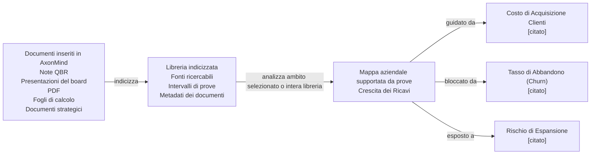

<p align="center">
  
</p>

<h1 align="center">AxonMind Open</h1>

<p align="center">
  <a href="README.md">English</a> | <a href="README.zh.md">简体中文</a> | <strong>Italiano</strong> | <a href="README.fr.md">Français</a> | <a href="README.de.md">Deutsch</a> | <a href="README.es.md">Español</a> | <a href="README.ja.md">日本語</a> | <a href="README.ko.md">한국어</a>
</p>

<p align="center">
  <strong>AxonMind mappa ogni documento inserito in un grafo della conoscenza aziendale supportato da prove.</strong>
</p>

<p align="center">
  Motore Rust · CLI · Tipi TypeScript · Hook React · Demo Tauri
</p>

AxonMind Open è il progetto open-source di AxonMind, che indicizza i documenti aziendali, estrae KPI, driver, rischi, decisioni e prove di supporto, per poi collegarli in un grafo della conoscenza tipizzato che puoi interrogare. Invece di analizzare un singolo file in isolamento, AxonMind crea una libreria della base di conoscenza a partire da tutti i documenti inseriti. Da lì, puoi analizzare un ambito selezionato o l'intera libreria per scoprire come i concetti aziendali si relazionano tra loro.

Ogni relazione è supportata da prove di origine, consentendo agli utenti di verificare perché AxonMind ritiene che un KPI sia guidato, bloccato, influenzato o collegato a un altro concetto. Il risultato è una mappa aziendale locale e tracciabile piuttosto che un riepilogo a scatola nera.

AxonMind è progettato per creare business intelligence locale-first, intelligenza documentale, dashboard operative e workflow di agenti in cui la spiegabilità è fondamentale.

> **Stato:** Il motore Rust e la CLI sono pronti per l'esplorazione pubblica. Validazione attuale: `cargo check`, `cargo test`, `cargo fmt`, `cargo clippy`, `bun run typecheck`, `bun run test`, `bun run build` e la build del bundle `.app` hanno tutti esito positivo in questo workspace.

## Perché provarlo

- **Intelligenza documentale basata su libreria.** Rilascia i documenti in un workspace locale, indicizzali una sola volta e analizza file selezionati, cartelle o l'intera libreria man mano che il contesto aziendale cresce.
- **Costruzione del grafo basata sulle prove.** Gli archi richiedono riferimenti alle prove a livello di archiviazione. Se AxonMind non può risalire al testo sorgente, non crea la relazione.
- **Locale per impostazione predefinita.** I workspace risiedono in SQLite con una cache `petgraph` in memoria. Non è richiesto alcun account, piano di controllo ospitato o dipendenza dal cloud per l'estrattore di regole predefinito.
- **Utile immediatamente dalla CLI.** Indicizza il documento di esempio incluso e interroga un grafo reale in meno di un minuto.
- **Architettura incorporabile.** Usa direttamente il motore Rust, chiama la CLI, esegui il server MCP per gli agenti AI o connetti una UI React/Tauri tramite l'interfaccia di trasporto TypeScript.
- **LLM opzionale.** L'estrazione deterministica funziona immediatamente. I provider LLM opzionali possono arricchire l'estrazione per un ragionamento a testo libero più ampio.

## Cosa fa

AxonMind trasforma una libreria di conoscenza in crescita in una mappa delle relazioni aziendali.

Innanzitutto, inserisci i documenti in un workspace. AxonMind li indicizza in una libreria locale, preservando i riferimenti alle fonti e il testo ricercabile. Quindi scegli l'ambito dell'analisi: un documento, un gruppo selezionato di documenti o tutto ciò che si trova nella libreria. AxonMind analizza quell'ambito per trovare KPI, rischi, decisioni, driver, blocker e relazioni supportate da prove tra di essi.

```text
documenti inseriti in AxonMind           libreria indicizzata           mappa aziendale supportata da prove
------------------------------           --------------------           -----------------------------------
Note QBR, presentazioni, PDF,       ->   fonti ricercabili       ->     Crescita dei Ricavi (Revenue Growth)
fogli di calcolo, doc strategici         intervalli di prove                  | guidato da -> Costo di Acquisizione Clienti [citato]
                                         metadati dei doc                     | bloccato da -> Tasso di Abbandono (Churn)   [citato]
                                                                              | esposto a -> Rischio di Espansione          [citato]
```



In pratica, AxonMind ti aiuta a porre domande aziendali tra i documenti invece di rileggerli uno per uno:

- Quali KPI sono guidati, bloccati o a rischio?
- Quali documenti contengono le prove per una relazione?
- Quali decisioni, rischi o presupposti continuano a comparire nella libreria?
- In che modo una metrica si collega a un'altra tra report, note, presentazioni e piani?

Puoi quindi:

- Concentrarti su un KPI e ispezionare i relativi driver, blocker, rischi e prove correlate
- Cercare nel grafo con SQLite FTS5 o usare il recupero dei documenti basato sul ragionamento
- Esporre il grafo della conoscenza agli agenti AI tramite il server MCP integrato
- Esportare o importare lo stato del grafo come JSON
- Integrare il motore dietro l'interfaccia utente del tuo prodotto
- Eseguire un'app demo Tauri locale con viste Brain Map, documenti, ingestione di immagini e inspector affiancati

**Fuori ambito:** SaaS ospitato, fatturazione, sincronizzazione cloud, SSO, RBAC, gestione del team o un piano di controllo gestito.

## Guida rapida

Il repository include un esempio di revisione aziendale in `fixtures/sample.md`. Compila e interroga un grafo senza chiave API e senza file di configurazione:

```bash
# 1. Crea un workspace locale.
cargo run -p axonmind_cli -- init --workspace ./demo

# 2. Indicizza la libreria di documenti di esempio.
cargo run -p axonmind_cli -- index ./fixtures --workspace ./demo

# Risultato previsto:
# Indexed: 1 files, 4 nodes, 5 edges, 3 evidence, 0 skipped, 0 errors

# 3. Concentrati sul KPI di esempio.
cargo run -p axonmind_cli -- query --workspace ./demo focus-kpi kpi.revenue_growth

# 4. Cerca nel grafo o restituisci JSON.
cargo run -p axonmind_cli -- search "revenue" --workspace ./demo
cargo run -p axonmind_cli -- query --workspace ./demo --json focus-kpi kpi.revenue_growth

# 5. Esegui il recupero basato sul ragionamento o avvia il server MCP.
cargo run -p axonmind_cli -- query --workspace ./demo reasoning-search "what drives revenue?"
cargo run -p axonmind_cli -- mcp --workspace ./demo

# 6. Ispeziona le statistiche del grafo o confronta due snapshot esportati.
cargo run -p axonmind_cli -- graph-stats --workspace ./demo
cargo run -p axonmind_cli -- graph-diff before.json after.json
```

L'estrattore di regole predefinito rileva i KPI dalle intestazioni e crea archi driver/blocker quando i KPI denominati appaiono nello stesso paragrafo con parole di collegamento come "influences" o "blocks". I documenti senza questi pattern possono produrre nodi KPI senza relazioni; questo è previsto. Utilizza l'estrazione LLM opzionale quando hai bisogno di una scoperta delle relazioni più ricca dalla prosa libera.

## App Demo

AxonMind Open include un'app demo Tauri locale per provare le superfici React con il motore.

```bash
bun install
bun run tauri:dev
```

Se il server di sviluppo è già in esecuzione e desideri riavviarlo in modo pulito, usa:

```bash
pkill -f "tauri dev"; pkill -f "axonmind-host"; bun tauri dev
```

Compila il pacchetto macOS `.app`:

```bash
bun run tauri:build
```

La demo funziona in modalità solo regole senza una chiave API. Per Brain Map supportate da LLM, estrazioni più ricche o trascrizione di immagini, aggiungi una chiave provider nelle impostazioni dell'app o esegui un server di modelli locale compatibile.

I provider cloud supportati includono Anthropic, OpenAI, Google Gemini, Groq, DeepSeek e OpenRouter. I percorsi del server locale supportati includono Ollama, LM Studio, llama.cpp, Jan e vLLM.

## Compilazione e Test

```bash
cargo fmt --all -- --check
cargo check --workspace
cargo test --workspace
cargo clippy --workspace

bun install
bun run typecheck
bun run test
bun run build
bun run tauri:build
```

La validazione locale attuale copre 193 test Rust e 19 test TypeScript.

## Funzionalità Opzionali

La build del motore predefinita utilizza l'estrazione di regole deterministiche e non ha dipendenze di sistema opzionali.

### Estrazione LLM

Abilita un'estrazione più ricca con:

```bash
cargo build -p axonmind_engine --features llm
```

I provider cloud possono essere configurati con chiavi API. Se usi l'avvio guidato dall'ambiente, queste sono le variabili comuni:

| Provider | Variabile d'ambiente |
|---|---|
| Anthropic | `ANTHROPIC_API_KEY` |
| OpenAI | `OPENAI_API_KEY` |
| Google Gemini | `GEMINI_API_KEY` |
| Groq | `GROQ_API_KEY` |
| DeepSeek | `DEEPSEEK_API_KEY` |
| OpenRouter | `OPENROUTER_API_KEY` |

Se compilato con `--features llm`, anche i file immagine possono essere trascritti tramite il provider attivo e convertiti in markdown strutturato prima dell'indicizzazione.

### Impostazioni dell'Ambiente

Copia il modello e imposta i valori per il tuo ambiente locale:

```bash
cp env_example .env
# o
cp env_example .env.local
```

Valori predefiniti correnti di Codex in `env_example`:

- `AXONMIND_CODEX_MODEL=gpt-5.4-mini`
- `AXONMIND_CODEX_INTELLIGENCE=low`

Perché `env_example` include solo queste due variabili:

- Sono i valori predefiniti di Codex letti attualmente da questo repository.
- `AXONMIND_CODEX_MODEL` viene passato direttamente a Codex (`-m`) e accetta qualsiasi stringa di modello valida, quindi i nuovi nomi dei modelli di solito non richiedono modifiche al codice Rust.
- `AXONMIND_CODEX_INTELLIGENCE` attualmente supporta `minimal`, `low`, `medium`, `high` e `xhigh`. Se Codex aggiungerà un livello di ragionamento completamente nuovo in futuro, questa mappatura potrebbe richiedere un aggiornamento del codice.

I suggerimenti opzionali del modello UI Codex possono essere configurati con un file JSON denominato `codex_session_options.json` nella directory di configurazione dell'app:

- macOS/Linux: `$XDG_CONFIG_HOME/axonmind-open/codex_session_options.json` (o `~/.config/axonmind-open/codex_session_options.json`)
- Windows: `%APPDATA%\\axonmind-open\\codex_session_options.json`

Usa `codex_session_options.example.json` come modello.

Nota: AxonMind attualmente legge direttamente le variabili d'ambiente del processo e non carica automaticamente `.env` o `.env.local`. Carica/esporta queste variabili nella shell prima di avviare l'app.

I provider locali non richiedono una chiave API quando il loro server è già in esecuzione:

| Strumento | Porta predefinita |
|---|---|
| Ollama | `11434` |
| LM Studio | `1234` |
| llama.cpp | `8080` |
| Jan | `1337` |
| vLLM | `8000` |

### Ingestione di immagini OCR

AxonMind PR4 aggiunge l'ingestione di immagini per `jpg`, `jpeg`, `png`, `bmp`, `webp`, `tiff`, `tif` e `gif`.

Ora sono supportati due percorsi:

1. `--features llm` con un provider attivo: i file immagine vengono trascritti in markdown tramite il percorso di visione del provider, quindi indicizzati come gli altri documenti analizzati.
2. `--features ocr`: fallback Tesseract locale per ambienti in cui si desidera l'OCR senza un provider compatibile con la visione.

Abilita l'OCR Tesseract locale con:

```bash
cargo build -p axonmind_engine --features ocr
```

Compila con entrambi i percorsi disponibili se desideri prima la trascrizione del provider e l'OCR locale come fallback:

```bash
cargo build -p axonmind_engine --features "llm ocr"
```

Se si tenta l'ingestione di immagini senza un provider LLM attivo e senza la funzionalità `ocr`, AxonMind restituisce un errore chiaro invece di produrre silenziosamente un documento vuoto.

Non tutti gli adattatori di provider espongono la trascrizione delle immagini. Se un provider configurato segnala che l'OCR delle immagini non è supportato su quel percorso, usa un provider compatibile con la visione o abilita il fallback locale `ocr`.

L'inspector di Tauri mostra il markdown/testo analizzato per le immagini elaborate proprio come per gli altri formati binari. Per i file già indicizzati preferisce le sezioni pageindex memorizzate nella cache, quindi esegue il fallback a un'analisi di anteprima se non esistono ancora sezioni memorizzate nella cache.

## Ottimizzazione Personalizzata

AxonMind è progettato per essere adattato al linguaggio aziendale senza dover riscrivere il motore. Inizia con i prompt se desideri categorie Brain Map, stili di denominazione, priorità di raggruppamento o vocabolario di dominio diversi. Modifica i tipi principali solo quando hai bisogno che il grafo supporti nuovi tipi di nodi o archi.

### Ottimizzare le categorie della Brain Map

Il riepilogo della Brain Map generato da LLM è assemblato da frammenti di prompt in `crates/axonmind_engine/src/extract/prompts/`:

| Frammento | Utilizzalo per personalizzare |
|---|---|
| `categorize.system.md` | Il ruolo generale e la definizione del dominio per l'organizzatore della mappa |
| `categorize.rules.md` | Conteggio delle categorie, regole di raggruppamento, regole dei nodi titolo e vincoli di denominazione |
| `categorize.optimization.md` | Preferenze di qualità come 4-8 categorie, etichette pulite e gruppi connessi |
| `categorize.output.md` | Il formato di risposta JSON atteso dal parser |

Per un workspace specifico, crea file di override in `<workspace>/prompts/` utilizzando le stesse chiavi di frammento:

```text
<workspace>/prompts/categorize.system.md
<workspace>/prompts/categorize.rules.md
<workspace>/prompts/categorize.optimization.md
<workspace>/prompts/categorize.output.md
```

Le sovrascritture dei prompt del workspace hanno la priorità sui prompt integrati; l'eliminazione di un override ripristina il frammento al valore predefinito integrato.

### Ottimizzare il comportamento di estrazione

- Modifica le istruzioni di estrazione LLM in `crates/axonmind_engine/src/extract/openai.rs` e `crates/axonmind_engine/src/extract/seeyoo.rs` quando desideri che il modello estragga concetti aziendali diversi mantenendo il vocabolario del grafo esistente.
- Modifica l'estrazione deterministica delle regole in `crates/axonmind_engine/src/extract/rules.rs` quando desideri che il comportamento senza LLM riconosca intestazioni, frasi, metriche o parole di relazione diverse.
- Modifica gli alias di normalizzazione in `crates/axonmind_engine/src/extract/normalize.rs` quando i tuoi documenti utilizzano parole diverse per i valori `NodeKind` o `EdgeKind` esistenti.

### Modificare il vocabolario del grafo

Se hai la necessità di aggiungere, rimuovere o rinominare tipi di nodi o archi di prima classe, aggiorna la tassonomia principale in `crates/axonmind_core/src/node.rs` e `crates/axonmind_core/src/edge.rs`. Quindi aggiorna qualsiasi normalizzazione dell'estrattore, logica di visualizzazione della UI, contratti TypeScript, fixture e test che dipendono da tali tipi.

Come regola generale: se le categorie esistenti sono corrette ma il raggruppamento sembra errato, ottimizza i prompt. Se i documenti utilizzano parole diverse per gli stessi concetti, ottimizza la normalizzazione. Se il prodotto ha bisogno di concetti che il grafo non può attualmente rappresentare, modifica la tassonomia principale.

## Struttura del Repository

```text
crates/
  axonmind_core/    Tipi di dominio, modello delle prove, modello di confidenza
  axonmind_engine/  Store, ingestione, estrazione, query, worker
  axonmind_tauri/   Adattatore Tauri v2 opzionale
  axonmind_cli/     Eseguibile CLI
  seeyoo_llm/       Client LLM multi-provider

packages/
  @axonmind/types   Contratti TypeScript generati dai tipi Rust
  @axonmind/react   React provider, hook, adattatore grafo, componenti UI

migrations/         Migrazioni dello schema SQLite
fixtures/           Documenti di esempio per avvio rapido e test
src-tauri/          Host demo locale minimale
```

## Funzionalità Incluse

| Funzionalità | Dettagli |
|---|---|
| Store del grafo | Database SQLite con modalità WAL e cache `petgraph` |
| Ingestione | Markdown, testo, PDF, DOCX, fogli di calcolo, HTML e file immagine con OCR/trascrizione opzionale |
| Estrazione | Regole deterministiche per impostazione predefinita; estrazione LLM opzionale e trascrizione di immagini |
| Analisi dell'ambito | Analizza un documento, documenti selezionati o l'intera libreria indicizzata |
| Query | Focus KPI, spiega KPI, ricerca prove, raggio di impatto, tracciamento decisioni, suggerimento azioni, ricerca nel grafo, ricerca ragionamento |
| Confronto grafo | Confronto tipizzato prima/dopo di due snapshot di grafi — nodi ed archi aggiunti, modificati e rimossi con elenchi di campi modificati |
| Statistiche grafo | Conteggio dei nodi per tipo e conteggio totale degli archi tramite metodo del motore, CLI e strumento MCP |
| Prove | Riferimenti alle relazioni e intervalli di origine sono dati del grafo di prima classe |
| Worker | Infrastruttura di scoperta KPI e ricalcolo KPI |
| SDK | Tipi TypeScript generati, hook React, trasporto Tauri |
| Integrazione | Server MCP (Model Context Protocol) standard per agenti AI |
| Demo | App Tauri locale con Brain Map, elenco documenti, modal di confronto grafo, ingestione di immagini, inspector affiancato e impostazioni |

## Invarianti Chiave

- Ogni arco richiede almeno un riferimento alle prove.
- Tutte le scritture passano attraverso `GraphMutation`.
- `search_index` viene sincronizzato manualmente alla mutazione, non dai trigger SQLite.
- I file inseriti vengono copiati in `blobs/<sha256>` in modo che il ricalcolo non dipenda dal percorso originale.

## Limitazioni Note

- L'estrattore di regole predefinito è intenzionalmente conservativo. Usa l'estrazione LLM per una scoperta di relazioni più ricca nella prosa libera.
- La creazione del pacchetto DMG non fa parte dello script `tauri:build` predefinito; il target desktop validato è il pacchetto macOS `.app`.
- L'autenticazione della sessione CLI per Claude Code e Antigravity è sperimentale poiché questi provider potrebbero richiedere header specifici aggiuntivi per gli endpoint.

## Stato dell'Autenticazione della Sessione CLI

- Testato: il percorso del provider LLM basato su sessione/login Codex CLI funziona nell'app Tauri.
- PR4: il percorso del provider Codex ora supporta allegati di immagini per la trascrizione di immagini durante l'ingestione.
> Il modello predefinito selezionato per Codex è `gpt-5.4-mini` e il livello di intelligenza predefinito è `low`. OpenAI e Codex potrebbero modificare i modelli disponibili in qualsiasi momento, quindi si prega di verificare la documentazione della CLI di Codex per le informazioni più recenti. Le sovrascritture del modello utilizzano `AXONMIND_CODEX_MODEL` (pass-through) e quelle dell'intelligenza utilizzano `AXONMIND_CODEX_INTELLIGENCE` (`minimal|low|medium|high|xhigh`) come mostrato in `env_example`.

## Funzionalità di Indicizzazione delle Pagine

### La re-indicizzazione è necessaria per i file esistenti

Le tabelle `page_*` (page_sections, page_section_fts) vengono popolate da `pageindex::index_document`, che viene eseguito alla fine di ogni inserimento tramite `run_ingest_tail`. I documenti che sono stati indicizzati prima di questa sessione non hanno righe in quelle tabelle, quindi "Search Contents" (Cerca Contenuto) non restituisce nulla per essi.

Il controllo di obsolescenza in `index_document` lo conferma: cerca `page_tree_sha` per ogni documento e, se manca (come per tutti i documenti preesistenti), compila e memorizza l'albero delle sezioni. Quindi, avviare nuovamente l'ingestione è sufficiente.

### Cosa fare nell'interfaccia utente

Nella vista Processed Files (File Elaborati): seleziona tutti i documenti → Regenerate selected (Rigenera selezionati). Questo legge dal blob già memorizzato (nessun caricamento richiesto), esegue nuovamente il parsing del file, ricostruisce l'albero delle sezioni e lo memorizza. Se non è connesso alcun provider AI, i documenti basati su testo sono comunque veloci e rimangono solo con regole; i file immagine richiedono un provider LLM attivo o una build con `--features ocr`.

In alternativa, per documento: il pulsante Regenerate (Rigenera) nella colonna Actions esegue la stessa operazione per un file alla volta.

### Cosa fare dalla CLI

`axonmind index <path> --workspace <dir>`

Senza `--skip-unchanged`, questo re-inserisce tutti i file e popola l'indice delle pagine. Con `--skip-unchanged` si interrompe in anticipo per i file non modificati e non raggiunge mai l'hook pageindex, quindi non utilizzare questo flag per questo scopo.

### Cosa non viene toccato

Per i documenti basati su testo, l'albero delle sezioni viene creato esclusivamente dalla struttura del documento analizzato, senza alcuna estrazione LLM a meno che `pageindex_enrich = true` (che per impostazione predefinita è false). Quindi la re-ingestione dei file di testo esistenti senza un provider AI è economica: analisi dal blob → creazione dell'albero delle intestazioni → scrittura su SQLite FTS. I file immagine fanno eccezione: richiedono la trascrizione del provider o l'OCR prima che esista la struttura analizzata. Anche i nodi e gli archi del grafo vengono re-inseriti, ma si tratta di un'operazione leggera (esistono già, quindi sono per lo più no-op).

### La rigenerazione e la generazione con l'AI potrebbero richiedere molto tempo

**Dove si perde tempo.** La rigenerazione prevede tre fasi LLM:

1. Estrazione delle entità — una chiamata API per documento (veloce, ~2s)
2. Estrazione delle relazioni — una chiamata API per coppia di entità per paragrafo (righe 196-216). Se un paragrafo menziona 8 entità, si tratta di 28 chiamate. Un documento con 5 paragrafi di questo tipo richiede 140 chiamate. A circa 2 secondi per chiamata, sono circa 5 minuti per il solo documento.
3. Collegamento semantico — una chiamata in più

Il ciclo N² di coppie di entità rappresenta il costo dominante. L'interfaccia utente avvisa già "Regenerating… (AI, may take a while)" (Rigenerazione in corso... AI, potrebbe richiedere del tempo) ma non mostra quante chiamate sono effettivamente in coda.

**Come capire se il processo è bloccato o attivo.** È attivo se il dashboard del provider API mostra richieste in corso. È bloccato se:
- Non c'è alcuna attività API per oltre 2 minuti
- Il processo dell'app non utilizza la CPU

Opzioni pratiche al momento:

- Lasciarlo girare. Se i file sono documenti densi di entità, sono previsti 5-10 minuti per ciascuno.
- Disattivare prima il provider, quindi rigenerare. Vai su Impostazioni, scollega la chiave API, quindi rigenera. L'estrazione delle regole richiede solo millisecondi — l'albero delle sezioni di pageindex viene ricostruito (che è tutto ciò di cui hai effettivamente bisogno per Cerca Contenuto) e non viene effettuata alcuna chiamata LLM. Ricollega il provider in seguito (ma tenendo conto di una qualità potenzialmente inferiore).
- Alternativa CLI per il backfill di massa senza costi LLM:
# Nessuna chiave LLM nella configurazione → solo regole + pageindex, molto veloce
`axonmind index <path> --workspace <dir>`

### Futuro miglioramento da notare (TODO)

Un comando dedicato per la ricostruzione dell'indice delle pagine — analogo all'esistente rebuild-search-index — che esegue la scansione di document_cache, legge ciascun blob e popola page_* senza toccare affatto le tabelle del grafo. Questo sarebbe il percorso di backfill più pulito, ma al momento non esiste.

## TODO
1. Testare i percorsi del provider LLM Claude Code e Antigravity end-to-end.
2. Un comando dedicato rebuild-page-index menzionato sopra.

## Contributi

### 🚀 Politica dei Contributi
**Al momento non accettiamo contributi di codice pubblici (pull request) per questo repository.** Ciò ci consente di mantenere una chiara proprietà della proprietà intellettuale della base di codice per la distribuzione commerciale di Axonmind.

### Come contribuire
Diamo comunque il benvenuto e apprezziamo la partecipazione della community sotto altre forme: **Segnalazioni di Bug**, **Richieste di Funzionalità** e **Documentazione**.
> Si prega di controllare i [GitHub Issues](https://github.com/seeyooHK/axonmind-open/issues) per verificare se l'argomento è già in discussione.

Dettagli in [CONTRIBUTING.md](CONTRIBUTING.md).

## Licenza

[AGPL-3.0-or-later](LICENSE)
