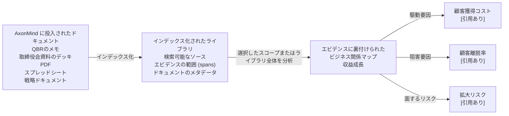

<p align="center">
  
</p>

<h1 align="center">AxonMind Open</h1>

<p align="center">
  <a href="README.md">English</a> | <a href="README.zh.md">简体中文</a> | <a href="README.it.md">Italiano</a> | <a href="README.fr.md">Français</a> | <a href="README.de.md">Deutsch</a> | <a href="README.es.md">Español</a> | <strong>日本語</strong> | <a href="README.ko.md">한국어</a>
</p>

<p align="center">
  <strong>AxonMind は、投入されたすべてのドキュメントを、エビデンスに裏付けられたビジネスナレッジグラフにマッピングします。</strong>
</p>

<p align="center">
  Rust エンジン · CLI · TypeScript 型 · React フック · Tauri デモ
</p>

AxonMind Open は AxonMind のオープンソースプロジェクトであり、ビジネスドキュメントをインデックス化し、KPI、駆動要因、リスク、意思決定、および裏付けとなるエビデンスを抽出して、クエリ可能な型付きナレッジグラフに接続します。単一のファイルを孤立して分析するのではなく、AxonMind は投入されたすべてのドキュメントからナレッジベースライブラリを構築します。そこから、選択したスコープまたはライブラリ全体を分析して、ビジネスコンセプトがどのように相互に関連しているかを明らかにできます。

すべての関係はソースのエビデンスに裏付けられているため、ユーザーはなぜ AxonMind が特定の KPI が他のコンセプトによって駆動、阻害、影響、または接続されていると判断したのかを検査できます。その結果、ブラックボックスの要約ではなく、ローカルで追跡可能なビジネス関係マップが得られます。

AxonMind は、説明可能性が重視されるローカルファーストのビジネスインテリジェンス、ドキュメントインテリジェンス、運用ダッシュボード、およびエージェントのワークフローを構築するために設計されています。

> **ステータス：** Rust エンジンと CLI は公開探索の準備ができています。現在の検証：このワークスペースにおいて `cargo check`、`cargo test`、`cargo fmt`、`cargo clippy`、`bun run typecheck`、`bun run test`、`bun run build`、および `.app` バンドルのビルドがすべてパスしています。

## 試してみる理由

- **ライブラリ優先のドキュメントインテリジェンス。** ドキュメントをローカルワークスペースにドラッグ＆ドロップして一度インデックス化すれば、ビジネスコンテキストの成長に合わせて、選択したファイル、フォルダ、またはドキュメントライブラリ全体を分析できます。
- **エビデンス優先のグラフ構築。** エッジはストレージ層でエビデンスの参照を必要とします。AxonMind がソーステキストを指し示すことができない場合、関係は作成されません。
- **デフォルトでローカル。** ワークスペースはメモリ内の `petgraph` キャッシュを備えた SQLite に保存されます。デフォルトのルール抽出器では、アカウント、ホストされたコントロールプレーン、またはクラウドへの依存は必要ありません。
- **CLI ですぐに利用可能。** 付属のサンプルドキュメントをインデックス化し、1分未満で実際のグラフをクエリできます。
- **組み込み可能なアーキテクチャ。** Rust エンジンを直接使用するか、CLI を呼び出すか、AI エージェント向けの MCP サーバーを実行するか、または TypeScript 転送インターフェースを介して React/Tauri UI を接続します。
- **LLM はオプション。** 決定論的なルール抽出は、設定なしでそのまま動作します。より広範なフリーテキスト推論を行いたい場合は、オプションの LLM プロバイダーを使用して抽出を充実させることができます。

## 機能について

AxonMind は、拡大するナレッジベースライブラリをビジネス関係マップに変換します。

まず、ドキュメントをワークスペースにドロップします。AxonMind はそれらをローカルライブラリにインデックス化し、ソース参照と検索可能なテキストを保存します。次に、分析スコープを選択します（1つのドキュメント、選択したドキュメントグループ、またはライブラリ内のすべて）。AxonMind はそのスコープを分析して、KPI、リスク、意思決定、駆動要因、阻害要因、およびそれらの間のエビデンスに裏付けられた関係を見つけます。

```text
AxonMind に投入されたドキュメント           インデックス化されたライブラリ             エビデンスに裏付けられたビジネス関係マップ
---------------------------------           --------------------------             ------------------------------------------
QBRのメモ、取締役会資料、PDF、        ->    検索可能なソース                 ->     収益成長 (Revenue Growth)
スプレッドシート、戦略ドキュメント          エビデンスの範囲 (spans)                       | 駆動要因 -> 顧客獲得コスト [引用あり]
                                            ドキュメントのメタデータ                       | 阻害要因 -> 顧客離脱率     [引用あり]
                                                                                           | 面するリスク -> 拡大リスク [引用あり]
```



実際には、AxonMind を使用すると、ドキュメントを1つずつ読み直す代わりに、ドキュメント間で次のようなビジネスに関する質問を行うことができます。

- どの KPI が駆動、阻害、またはリスクにさらされているか？
- 関係のエビデンスが含まれているドキュメントはどれか？
- ライブラリ全体で繰り返し現れる意思決定、リスク、または仮定は何か？
- レポート、メモ、デッキ、計画の間で、ある指標が別の指標とどのように接続しているか？

その後、以下を実行できます。

- KPI に焦点を当て、その駆動要因、阻害要因、リスク、および関連するエビデンスを検査する
- SQLite FTS5 を使用してグラフ全体を検索するか、推論ベースのドキュメント検索を使用する
- 内蔵の MCP サーバーを介してナレッジグラフを AI エージェントに公開する
- グラフの状態を JSON としてエクスポートまたはインポートする
- 独自の製品 UI の背後にエンジンを組み込む
- Brain Map、ドキュメント、左右に並んだインスペクタービューを備えたローカルの Tauri デモアプリを実行する

**スコープ外：** ホストされた SaaS、課金、クラウド同期、SSO、RBAC、チーム管理、または管理されたコントロールプレーン。

## クイックスタート

リポジトリには、`fixtures/sample.md` にビジネスレビューのサンプルが含まれています。API キーや設定ファイルなしでグラフを構築してクエリを実行します。

```bash
# 1. ローカルワークスペースを作成します。
cargo run -p axonmind_cli -- init --workspace ./demo

# 2. サンプルドキュメントライブラリをインデックス化します。
cargo run -p axonmind_cli -- index ./fixtures --workspace ./demo

# 期待される出力例：
# Indexed: 1 files, 4 nodes, 5 edges, 3 evidence, 0 skipped, 0 errors

# 3. サンプルの KPI に焦点を当てます。
cargo run -p axonmind_cli -- query --workspace ./demo focus-kpi kpi.revenue_growth

# 4. グラフを検索するか、JSON を返します。
cargo run -p axonmind_cli -- search "revenue" --workspace ./demo
cargo run -p axonmind_cli -- query --workspace ./demo --json focus-kpi kpi.revenue_growth

# 5. 推論ベースの検索を実行するか、MCP サーバーを起動します。
cargo run -p axonmind_cli -- query --workspace ./demo reasoning-search "what drives revenue?"
cargo run -p axonmind_cli -- mcp --workspace ./demo
```

デフォルトのルール抽出器は見出しから KPI を検出し、名前付き KPI が同じ段落内に “influences” や “blocks” などの接続語と共に現れた場合に駆動要因/阻害要因のエッジを作成します。これらのパターンを持たないドキュメントは、関係のない KPI ノードを生成する可能性がありますが、これは想定内です。自由な文章からより豊かな関係を発見する必要がある場合は、オプションの LLM 抽出を使用してください。

## デモアプリ

AxonMind Open には、エンジンに対する React インターフェースを試すためのローカル Tauri デモアプリが含まれています。

```bash
bun install
bun run tauri:dev
```

開発サーバーがすでに実行されており、クリーンに再起動したい場合は、以下を使用します。

```bash
pkill -f "tauri dev"; pkill -f "axonmind-host"; bun tauri dev
```

macOS の `.app` バンドルをビルドします。

```bash
bun run tauri:build
```

デモは、API キーなしでルール専用モードで動作します。LLM を利用した Brain Map とより豊かな抽出を行うには、アプリの設定でプロバイダーキーを追加するか、互換性のあるローカルモデルサーバーを実行します。

サポートされているクラウドプロバイダーには、Anthropic、OpenAI、Google Gemini、Groq、DeepSeek、および OpenRouter が含まれます。サポートされているローカルサーバーのパスには、Ollama、LM Studio、llama.cpp、Jan、および vLLM が含まれます。

## ビルドとテスト

```bash
cargo fmt --all -- --check
cargo check --workspace
cargo test --workspace
cargo clippy --workspace

bun install
bun run typecheck
bun run test
bun run build
bun run tauri:build
```

現在のローカル検証は、159個の Rust テストと19個の TypeScript テストをカバーしています。

## オプション機能

デフォルトのエンジンビルドは決定論的なルール抽出を使用し、オプションのシステム依存関係はありません。

### LLM 抽出

以下を使用して、より豊かな抽出を有効にします。

```bash
cargo build -p axonmind_engine --features llm
```

クラウドプロバイダーは API キーで設定できます。環境変数駆動の起動を使用する場合、以下が一般的な変数名です。

| プロバイダー | 環境変数 |
|---|---|
| Anthropic | `ANTHROPIC_API_KEY` |
| OpenAI | `OPENAI_API_KEY` |
| Google Gemini | `GEMINI_API_KEY` |
| Groq | `GROQ_API_KEY` |
| DeepSeek | `DEEPSEEK_API_KEY` |
| OpenRouter | `OPENROUTER_API_KEY` |

### 環境設定

テンプレートをコピーし、ローカル環境の値を設定します。

```bash
cp env_example .env
# または
cp env_example .env.local
```

`env_example` における現在の Codex デフォルト値：

- `AXONMIND_CODEX_MODEL=gpt-5.4-mini`
- `AXONMIND_CODEX_INTELLIGENCE=low`

`env_example` にこれら2つの変数のみが含まれている理由：

- これらは、現在このリポジトリによって直接読み取られる Codex のデフォルトのオーバーライドです。
- `AXONMIND_CODEX_MODEL` は Codex にそのまま渡され (`-m`)、任意の有効なモデル文字列を受け入れるため、新しいモデル名を追加する場合でも通常 Rust コードを変更する必要はありません。
- `AXONMIND_CODEX_INTELLIGENCE` は現在、`minimal`、`low`、`medium`、`high`、および `xhigh` をサポートしています。将来 Codex がまったく新しい推論レベルを追加した場合、このマッピングにはコードの更新が必要になる場合があります。

オプションの Codex UI モデルの提案は、アプリ設定ディレクトリ内の `codex_session_options.json` という名前の JSON ファイルで設定できます。

- macOS/Linux: `$XDG_CONFIG_HOME/axonmind-open/codex_session_options.json` (または `~/.config/axonmind-open/codex_session_options.json`)
- Windows: `%APPDATA%\\axonmind-open\\codex_session_options.json`

テンプレートとして `codex_session_options.example.json` を使用してください。

注意：AxonMind は現在、プロセスの環境変数を直接読み取り、`.env` または `.env.local` を自動ロードしません。アプリを起動する前に、シェルまたはランナーでこれらの環境変数をロード/エクスポートしてください。

ローカルプロバイダーは、そのサーバーがすでに実行されている場合、API キーを必要としません。

| ツール | デフォルトポート |
|---|---|
| Ollama | `11434` |
| LM Studio | `1234` |
| llama.cpp | `8080` |
| Jan | `1337` |
| vLLM | `8000` |

### OCR 画像取り込み

ローカルの Tesseract を介して画像の OCR を有効にします。

```bash
cargo build -p axonmind_engine --features ocr
```

サポートされている画像拡張子には、`jpg`、`jpeg`、`png`、`bmp`、`webp`、`tiff`、`tif`、および `gif` が含まれます。`ocr` 機能なしで画像取り込みが試行された場合、AxonMind は暗黙的に空のドキュメントを生成するのではなく、明確なエラーを返します。

## パーソナライズされた最適化

AxonMind は、エンジンを書き換えることなく、独自のビジネス言語に適応できるように設計されています。異なる Brain Map のカテゴリ、命名スタイル、グループ化の優先順位、またはドメインの語彙が必要な場合は、プロンプトの調整から始めてください。グラフ自体に新しいノードやエッジの種類をサポートさせる必要がある場合にのみ、コアタイプを変更します。

### Brain Map カテゴリの調整

LLM を利用した Brain Map の要約は、`crates/axonmind_engine/src/extract/prompts/` にあるプロンプトフラグメントから組み立てられます。

| フラグメント | カスタマイズ対象 |
|---|---|
| `categorize.system.md` | マップオーガナイザーの全体的な役割とドメインのフレーミング |
| `categorize.rules.md` | カテゴリ数、グループ化ルール、ヘッドラインノードルール、命名制約 |
| `categorize.optimization.md` | 4〜8個のカテゴリ、クリーンなラベル、接続されたグループなどの品質設定 |
| `categorize.output.md` | パーサーによって期待される JSON レスポンスのコントラクト |

特定のワークスペースについて、同じフラグメントキーを使用して `<workspace>/prompts/` の下にオーバーライドファイルを作成します。

```text
<workspace>/prompts/categorize.system.md
<workspace>/prompts/categorize.rules.md
<workspace>/prompts/categorize.optimization.md
<workspace>/prompts/categorize.output.md
```

ワークスペースのプロンプトオーバーライドは組み込みのプロンプトに優先し、オーバーライドを削除するとそのフラグメントは組み込みのデフォルトに戻ります。

### 抽出動作の調整

- 既存のグラフ語彙を維持したまま、モデルに異なるビジネスコンセプトを抽出させたい場合は、`crates/axonmind_engine/src/extract/openai.rs` および `crates/axonmind_engine/src/extract/seeyoo.rs` の LLM 抽出命令を変更します。
- LLM を使用しない動作で異なる見出し、フレーズ、メトリクス、または関係言語を認識させたい場合は、`crates/axonmind_engine/src/extract/rules.rs` の決定論的ルール抽出を変更します。
- ドキュメントが既存の `NodeKind` または `EdgeKind` 値に対して異なる単語を使用している場合は、`crates/axonmind_engine/src/extract/normalize.rs` の正規化エイリアスを変更します。

### グラフ語彙の変更

最優先のノードまたはエッジの種類を追加、削除、または名前変更する必要がある場合は、`crates/axonmind_core/src/node.rs` および `crates/axonmind_core/src/edge.rs` のコアタクソノミを更新します。その後、それらの種類に依存する抽出器の正規化、UI 表示ロジック、TypeScript コントラクト、フィクスチャ、およびテストを更新します。

大まかな目安として、既存のカテゴリは正しいがグループ化が間違っていると感じる場合はプロンプトを調整します。ドキュメントが同じ概念に対して異なる表現を使用している場合は正規化を調整します。グラフが現在表現できない概念を製品が必要としている場合は、コアタクソノミを変更します。

## リポジトリ構成

```text
crates/
  axonmind_core/    ドメイン型、エビデンスモデル、信頼度モデル
  axonmind_engine/  ストア、インジェスト、抽出、クエリ、ワーカー
  axonmind_tauri/   オプションの Tauri v2 アダプター
  axonmind_cli/     CLI バイナリ
  seeyoo_llm/       マルチプロバイダー LLM クライアント

packages/
  @axonmind/types   Rust 型から生成された TypeScript コントラクト
  @axonmind/react   React プロバイダー、フック、グラフアダプター、UI コンポーネント

migrations/         SQLite スキーマ移行
fixtures/           クイックスタートおよびテスト用のサンプルドキュメント
src-tauri/          最小限のローカルデモホスト
```

## 含まれる機能

| 機能 | 詳細 |
|---|---|
| グラフストア | WAL モードと `petgraph` キャッシュを備えた SQLite バックエンドストア |
| インジェスト | Markdown、テキスト、PDF、DOCX、スプレッドシート、HTML、オプションの画像 OCR |
| 抽出 | デフォルトで決定論的ルール、オプションで LLM 抽出 |
| スコープ分析 | 1つのドキュメント、選択したドキュメント、またはインデックス化されたライブラリ全体の分析 |
| クエリ | KPI フォーカス、KPI 説明、エビデンス検索、影響半径、意思決定追跡、アクションの提案、グラフ検索、推論検索 |
| エビデンス | 関係の引用とソースの範囲は最優先のグラフデータです |
| ワーカー | KPI 発見および KPI 再計算のインフラストラクチャ |
| SDK | 生成された TypeScript 型、React フック、Tauri 転送 |
| 統合 | AI エージェント用の標準 MCP (Model Context Protocol) サーバー |
| デモ | Brain Map、ドキュメントリスト、左右に並んだインスペクター、設定を備えたローカルの Tauri アプリ |

## 重要な不変条件

- すべてのエッジには、少なくとも1つのエビデンス参照が必要です。
- すべての書き込みは `GraphMutation` を経由します。
- `search_index` は SQLite のトリガーではなく、ミューテーション時に手動で同期されます。
- インジェストされたファイルは `blobs/<sha256>` にコピーされるため、再計算は元のパスに依存しません。

## 既知の制限

- デフォルトのルール抽出器は意図的に控えめに設定されています。自由な文章内でのより豊かな関係発見には LLM 抽出を使用してください。
- DMG パッケージングはデフォルトの `tauri:build` スクリプトに含まれていません。検証済みのデスクトップビルドターゲットは macOS の `.app` バンドルです。
- Claude Code および Antigravity CLI セッション認証は、これらのプロバイダーが追加のエンドポイント固有のヘッダーを必要とする場合があるため、実験的です。

## CLI セッション認証ステータス

- テスト済み：Codex CLI のログイン/セッションベースの LLM プロバイダーパスは、Tauri アプリで動作します。
> Codex に選択されているデフォルトのモデルは `gpt-5.4-mini` であり、デフォルトのインテリジェンスレベルは `low` です。OpenAI と Codex はいつでも利用可能なモデルを変更する可能性があるため、最新情報については Codex CLI のドキュメントを確認してください。モデルのオーバーライドは `AXONMIND_CODEX_MODEL` を使用し、インテリジェンスのオーバーライドは `env_example` に示すように `AXONMIND_CODEX_INTELLIGENCE` (`minimal|low|medium|high|xhigh`) を使用します。

## ページインデックス機能

### 既存のファイルには再インデックス化が必要

`page_*` テーブル (page_sections, page_section_fts) は `pageindex::index_document` によって投入され、これは `run_ingest_tail` を介して各インジェストの終了時に実行されます。このセッションの前にインデックス化されたドキュメントは、それらのテーブルに行がないため、「コンテンツの検索 (Search Contents)」を実行しても何も返されません。

`index_document` の有効期限チェックはこれを確認しています。各ドキュメントの `page_tree_sha` を検索し、それが存在しない場合（既存のすべてのドキュメントで存在しません）、セクションツリーを構築して保存します。したがって、インジェストを再トリガーするだけで十分です。

### UI で行うこと

Processed Files（処理済みファイル）ビューで：すべてのドキュメントを選択 → Regenerate selected（選択項目を再生成）。これにより、すでに保存されている blob から読み取られ（再アップロードは不要）、ファイルが再パースされ、セクションツリーが再構築されて保存されます。AI プロバイダーが接続されていない場合、ルール抽出のみが行われるため高速（LLM 呼び出しなし）です。

または、ドキュメントごとに行う場合：Actions 列の Regenerate ボタンをクリックすると、一度に1つのファイルに対して同じ処理が実行されます。

### CLI で行うこと

`axonmind index <path> --workspace <dir>`

`--skip-unchanged` なしで実行すると、すべてのファイルが再インジェストされ、ページインデックスが設定されます。`--skip-unchanged` ありで実行すると、変更されていないファイルについては早期に処理を終了し、pageindex フックに到達しないため、この目的ではこのフラグを使用しないでください。

### 触れない部分について

セクションツリーは、パースされたドキュメント構造のみから構築されます。`pageindex_enrich = true`（デフォルトは false）でない限り、LLM の抽出は行われません。そのため、AI プロバイダーなしで既存のファイルを再インジェストする処理は軽量です（blob からのパース → 見出しツリーの構築 → SQLite FTS への書き込み）。グラフのノードとエッジも再 upsert されますが、これは軽量（すでに存在するため、ほとんどが no-op）です。

### AI による再生成および生成には時間がかかる場合があります

**何に時間がかかっているか。** 再生成には、3つの LLM フェーズがあります。

1. エンティティ抽出 — ドキュメントあたり1回の API 呼び出し（高速、約2秒）
2. 関係抽出 — 段落ごとのエンティティペアあたり1回の API 呼び出し（196〜216行目）。段落で8個のエンティティに言及している場合、28回の呼び出しになります。このような段落が5個あるドキュメントでは140回の呼び出しになり、1回あたり約2秒とすると、そのドキュメントだけで約5分かかります。
3. セマンティックリンク — もう1回の呼び出し

N² のエンティティペアのループが支配的なコストとなっています。UI にはすでに「Regenerating… (AI, may take a while)」という警告が表示されますが、実際にキューに入れられている呼び出し数は表示されません。

**ハングしているか動作しているかを判断する方法。** API プロバイダーのダッシュボードに継続的なリクエストが表示されている場合は動作しています。以下の場合はハングしています。
- 2分以上 API のアクティビティがない
- アプリプロセスが CPU を使用していない

現在の実用的な選択肢：

- そのまま実行する。エンティティ密度の高いドキュメントファイルの場合、それぞれ5〜10分かかるのが正常です。
- 最初にプロバイダーを無効にしてから再生成する。設定に移動し、API キーの接続を解除してから再生成します。ルール抽出は数ミリ秒しかかからず、pageindex のセクションツリーが再構築され（Search Contents に必要なのはこれだけです）、LLM の呼び出しは行われません。その後、プロバイダーを再接続します（ただし、品質が下がるコストがあります）。
- LLM コストなしで一括バックフィルを行うための CLI の代替手段：
# 設定に LLM キーがない場合 → ルール専用 + ページインデックス、非常に高速
`axonmind index <path> --workspace <dir>`

### 将来の注目すべき改善点 (TODO)

専用のページインデックス再構築コマンド（既存の rebuild-search-index に類似）を導入し、document_cache を走査して各 blob を読み込み、グラフテーブルに一切触れずに page_* を設定できるようにします。これが最もクリーンなバックフィルパスとなりますが、まだ存在しません。

## TODO
1. Claude Code および Antigravity LLM プロバイダーのパスをエンドツーエンドでテストする。
2. 上記で言及した専用の rebuild-page-index コマンド。

## コントリビューション

### 🚀 コントリビューションポリシー
**現在、このリポジトリへの公開コードの貢献（プルリクエスト）は受け付けておりません。** これにより、Axonmind の商用配布に向けて、コードベースの明確な知的財産権の所有権を維持することができます。

### 貢献方法
コミュニティの他の形での参加は引き続き歓迎し、重視しています：**バグ報告**、**機能要望**、および**ドキュメントの作成**。
> トピックがすでに議論されているかどうかを確認するために、[GitHub Issues](https://github.com/seeyooHK/axonmind-open/issues) をご確認ください。

詳細は [CONTRIBUTING.md](CONTRIBUTING.md) を参照してください。

## ライセンス

[AGPL-3.0-or-later](LICENSE)
