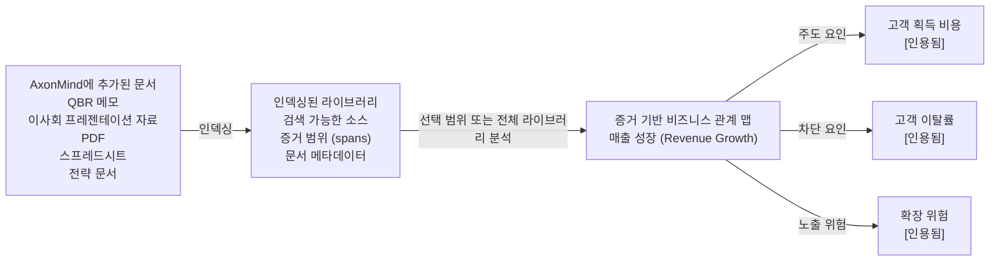

<p align="center">
  
</p>

<h1 align="center">AxonMind Open</h1>

<p align="center">
  <a href="README.md">English</a> | <a href="README.zh.md">简体中文</a> | <a href="README.it.md">Italiano</a> | <a href="README.fr.md">Français</a> | <a href="README.de.md">Deutsch</a> | <a href="README.es.md">Español</a> | <a href="README.ja.md">日本語</a> | <strong>한국어</strong>
</p>

<p align="center">
  <strong>AxonMind는 추가한 모든 문서를 증거 기반 비즈니스 지식 그래프로 매핑합니다.</strong>
</p>

<p align="center">
  Rust 엔진 · CLI · TypeScript 타입 · React 훅 · Tauri 데모
</p>

AxonMind Open은 비즈니스 문서를 인덱싱하고, KPI, 동인(drivers), 위험(risks), 결정(decisions), 그리고 지원 증거(evidence)를 추출하여 쿼리 가능한 유형화된 지식 그래프로 연결하는 AxonMind의 오픈 소스 프로젝트입니다. 단일 파일을 분리하여 분석하는 대신, AxonMind는 사용자가 추가하는 모든 문서로부터 지식 기반 라이브러리를 구축합니다. 여기에서 선택한 범위 또는 라이브러리 전체를 분석하여 비즈니스 개념이 서로 어떻게 연결되어 있는지 밝혀낼 수 있습니다.

모든 관계는 소스 증거의 지원을 받으므로, 사용자는 AxonMind가 특정 KPI가 다른 개념에 의해 주도, 차단, 영향력을 받거나 연결되었다고 생각하는 이유를 조사할 수 있습니다. 결과는 블랙박스 요약이 아니라 로컬에서 추적 가능한 비즈니스 관계 맵입니다.

AxonMind는 설명 가능성이 중요한 로컬 우선 비즈니스 인텔리전스, 문서 인텔리전스, 운영 대시보드 및 에이전트 워크플로우를 구축하도록 설계되었습니다.

> **상태:** Rust 엔진과 CLI는 공개 탐색을 위한 출시 준비가 완료되었습니다. 현재 검증: 본 워크스페이스 내에서 `cargo check`, `cargo test`, `cargo fmt`, `cargo clippy`, `bun run typecheck`, `bun run test`, `bun run build` 및 `.app` 번들 빌드가 모두 성공적으로 패스했습니다.

## 사용해 보아야 하는 이유

- **라이브러리 우선 문서 인텔리전스.** 문서를 로컬 워크스페이스에 드래그 앤 드롭하여 단 한 번 인덱싱하면, 비즈니스 컨텍스트의 성장에 따라 선택한 파일, 폴더 또는 전체 문서 라이브러리를 분석할 수 있습니다.
- **증거 우선 그래프 구축.** 에지(edge)는 저장소 레이어에서 증거 참조를 필수적으로 요구합니다. AxonMind가 소스 텍스트를 지목할 수 없는 경우, 해당 관계를 생성하지 않습니다.
- **기본 로컬 실행.** 워크스페이스는 메모리 내 `petgraph` 캐시와 함께 SQLite에 저장됩니다. 기본 규칙 추출기에는 계정 생성, 호스팅된 제어 평면(control plane) 또는 클라우드 종속성이 필요하지 않습니다.
- **CLI로 즉시 활용 가능.** 리포지토리에 포함된 샘플 문서를 인덱싱하고 1분 이내에 실제 지식 그래프를 쿼리해 보세요.
- **임베디드 아키텍처.** Rust 엔진을 직접 사용하거나, CLI를 호출하거나, AI 에이전트를 위한 MCP 서버를 실행하거나, TypeScript 전송 인터페이스를 통해 React/Tauri UI를 연결하세요.
- **선택적 LLM 활용.** 규칙 기반의 확정적 추출은 설정 없이 바로 동작합니다. 더 광범위하고 자유로운 추론을 원할 때 선택적 LLM 제공업체를 연결하여 추출 결과를 강화할 수 있습니다.

## 주요 기능

AxonMind는 성장하는 지식 라이브러리를 비즈니스 관계 맵으로 변환합니다.

먼저 문서를 워크스페이스에 드롭합니다. AxonMind는 소스 참조와 검색 가능한 텍스트를 보존하면서 문서를 로컬 라이브러리에 인덱싱합니다. 그런 다음 분석 범위를 설정합니다. 하나의 문서, 선택한 문서 그룹 또는 라이브러리의 모든 문서 중 선택할 수 있습니다. AxonMind는 해당 범위를 분석하여 KPI, 위험, 의사 결정, 동인, 차단 요인 및 이들 사이의 증거 기반 관계를 찾아냅니다.

```text
AxonMind에 추가된 문서                     인덱싱된 라이브러리                    증거 기반 비즈니스 관계 맵
---------------------                     -------------------                    --------------------------
QBR 메모, 이사회 자료, PDF,         ->    검색 가능한 소스                ->     매출 성장 (Revenue Growth)
스프레드시트, 전략 문서                         증거 범위 (spans)                             | 주도 요인 -> 고객 획득 비용 [인용됨]
                                                문서 메타데이터                               | 차단 요인 -> 고객 이탈률     [인용됨]
                                                                                              | 노출 위험 -> 확장 위험       [인용됨]
```



실제 업무에서 AxonMind는 문서를 하나씩 다시 읽는 대신 문서 전체를 관통하는 비즈니스 질문을 던질 수 있도록 돕습니다.

- 어떤 KPI가 촉진되거나 차단되거나 혹은 위험에 처해 있는가?
- 어떤 문서가 특정 관계에 대한 증거를 포함하고 있는가?
- 라이브러리 전반에 걸쳐 공통적으로 나타나는 의사 결정, 위험 또는 가정은 무엇인가?
- 보고서, 회의록, 슬라이드 및 계획 전반에서 하나의 메트릭이 다른 메트릭과 어떻게 연결되는가?

그 후에 다음과 같은 작업을 수행할 수 있습니다.

- 특정 KPI에 초점을 맞추고 동인, 차단 요인, 위험 및 관련 증거를 검사합니다.
- SQLite FTS5를 사용하여 그래프 전체를 검색하거나 추론 기반 문서 검색을 활용합니다.
- 내장된 MCP 서버를 통해 AI 에이전트에 지식 그래프를 제공합니다.
- 그래프 상태를 JSON으로 내보내거나 가져옵니다.
- 자체 제품 UI 뒤에 엔진을 임베드합니다.
- Brain Map, 문서 목록 및 좌우 배치형 검사기 뷰를 제공하는 로컬 Tauri 데모 앱을 실행합니다.

**범위 외 사항:** 호스팅되는 SaaS, 결제 시스템, 클라우드 동기화, SSO, RBAC, 팀 관리 또는 관리형 제어 평면.

## 빠른 시작

리포지토리의 `fixtures/sample.md`에 샘플 비즈니스 검토 문서가 포함되어 있습니다. API 키와 구성 파일 없이 그래프를 빌드하고 쿼리할 수 있습니다.

```bash
# 1. 로컬 워크스페이스를 생성합니다.
cargo run -p axonmind_cli -- init --workspace ./demo

# 2. 샘플 문서 라이브러리를 인덱싱합니다.
cargo run -p axonmind_cli -- index ./fixtures --workspace ./demo

# 예상 출력 형태:
# Indexed: 1 files, 4 nodes, 5 edges, 3 evidence, 0 skipped, 0 errors

# 3. 샘플 KPI에 집중하여 조회합니다.
cargo run -p axonmind_cli -- query --workspace ./demo focus-kpi kpi.revenue_growth

# 4. 그래프를 검색하거나 JSON 결과를 반환받습니다.
cargo run -p axonmind_cli -- search "revenue" --workspace ./demo
cargo run -p axonmind_cli -- query --workspace ./demo --json focus-kpi kpi.revenue_growth

# 5. 추론 기반 검색을 구동하거나 MCP 서버를 시작합니다.
cargo run -p axonmind_cli -- query --workspace ./demo reasoning-search "what drives revenue?"
cargo run -p axonmind_cli -- mcp --workspace ./demo

# 6. 그래프 통계 검사 또는 내보낸 두 스냅샷의 차이 비교.
cargo run -p axonmind_cli -- graph-stats --workspace ./demo
cargo run -p axonmind_cli -- graph-diff before.json after.json
```

기본 규칙 추출기는 헤더에서 KPI를 감지하고, 동일한 단락에 명명된 KPI가 "influences"나 "blocks" 같은 연결 표현과 함께 나타날 때 주도/차단 에지를 생성합니다. 이러한 패턴이 없는 문서는 관계가 없는 KPI 노드만 생성할 수 있으며 이는 정상입니다. 자유로운 텍스트에서 더 복잡하고 유기적인 관계를 찾아내려면 선택적인 LLM 추출 방식을 사용하십시오.

## 데모 앱

AxonMind Open에는 엔진과 React 화면을 함께 작동시켜 볼 수 있는 로컬 Tauri 데모 앱이 포함되어 있습니다.

```bash
bun install
bun run tauri:dev
```

개발 서버가 이미 실행 중인 상태에서 깔끔하게 재시작하려면 다음을 실행하십시오.

```bash
pkill -f "tauri dev"; pkill -f "axonmind-host"; bun tauri dev
```

macOS 용 `.app` 번들을 빌드합니다.

```bash
bun run tauri:build
```

데모 앱은 API 키가 없는 경우 규칙 전용 모드로 작동합니다. LLM 기반의 Brain Map과 더 다채로운 관계 추출을 시험하려면 앱 설정에서 제공업체 API 키를 등록하거나 호환되는 로컬 LLM 서버를 구동하십시오.

지원하는 클라우드 제공업체는 Anthropic, OpenAI, Google Gemini, Groq, DeepSeek, OpenRouter입니다. 지원하는 로컬 서버 경로는 Ollama, LM Studio, llama.cpp, Jan, vLLM입니다.

## 빌드 및 테스트

```bash
cargo fmt --all -- --check
cargo check --workspace
cargo test --workspace
cargo clippy --workspace

bun install
bun run typecheck
bun run test
bun run build
bun run tauri:build
```

현재 로컬 검증은 193개의 Rust 테스트와 19개의 TypeScript 테스트를 다룹니다.

## 선택적 기능

기본 엔진 빌드는 규칙 기반 추출을 사용하며 별도의 선택적 시스템 종속성이 없습니다.

### LLM 추출 기능

다음 명령어로 더 세부적인 추출 기능을 켭니다.

```bash
cargo build -p axonmind_engine --features llm
```

클라우드 제공업체는 API 키를 통해 설정할 수 있습니다. 환경 변수를 통해 구동하는 경우 주로 아래 변수명을 사용합니다.

| 제공업체 | 환경 변수명 |
|---|---|
| Anthropic | `ANTHROPIC_API_KEY` |
| OpenAI | `OPENAI_API_KEY` |
| Google Gemini | `GEMINI_API_KEY` |
| Groq | `GROQ_API_KEY` |
| DeepSeek | `DEEPSEEK_API_KEY` |
| OpenRouter | `OPENROUTER_API_KEY` |

### 환경 변수 설정

템플릿을 복사하여 로컬 환경에 맞는 값을 설정하십시오.

```bash
cp env_example .env
# 또는
cp env_example .env.local
```

현재 `env_example`에 지정된 Codex 기본값:

- `AXONMIND_CODEX_MODEL=gpt-5.4-mini`
- `AXONMIND_CODEX_INTELLIGENCE=low`

`env_example` 파일에 이 두 가지 변수만 있는 이유:

- 이 변수들은 현재 리포지토리에서 직접 읽어오는 Codex 기본 재정의 옵션입니다.
- `AXONMIND_CODEX_MODEL`은 Codex로 그대로 전달되며(`-m`), 유효한 모든 모델 문자열을 허용하므로 새로운 모델이 출시되더라도 보통 Rust 코드를 수정할 필요가 없습니다.
- `AXONMIND_CODEX_INTELLIGENCE`는 현재 `minimal`, `low`, `medium`, `high`, `xhigh` 수준을 지원합니다. 향후 Codex가 완전히 새로운 추론 수준을 추가할 경우 이 매핑과 관련된 코드를 업데이트해야 할 수 있습니다.

선택적인 Codex UI 모델 제안 사항은 앱 설정 디렉토리 내의 `codex_session_options.json`이라는 JSON 파일을 생성하여 구성할 수 있습니다.

- macOS/Linux: `$XDG_CONFIG_HOME/axonmind-open/codex_session_options.json` (또는 `~/.config/axonmind-open/codex_session_options.json`)
- Windows: `%APPDATA%\\axonmind-open\\codex_session_options.json`

구성 파일의 템플릿으로 `codex_session_options.example.json`을 활용하십시오.

주의: AxonMind는 현재 프로세스의 환경 변수를 직접 읽으며 `.env` 또는 `.env.local`을 자동으로 로드하지 않습니다. 앱을 실행하기 전에 셸이나 러너에서 이 환경 변수들을 먼저 내보내기(export/load) 하십시오.

로컬 제공업체(Local Provider)는 관련 서버가 가동 중인 경우 별도의 API 키를 요구하지 않습니다.

| 도구 | 기본 포트 |
|---|---|
| Ollama | `11434` |
| LM Studio | `1234` |
| llama.cpp | `8080` |
| Jan | `1337` |
| vLLM | `8000` |

### OCR 이미지 파싱

로컬 Tesseract를 통해 이미지 OCR을 활성화합니다.

```bash
cargo build -p axonmind_engine --features ocr
```

지원하는 이미지 확장자는 `jpg`, `jpeg`, `png`, `bmp`, `webp`, `tiff`, `tif`, `gif`입니다. 만약 `ocr` 기능이 꺼진 상태에서 이미지 분석을 시도하면 AxonMind는 자동으로 빈 문서를 생성하는 대신 오류를 상세히 반환합니다.

## 개인화된 최적화

AxonMind는 엔진을 다시 빌드하지 않고도 사용자의 비즈니스 언어에 적응할 수 있도록 설계되었습니다. 다른 형태의 Brain Map 카테고리 분류, 명명 스타일, 그룹화 우선순위, 도메인 전문 용어 등이 필요한 경우 프롬프트 템플릿 파일부터 조율하십시오. 그래프 데이터베이스 자체가 새로운 노드나 에지 타입을 지원해야 하는 경우에만 핵심 타입 코드를 변경하십시오.

### Brain Map 카테고리 조정

LLM 기반의 Brain Map 요약 서비스는 `crates/axonmind_engine/src/extract/prompts/`에 위치한 프롬프트 파일 조각들로 조립됩니다.

| 프롬프트 조각 | 사용자 정의 목적 |
|---|---|
| `categorize.system.md` | 맵 정리 에이전트의 전반적인 역할 및 도메인 구조 정의 |
| `categorize.rules.md` | 카테고리 개수, 그룹화 규칙, 헤드라인 노드 규칙 및 이름 명명 제약 조건 |
| `categorize.optimization.md` | 4~8개 카테고리 제한, 깔끔한 레이블링, 노드 간 연결 그룹 선호 등의 품질 속성 정의 |
| `categorize.output.md` | 파서가 정상적으로 분석할 수 있는 JSON 응답 구조 규약 |

특정 워크스페이스를 위한 재정의가 필요하다면, 동일한 파일명으로 `<workspace>/prompts/` 경로 아래에 재정의할 파일을 생성하십시오.

```text
<workspace>/prompts/categorize.system.md
<workspace>/prompts/categorize.rules.md
<workspace>/prompts/categorize.optimization.md
<workspace>/prompts/categorize.output.md
```

워크스페이스 내의 프롬프트 파일들은 내장된(built-in) 기본 프롬프트보다 우선적으로 선택되며, 워크스페이스의 재정의 파일을 삭제하면 다시 기본 템플릿으로 롤백됩니다.

### 추출 동작 세부 조율

- 기존의 그래프 용어집을 유지하면서 인공지능이 또 다른 비즈니스 개념을 파싱하도록 지시하려면 `crates/axonmind_engine/src/extract/openai.rs` 및 `crates/axonmind_engine/src/extract/seeyoo.rs` 내의 LLM 추출 명령어를 수정하십시오.
- 인공지능을 거치지 않는 결정론적 규칙 추출이 또 다른 제목 유형, 특정 구절, 메트릭 용어, 혹은 관계를 나타내는 동사들을 감지하도록 조율하려면 `crates/axonmind_engine/src/extract/rules.rs`를 수정하십시오.
- 사용자의 비즈니스 문서들이 기존의 `NodeKind` 또는 `EdgeKind` 값들에 매핑되는 다른 단어들을 사용하고 있다면 `crates/axonmind_engine/src/extract/normalize.rs` 내의 별칭 정리 목록을 보강하십시오.

### 그래프 용어(Taxonomy) 체계 변경

최우선 클래스인 노드나 에지의 종류를 직접 추가, 삭제, 혹은 이름을 바꾸어야 하는 경우 `crates/axonmind_core/src/node.rs` 및 `crates/axonmind_core/src/edge.rs`에 선언된 핵심 구조를 업데이트하십시오. 그 후 여기에 의존하는 추출기 정규화 코드, UI 화면 표시 로직, TypeScript 규약 파일, 테스트용 픽스처 및 유닛 테스트 코드를 함께 고쳐야 합니다.

대략적인 기준: 기본 구조는 알맞으나 카테고리 분류가 다소 어색하다면 프롬프트를 조정하십시오. 문서 내의 표현만 다른 것이라면 정규화 규칙을 수정하십시오. 그래프 자체가 새로운 형태의 정보 모델을 담아야 한다면 핵심 소스코드를 편집하십시오.

## 리포지토리 구조

```text
crates/
  axonmind_core/    도메인 타입 정의, 증거(Evidence) 모델, 신뢰도 모델
  axonmind_engine/  그래프 저장소, 수집/인덱싱, 관계 추출, 쿼리 엔진, 비동기 워커
  axonmind_tauri/   선택적 Tauri v2 어댑터
  axonmind_cli/     CLI 바이너리 실행 파일
  seeyoo_llm/       멀티 프로바이더 LLM 클라이언트

packages/
  @axonmind/types   Rust 코드로부터 자동 생성된 TypeScript 인터페이스 타입
  @axonmind/react   React 컨텍스트 프로바이더, 커스텀 훅, 그래프 데이터 변환 어댑터, UI 컴포넌트

migrations/         SQLite 스키마 마이그레이션 파일들
fixtures/           빠른 실행 및 테스트를 위한 샘플 문서
src-tauri/          로컬 데모 프로그램의 메인 호스트 코드
```

## 포함된 기능

| 기능 | 상세 내용 |
|---|---|
| 그래프 저장소 | SQLite 기반 데이터 저장소 (WAL 모드 지원 및 `petgraph` 메모리 캐시 지원) |
| 문서 수집/파싱 | 마크다운, 일반 텍스트, PDF, DOCX, 스프레드시트, HTML 파싱 및 선택적 이미지 OCR |
| 관계 추출 | 기본적 규칙 감지 엔진 내장 및 선택적 LLM 관계 추출 지원 |
| 분석 범위 제어 | 단일 문서 분석, 일부 선택 문서군 분석, 혹은 인덱싱된 전체 라이브러리 분석 |
| 비즈니스 쿼리 | 특정 KPI 집중 탐색, KPI 분석 설명, 증거 찾기, 영향 반경 계산, 결정 추적, 추천 액션 제안, 그래프 검색, 추론 검색 |
| 그래프 비교 | 두 그래프 스냅샷 간의 타입 지정된 이전/이후 비교 — 변경된 필드 목록과 함께 추가, 수정 및 제거된 노드와 에지 표시 |
| 그래프 통계 | 엔진 메서드, CLI 및 MCP 도구를 통한 유형별 노드 수 및 총 에지 수 |
| 증거 추적성 | 관계를 나타내는 연결선과 원문 텍스트 내 스팬 정보가 일급 시민 데이터로 저장됨 |
| 비동기 워커 | KPI 자동 감지 및 KPI 재계산 인프라 탑재 |
| SDK 지원 | 자동 생성된 TypeScript 타입 정의, React 전용 훅, Tauri 인터페이스 계층 제공 |
| 연동성 | AI 에이전트를 위한 표준 MCP(Model Context Protocol) 서버 |
| 데모 환경 | Brain Map 시각화 화면, 문서 관리 목록, 그래프 비교 모달, 좌우 배치형 속성 검사기 및 설정 화면을 탑재한 로컬 Tauri 앱 |

## 주요 불변값

- 모든 에지(연결선)는 최소한 하나 이상의 증거(Evidence) 노드를 참조하고 있어야 합니다.
- 데이터베이스의 모든 변경 작업은 오직 `GraphMutation`만을 통과해야 합니다.
- `search_index`는 SQLite의 데이터베이스 트리거에 의존하지 않고 소스코드 내에서 명시적으로 변경 시점에 동기화됩니다.
- 수집된 원본 파일들은 `blobs/<sha256>` 파일명으로 복사되어 보관되므로, 이후의 모든 재계산 작업은 원래의 상대/절대 파일 경로에 종속되지 않습니다.

## 알려진 제한 사항

- 기본 탑재된 규칙 추출기는 매우 보수적으로 필터링하도록 프로그래밍되어 있습니다. 복잡한 줄글에서 다채로운 맥락적 관계를 이끌어내려면 LLM 추출을 사용하십시오.
- 기본 구성된 `tauri:build` 스크립트에는 DMG 설치 파일 제작 패키징 설정이 빠져 있습니다. 공식적으로 검증된 데스크톱 빌드 타겟은 macOS `.app` 번들입니다.
- Claude Code 및 Antigravity CLI 세션 인증은 실험적 기능입니다. 해당 서비스 제공업체들이 엔드포인트별 특수 헤더를 요구할 수 있습니다.

## CLI 세션 인증 상태

- 테스트 완료: Tauri 앱 내에서 Codex CLI 로그인/세션 기반의 LLM 프로바이더 경로가 정상적으로 동작함을 확인했습니다.
> Codex의 기본 탑재 모델은 `gpt-5.4-mini`이며, 기본 지능 지수 등급은 `low`입니다. OpenAI 및 Codex 측의 사정에 따라 사용 가능한 모델 목록은 수시로 변경될 수 있으므로, 항상 Codex CLI 공식 문서를 통해 최신 옵션을 조회하십시오. 모델을 강제로 재정의하려면 `AXONMIND_CODEX_MODEL` 변수를 사용하고 지능 수준을 강제하려면 `env_example` 파일 내용과 같이 `AXONMIND_CODEX_INTELLIGENCE` (`minimal|low|medium|high|xhigh`) 변수를 사용하십시오.

## 페이지 인덱싱 기능

### 기존 파일의 재인덱싱 요구 사항

`page_*` 테이블 (page_sections, page_section_fts)은 수집 작업 말미에 `run_ingest_tail`을 거쳐 구동되는 `pageindex::index_document`에 의해 채워집니다. 현 빌드 세션 이전에 예전 데이터베이스에 미리 인덱싱되어 있던 문서들은 해당 테이블에 매칭되는 행이 존재하지 않으므로, UI에서 "Search Contents (본문 검색)"을 실행하더라도 조회되는 결과가 없습니다.

`index_document` 내부에 탑재된 실시간 노후화 검사(staleness check)가 이를 감지합니다. 각 문서의 `page_tree_sha` 값을 대조한 후, 해당 값이 누락되어 있다면(과거의 모든 문서가 이에 해당합니다) 본문 섹션 구조 트리를 다시 설계하여 저장합니다. 따라서, 문서를 다시 수집하는 것만으로 충분합니다.

### UI에서 처리하는 방법

Processed Files (처리 완료된 파일) 화면 진입 후: 전체 문서 선택 → Regenerate selected (선택된 파일 재생성) 버튼을 클릭하십시오. 이렇게 하면 이미 저장소에 보관된 파일 blob을 재사용(다시 업로드할 필요 없음)하여 파일을 분석하고, 섹션 구조를 빌드한 후 데이터베이스에 씁니다. 만약 인공지능(AI) 제공업체가 꺼져 있다면 이 작업은 규칙(Rule) 엔진만 사용하므로 단 몇 밀리초 내에 빠르게 끝납니다.

또는 문서 개별적으로 수행하려는 경우: Actions 열의 Regenerate (재생성) 버튼을 눌러 개별 문서를 하나씩 다시 분석할 수 있습니다.

### CLI에서 처리하는 방법

`axonmind index <문서경로> --workspace <작업디렉토리>`

주의: `--skip-unchanged` 옵션을 붙이지 않고 인덱싱 명령을 가동하면 변경되지 않은 파일들도 모두 강제로 재수집하여 페이지 인덱싱 테이블을 갱신합니다. 만약 `--skip-unchanged`를 활성화하면 변경사항이 없는 문서는 분석을 즉시 건너뛰며 pageindex 라이프사이클 훅까지 도달하지 못하므로, 본 작업 중에는 해당 플래그를 붙이지 마십시오.

### 영향을 받지 않는 부분

섹션 문서 구조 트리는 오직 파일 파싱 구조 자체에만 의존하여 생성됩니다. 즉, `pageindex_enrich = true` (기본값 false) 옵션을 수동으로 켜지 않는 한 LLM의 도움을 받지 않습니다. 따라서 AI API를 연결하지 않고 단순히 기존 문서를 재분석하는 작업은 매우 저렴합니다 (Blob 읽기 → 헤더 계층 구조 트리 빌드 → SQLite FTS 테이블 작성). 이때 그래프 상의 노드와 에지들도 데이터베이스에 다시 기록(upsert)되지만, 대부분은 이미 존재하는 정보여서 변경 없이 빠르게 넘어갑니다.

### AI 추출 방식의 재생성 및 분석은 오랜 시간이 걸릴 수 있습니다

**시간이 지체되는 원인.** AI 추출 방식을 사용한 문서 재생성은 세 가지 LLM 파이프라인 단계를 거칩니다.

1. 엔티티 추출 — 문서당 1회의 API 호출 (매우 빠름, ~2초 소요)
2. 관계 추출 — 문단 하나에 나열된 모든 엔티티 쌍(Entity Pair)마다 각각 1회의 API 호출 (코드 196-216라인 참고). 예를 들어 한 문단 안에 8개의 개별 엔티티 명사가 언급되었다면 총 28회의 API 호출이 필요합니다. 이러한 문단이 문서 전체에 5개만 있어도 140회의 호출이 발생하며, 호출당 2초씩 잡아도 하나의 문서를 파싱하는 데 5분 이상 소요됩니다.
3. 의미론적 연결망 구성 — 최종 1회 추가 호출

N²으로 승산되는 엔티티 쌍 비교 루프가 지연의 가장 지배적인 원인입니다. UI 화면상에서 "Regenerating… (AI, may take a while)"과 같은 경고를 띄워 주기는 하나, 백그라운드에 대기 중인 실제 호출 개수까지 자세히 보여주지는 못합니다.

**작업이 먹통이 되었는지 정상 진행 중인지 판별하는 법.** API 제공업체의 관리자 대시보드에서 실시간 요청 횟수가 유의미하게 늘어나고 있다면 정상적으로 동작 중입니다. 만약 다음 상황에 처해 있다면 오류나 교착 상태를 의심해야 합니다.
- 2분 넘게 클라우드 API 호출 활동이 감지되지 않음
- 로컬 컴퓨터의 프로세스 CPU 사용률이 0%에 수렴함

대처 방법 요약:

- 그대로 기다립니다. 엔티티 정보가 조밀하게 들어찬 대형 문서의 경우, 문서당 5~10분 소요되는 것이 기술적으로 정상입니다.
- 임시로 AI를 끄고 문서 구조만 갱신합니다. 앱 설정(Settings) 화면에서 API 키 연결을 해제한 후 Regenerate 작업을 클릭하십시오. 규칙 감지 추출 방식은 단 수 밀리초 만에 끝나며, 본문 검색 기능에 필요한 페이지 섹션 구조 FTS가 완벽히 구축됩니다. 작업 완료 후 다시 API 키를 입력하여 재연결해 두십시오.
- LLM 요금이나 지연 없이 대량의 문서를 터미널에서 즉시 백필하는 CLI 명령어 예시:
# 설정에 LLM 키가 등록되어 있지 않은 경우 → 규칙 엔진 + 페이지 인덱싱 모드로 매우 빠르게 분석됨
`axonmind index <문서경로> --workspace <작업디렉토리>`

### 앞으로 개선되어야 할 기능 (TODO)

기존에 탑재된 `rebuild-search-index` 도구와 유사하게, document_cache에 누적된 바이너리 데이터를 바탕으로 그래프 데이터 자체에는 전혀 영향을 주지 않으면서 page_* 테이블들만 골라 조용히 백필해 주는 전용 `rebuild-page-index` 명령어가 추가되면 향후 훨씬 깔끔하게 조치할 수 있을 것입니다. 다만 현 릴리스 기준으로는 아직 구현되어 있지 않습니다.

## TODO
1. Claude Code 및 Antigravity LLM 프로바이더 연동 경로를 엔드투엔드로 테스트합니다.
2. 위에서 논의된 전용 rebuild-page-index 복구 명령어를 설계 및 탑재합니다.

## 기여

### 🚀 기여 정책
**본 리포지토리에서는 현재 외부 오픈 소스 코드 기여(풀 리퀘스트/PR)를 수용하지 않고 있습니다.** 이는 Axonmind 상용 배포 패키지의 명확한 지식재산권 독점 소유권을 확보하고 유지하기 위함입니다.

### 기여에 참여하는 법
하지만 우리는 커뮤니티의 다양한 다른 형태의 의견 교류와 참여를 적극 환영하며 소중히 여깁니다: **버그 제보**, **기능 개선 제안**, **문서 보강 기여** 등이 이에 해당합니다.
> 새로운 제안을 작성하기 전에 [GitHub Issues](https://github.com/seeyooHK/axonmind-open/issues)를 먼저 검색하여 유사한 논의가 미리 열려 있는지 대조해 주시기 바랍니다.

자세한 지침은 [CONTRIBUTING.md](CONTRIBUTING.md) 파일을 참조하십시오.

## 라이선스

[AGPL-3.0-or-later](LICENSE)
