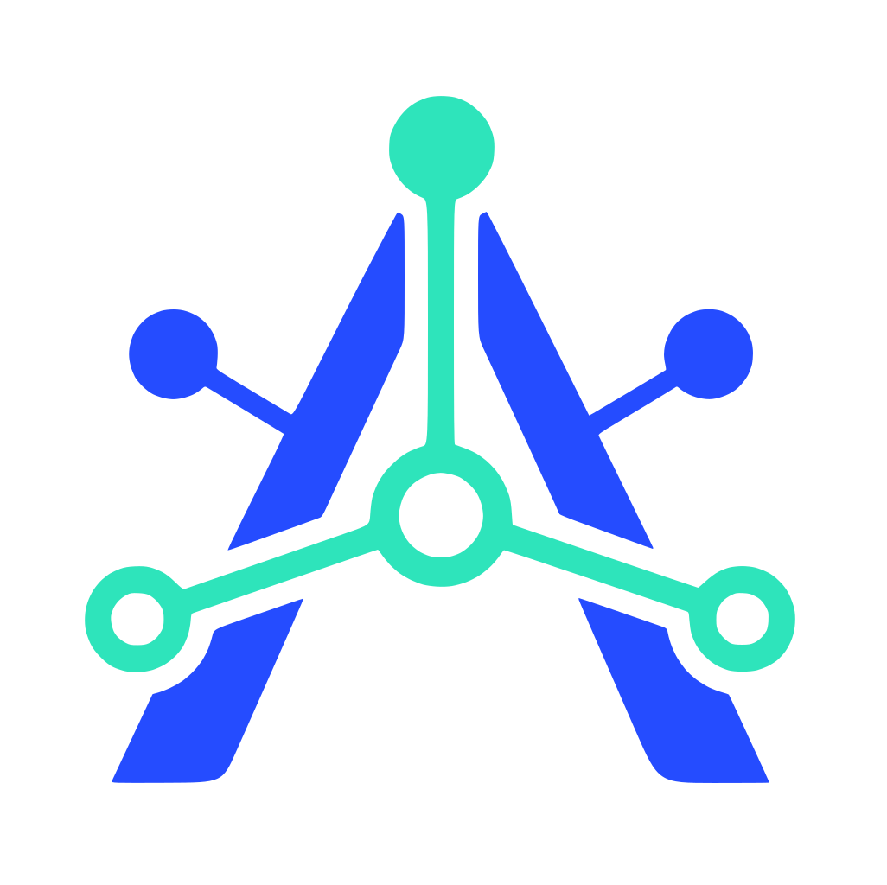
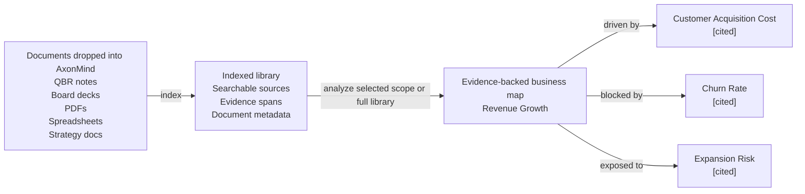

<p align="center">
  
</p>

<h1 align="center">AxonMind Open</h1>

<p align="center">
  <strong>AxonMind Map every document you drop into an evidence-backed business knowledge graph.</strong>
</p>

<p align="center">
  Rust engine · CLI · TypeScript types · React hooks · Tauri demo
</p>

AxonMind Open is the open-sourced project of AxonMind, which indexes business documents, extracts KPIs, drivers, risks, decisions, and supporting evidence, then connects them into a typed knowledge graph you can query. Instead of analyzing one file in isolation, AxonMind builds a knowledge base library from all documents you drop into it. From there, you can analyze a selected scope or the entire library to uncover how business concepts relate to each other.

Every relationship is backed by source evidence, so users can inspect why AxonMind believes a KPI is driven by, blocked by, influenced by, or connected to another concept. The result is a local, traceable business map rather than a black-box summary.

AxonMind is designed to build local-first business intelligence, document intelligence, operating dashboards, and agent workflows where explainability matters.

> **Status:** Rust engine and CLI are release-ready for public exploration. Current validation: `cargo check`, `cargo test`, `cargo fmt`, `cargo clippy`, `bun run typecheck`, `bun run test`, `bun run build`, and `.app` bundle build all pass in this workspace.

## Why Try It

- **Library-first document intelligence.** Drop documents into a local workspace, index them once, and analyze selected files, folders, or the full document library as your business context grows.
- **Evidence-first graph construction.** Edges require evidence references at the storage layer. If AxonMind cannot point back to source text, it does not create the relationship.
- **Local by default.** Workspaces live in SQLite with an in-memory `petgraph` cache. No account, hosted control plane, or cloud dependency is required for the default rule extractor.
- **Useful immediately from the CLI.** Index the included sample document and query a real graph in under a minute.
- **Embeddable architecture.** Use the Rust engine directly, call the CLI, or connect a React/Tauri UI through the TypeScript transport interface.
- **LLM-optional.** Deterministic extraction works out of the box. Optional LLM providers can enrich extraction when you want broader free-form reasoning.

## What It Does

AxonMind turns a growing knowledge base library into a business relationship map.

First, drop documents into a workspace. AxonMind indexes them into a local library, preserving source references and searchable text. Then choose the analysis scope: one document, a selected group of documents, or everything in the library. AxonMind analyzes that scope to find KPIs, risks, decisions, drivers, blockers, and evidence-backed relationships between them.

```text
documents dropped into AxonMind          indexed library                evidence-backed business map
-------------------------------          ---------------                ----------------------------
QBR notes, board decks, PDFs,      ->     searchable sources      ->     Revenue Growth
spreadsheets, strategy docs               evidence spans                  | driven by  -> Customer Acquisition Cost [cited]
                                         document metadata                | blocked by -> Churn Rate                [cited]
                                                                          | exposed to -> Expansion Risk            [cited]
```



In practice, AxonMind helps you ask business questions across documents instead of rereading them one by one:

- Which KPIs are being driven, blocked, or put at risk?
- Which documents contain the evidence for a relationship?
- What decisions, risks, or assumptions keep appearing across the library?
- How does one metric connect to another across reports, notes, decks, and plans?

You can then:

- focus on a KPI and inspect its drivers, blockers, risks, and related evidence
- search across the graph with SQLite FTS5
- export or import graph state as JSON
- embed the engine behind your own product UI
- run a local Tauri demo app with Brain Map, documents, and inspector views

**Not in scope:** hosted SaaS, billing, cloud sync, SSO, RBAC, team management, or a managed control plane.

## Quickstart

The repository includes a sample business review in `fixtures/sample.md`. Build and query a graph with no API key and no config file:

```bash
# 1. Create a local workspace.
cargo run -p axonmind_cli -- init --workspace ./demo

# 2. Index the sample document library.
cargo run -p axonmind_cli -- index ./fixtures --workspace ./demo

# Expected shape:
# Indexed: 1 files, 4 nodes, 5 edges, 3 evidence, 0 skipped, 0 errors

# 3. Focus on the sample KPI.
cargo run -p axonmind_cli -- query --workspace ./demo focus-kpi kpi.revenue_growth

# 4. Search the graph or return JSON.
cargo run -p axonmind_cli -- search "revenue" --workspace ./demo
cargo run -p axonmind_cli -- query --workspace ./demo --json focus-kpi kpi.revenue_growth
```

The default rule extractor detects KPIs from headings and creates driver/blocker edges when named KPIs appear in the same paragraph with linking language such as "influences" or "blocks". Documents without those patterns may produce KPI nodes without relationships; that is expected. Use optional LLM extraction when you need richer relationship discovery from free-form prose.

## Demo App

AxonMind Open includes a local Tauri demo app for trying the React surfaces against the engine.

```bash
bun install
bun run tauri:dev
```

If the dev server is already running and you want to restart it cleanly, use:

```bash
pkill -f "tauri dev"; pkill -f "axonmind-host"; bun tauri dev
```

Build the macOS `.app` bundle:

```bash
bun run tauri:build
```

The demo works in rule-only mode without an API key. For LLM-backed Brain Map and richer extraction, add a provider key in the app settings or run a compatible local model server.

Supported cloud providers include Anthropic, OpenAI, Google Gemini, Groq, DeepSeek, and OpenRouter. Supported local server paths include Ollama, LM Studio, llama.cpp, Jan, and vLLM.

## Build And Test

```bash
cargo fmt --all -- --check
cargo check --workspace
cargo test --workspace
cargo clippy --workspace

bun install
bun run typecheck
bun run test
bun run build
bun run tauri:build
```

Current local validation covers 159 Rust tests and 19 TypeScript tests.

## Optional Features

The default engine build uses deterministic rule extraction and has no optional system dependencies.

### LLM extraction

Enable richer extraction with:

```bash
cargo build -p axonmind_engine --features llm
```

Cloud providers can be configured with API keys. If you use env-driven startup, these are common variable names:

| Provider | Environment variable |
|---|---|
| Anthropic | `ANTHROPIC_API_KEY` |
| OpenAI | `OPENAI_API_KEY` |
| Google Gemini | `GEMINI_API_KEY` |
| Groq | `GROQ_API_KEY` |
| DeepSeek | `DEEPSEEK_API_KEY` |
| OpenRouter | `OPENROUTER_API_KEY` |

### Environment Settings

Copy the template and set values for your local environment:

```bash
cp env_example .env
# or
cp env_example .env.local
```

Current Codex defaults in `env_example`:

- `AXONMIND_CODEX_MODEL=gpt-5.4-mini`
- `AXONMIND_CODEX_INTELLIGENCE=low`

Why `env_example` only includes these two variables:

- They are the Codex default overrides currently read directly by this repo.
- `AXONMIND_CODEX_MODEL` is passed through to Codex (`-m`) and accepts any valid model string, so new model names usually do not require Rust code changes.
- `AXONMIND_CODEX_INTELLIGENCE` currently supports `minimal`, `low`, `medium`, `high`, and `xhigh`. If Codex adds a brand-new reasoning level in the future, this mapping may need a code update.

Optional Codex UI model suggestions can be configured with a JSON file named `codex_session_options.json` in the app config directory:

- macOS/Linux: `$XDG_CONFIG_HOME/axonmind-open/codex_session_options.json` (or `~/.config/axonmind-open/codex_session_options.json`)
- Windows: `%APPDATA%\\axonmind-open\\codex_session_options.json`

Use `codex_session_options.example.json` as a template.

Note: AxonMind currently reads process environment variables directly and does not auto-load `.env` or `.env.local`. Load/export these variables in your shell or runner before starting the app.

Local providers do not require an API key when their server is already running:

| Tool | Default port |
|---|---|
| Ollama | `11434` |
| LM Studio | `1234` |
| llama.cpp | `8080` |
| Jan | `1337` |
| vLLM | `8000` |

### OCR image ingestion

Enable image OCR via local Tesseract:

```bash
cargo build -p axonmind_engine --features ocr
```

Supported image extensions include `jpg`, `jpeg`, `png`, `bmp`, `webp`, `tiff`, `tif`, and `gif`. If image ingestion is attempted without the `ocr` feature, AxonMind returns a clear error instead of silently producing an empty document.

## Personalized Optimization

AxonMind is designed to be adapted to your own business language without rewriting the engine. Start with prompts when you want different Brain Map categories, naming style, grouping priorities, or domain vocabulary. Change core types only when you need the graph itself to support new node or edge kinds.

### Tune Brain Map categories

The LLM-powered Brain Map summary is assembled from prompt fragments in `crates/axonmind_engine/src/extract/prompts/`:

| Fragment | Use it to customize |
|---|---|
| `categorize.system.md` | The overall role and domain framing for the map organizer |
| `categorize.rules.md` | Category count, grouping rules, headline-node rules, and naming constraints |
| `categorize.optimization.md` | Quality preferences such as 4-8 categories, clean labels, and connected groups |
| `categorize.output.md` | The JSON response contract expected by the parser |

For a specific workspace, create override files under `<workspace>/prompts/` using the same fragment keys:

```text
<workspace>/prompts/categorize.system.md
<workspace>/prompts/categorize.rules.md
<workspace>/prompts/categorize.optimization.md
<workspace>/prompts/categorize.output.md
```

Workspace prompt overrides win over the built-in prompts, and deleting an override returns that fragment to the built-in default.

### Tune extraction behavior

- Change LLM extraction instructions in `crates/axonmind_engine/src/extract/openai.rs` and `crates/axonmind_engine/src/extract/seeyoo.rs` when you want the model to extract different business concepts while keeping the existing graph vocabulary.
- Change deterministic rule extraction in `crates/axonmind_engine/src/extract/rules.rs` when you want no-LLM behavior to recognize different headings, phrases, metrics, or relationship language.
- Change normalization aliases in `crates/axonmind_engine/src/extract/normalize.rs` when your documents use different words for existing `NodeKind` or `EdgeKind` values.

### Change the graph vocabulary

If you need to add, remove, or rename first-class node or edge kinds, update the core taxonomy in `crates/axonmind_core/src/node.rs` and `crates/axonmind_core/src/edge.rs`. Then update any extractor normalization, UI display logic, TypeScript contracts, fixtures, and tests that depend on those kinds.

As a rule of thumb: if the existing categories are right but the grouping feels wrong, tune prompts. If the documents use different wording for the same concepts, tune normalization. If the product needs concepts the graph cannot currently represent, change the core taxonomy.

## Repository Layout

```text
crates/
  axonmind_core/    Domain types, evidence model, confidence model
  axonmind_engine/  Store, ingestion, extraction, queries, workers
  axonmind_tauri/   Optional Tauri v2 adapter
  axonmind_cli/     CLI binary
  seeyoo_llm/       Multi-provider LLM client

packages/
  @axonmind/types   TypeScript contracts generated from Rust types
  @axonmind/react   React provider, hooks, graph adapter, UI components

migrations/         SQLite schema migrations
fixtures/           Sample documents for quickstart and tests
src-tauri/          Minimal local demo host
```

## Included Capabilities

| Capability | Detail |
|---|---|
| Graph store | SQLite-backed store with WAL mode and `petgraph` cache |
| Ingestion | Markdown, text, PDF, DOCX, spreadsheets, HTML, optional image OCR |
| Extraction | Deterministic rules by default; optional LLM extraction |
| Scope analysis | Analyze one document, selected documents, or the full indexed library |
| Queries | KPI focus, graph search, evidence lookup, impact radius, trace decision, suggest actions |
| Evidence | Relationship citations and source spans are first-class graph data |
| Workers | KPI discovery and KPI recomputation infrastructure |
| SDK | Generated TypeScript types, React hooks, Tauri transport |
| Demo | Local Tauri app with Brain Map, document list, inspector, and settings |

## Key Invariants

- Every edge requires at least one evidence reference.
- All writes go through `GraphMutation`.
- `search_index` is synchronized manually on mutation, not by SQLite triggers.
- Ingested files are copied into `blobs/<sha256>` so recomputation does not depend on the original path.

## Known Limitations

- The default rule extractor is intentionally conservative. Use LLM extraction for richer relationship discovery in free-form prose.
- DMG packaging is not part of the default `tauri:build` script; the validated desktop build target is the macOS `.app` bundle.
- Claude Code and Antigravity CLI session auth are experimental because those providers may require additional endpoint-specific headers.

## CLI Session Auth Status

- Tested: Codex CLI login/session-based LLM provider path works in the Tauri app.
> The default model selected for Codex is `gpt-5.4-mini`, and the default intelligence level is `low`. OpenAI and Codex might change available models at any time, so please check the Codex CLI documentation for the latest information. Model overrides use `AXONMIND_CODEX_MODEL` (pass-through), and intelligence overrides use `AXONMIND_CODEX_INTELLIGENCE` (`minimal|low|medium|high|xhigh`) as shown in `env_example`.

## Page Indexing Features

### Re-indexing is needed for existing files

The `page_*` tables (page_sections, page_section_fts) are populated by pageindex::index_document, which runs at the end of every ingest via `run_ingest_tail`. Documents that were indexed before this session have no rows in those tables — so "Search Contents" returns nothing for them.

The staleness check in `index_document` confirms this: it looks up `page_tree_sha` for each document and, if it's missing (which it is for all pre-existing docs), builds and stores the section tree. So re-triggering ingest is enough.

### What to do in the UI

In the Processed Files view: select all documents → Regenerate selected. This reads from the already-stored blob (no re-upload needed), re-parses the file, rebuilds the section tree, and stores it. If no AI provider is connected, it's fast — rule extraction only, no LLM calls.

Alternatively, per-document: the Regenerate button in the Actions column does the same for one file at a time.

### What to do from the CLI

`axonmind index <path> --workspace <dir>`

Without `--skip-unchanged`, this re-ingests all files and populates the page index. With `--skip-unchanged` it bails out early for unchanged files and never reaches the pageindex hook — so don't use that flag for this purpose.

### What this does not touch

The section tree is built purely from the parsed document structure — no LLM extraction involved unless pageindex_enrich = true (which defaults to false). So re-ingesting existing files without an AI provider is cheap: parse from blob → build headings tree → write to SQLite FTS. The graph nodes and edges also get re-upserted but that's lightweight (they already exist, so it's mostly no-ops).

### Regeneration and Generation with AI might take long

**What's eating the time.** Regeneration has three LLM phases:

1. Entity extraction — one API call per document (fast, ~2s)
2. Relation extraction — one API call per entity pair per paragraph (line 196-216). If a paragraph mentions 8 entities, that's 28 calls. A document with 5 such paragraphs is 140 calls. At ~2s/call that's ~5 minutes per document alone.
3. Semantic linking — one more call

The N² entity-pair loop is the dominant cost. The UI already warns "Regenerating… (AI, may take a while)" but doesn't surface how many calls are actually queued.

**How to tell if it's hung vs. working.** It's working if your API provider dashboard shows ongoing requests. It's hung if:
- No API activity for >2 minutes
- The app process is using no CPU

Practical options right now:

- Let it run. If the files are entity-dense documents, 5–10 min each is expected.
- Disable the provider first, then regenerate. Go to Settings, disconnect the API key, then regenerate. Rule extraction only takes milliseconds — the pageindex section tree gets rebuilt (which is all you actually need for Search Contents) and no LLM calls are made. Reconnect the provider after (but with the costs of lower quality).
- CLI alternative for bulk backfill without LLM cost:
# No LLM key in config → rule-only + pageindex, very fast
`axonmind index <path> --workspace <dir>`

### Future improvement worth noting (TODO)

A dedicated rebuild-page-index command — analogous to the existing rebuild-search-index — that walks document_cache, reads each blob, and populates page_* without touching graph tables at all. That would be the cleanest backfill path, but it doesn't exist yet.

## TODO
1. Test Claude Code and Antigravity LLM provider paths end-to-end.
2. A dedicated rebuild-page-index command mentioned above.

## Contributing
### 🚀 Contribution Policy
 **We do not accept public code contributions (pull requests) to this repository at this time.** This allows us to maintain clear intellectual property ownership of the codebase for Axonmind commercial distribution.

### How to contribute
 We still welcome and value community participation in other forms: **Bug Reports**, **Feature Requests** and **Documentation**.
> Please check the [GitHub Issues](https://github.com/seeyooHK/axonmind-open/issues) to see if a topic is already being discussed.

Details see [CONTRIBUTING.md](CONTRIBUTING.md).

## License

[AGPL-3.0-or-later](LICENSE)
