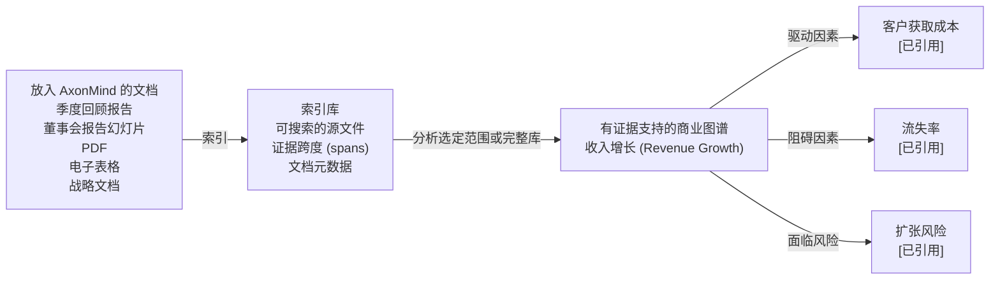

<p align="center">
  
</p>

<h1 align="center">AxonMind Open</h1>

<p align="center">
  <a href="README.md">English</a> | <strong>简体中文</strong> | <a href="README.it.md">Italiano</a> | <a href="README.fr.md">Français</a> | <a href="README.de.md">Deutsch</a> | <a href="README.es.md">Español</a> | <a href="README.ja.md">日本語</a> | <a href="README.ko.md">한국어</a>
</p>

<p align="center">
  <strong>AxonMind 将你载入的每个文档映射到一个有证据支持的商业知识图谱中。</strong>
</p>

<p align="center">
  Rust 引擎 · CLI · TypeScript 类型 · React hooks · Tauri 演示
</p>

AxonMind Open 是 AxonMind 的开源项目，它可以索引商业文档，提取 KPI、驱动因素、风险、决策和支持性证据，然后将它们连接到一个可查询的有类型知识图谱中。AxonMind 不是孤立地分析单个文件，而是从你放入其中的所有文档中构建一个知识库。从那里，你可以分析选定的范围或整个库，以揭示商业概念之间是如何相互关联的。

每个关系都由源证据支持，因此用户可以检查为什么 AxonMind 认为一个 KPI 是由另一个概念驱动、阻碍、影响或关联的。其结果是一个本地的、可追溯的商业图谱，而不是一个黑盒摘要。

AxonMind 旨在构建本地优先的商业智能、文档智能、运营仪表板和注重可解释性的 Agent 工作流。

> **状态：** Rust 引擎和 CLI 已准备好发布，可供公众探索。当前验证：本工作区中的 `cargo check`、`cargo test`、`cargo fmt`、`cargo clippy`、`bun run typecheck`、`bun run test`、`bun run build` 和 `.app` 包构建均已通过。

## 为什么尝试它

- **以库为中心的文档智能。** 将文档拖入本地工作区，只需索引一次，随着业务上下文的增长，即可分析选定的文件、文件夹或整个文档库。
- **证据优先的图谱构建。** 边 (edges) 在存储层需要证据引用。如果 AxonMind 无法指出源文本，它就不会创建该关系。
- **默认本地运行。** 工作区保存在 SQLite 中，带有内存中的 `petgraph` 缓存。默认的规则提取器不需要账户、托管控制平面或云依赖。
- **通过 CLI 立即投入使用。** 在一分钟内索引包含的示例文件并查询真实的图谱。
- **易于嵌入的架构。** 直接使用 Rust 引擎，调用 CLI，或通过 TypeScript 传输接口连接 React/Tauri UI。
- **LLM 可选。** 确定性提取开箱即用。当你想获得更广泛的自由文本推理时，可选的 LLM 提供商可以丰富提取内容。

## 它的功能

AxonMind 将不断增长的知识库转变为商业关系图谱。

首先，将文档放入工作区。AxonMind 会将它们索引到本地库中，并保留源引用和可搜索的文本。然后选择分析范围：单个文档、选定的一组文档或库中的所有内容。AxonMind 会分析该范围以寻找 KPI、风险、决策、驱动因素、阻碍因素以及它们之间有证据支持的关系。

```text
放入 AxonMind 的文档                   索引库                        有证据支持的商业图谱
--------------------                  ------                        --------------------
季度回顾、董事会报告、PDF、        ->  可搜索的源文件         ->     收入增长 (Revenue Growth)
电子表格、战略文档                    证据跨度 (spans)                  | 驱动因素 -> 客户获取成本 [已引用]
                                      文档元数据                        | 阻碍因素 -> 流失率       [已引用]
                                                                        | 面临风险 -> 扩张风险     [已引用]
```



在实际应用中，AxonMind 可以帮助你跨文档提出商业问题，而不用逐个阅读它们：

- 哪些 KPI 正在被驱动、阻碍或面临风险？
- 哪些文档包含关系的证据？
- 哪些决策、风险或假设在库中反复出现？
- 在报告、笔记、幻灯片和计划中，一个指标如何与另一个指标相连？

然后你可以：

- 关注某个 KPI 并检查其驱动因素、阻碍因素、风险和相关证据
- 使用 SQLite FTS5 跨图谱搜索
- 将图谱状态导出或导入为 JSON
- 在你自己的产品 UI 后嵌入该引擎
- 运行一个带有 Brain Map、文档和检查器视图的本地 Tauri 演示应用

**不在范围内：** 托管的 SaaS、计费、云同步、SSO、RBAC、团队管理或托管的控制平面。

## 快速开始

该仓库在 `fixtures/sample.md` 中包含一个示例业务回顾。无需 API 密钥或配置文件即可构建和查询图谱：

```bash
# 1. 创建本地工作区。
cargo run -p axonmind_cli -- init --workspace ./demo

# 2. 索引示例文档库。
cargo run -p axonmind_cli -- index ./fixtures --workspace ./demo

# 预期结果：
# Indexed: 1 files, 4 nodes, 5 edges, 3 evidence, 0 skipped, 0 errors

# 3. 关注示例 KPI。
cargo run -p axonmind_cli -- query --workspace ./demo focus-kpi kpi.revenue_growth

# 4. 搜索图谱或返回 JSON。
cargo run -p axonmind_cli -- search "revenue" --workspace ./demo
cargo run -p axonmind_cli -- query --workspace ./demo --json focus-kpi kpi.revenue_growth
```

默认的规则提取器会从标题中检测 KPI，并在同一个段落中出现命名 KPI 以及表示关联的语言（如 “influences” 或 “blocks”）时，创建驱动因素/阻碍因素边。不包含这些模式的文档可能会生成没有关系的 KPI 节点；这是预期之中的。当你需要从自由文本中发掘更丰富的关系时，请使用可选的 LLM 提取。

## 演示应用

AxonMind Open 包含一个本地 Tauri 演示应用，用于尝试 React 界面与引擎的交互。

```bash
bun install
bun run tauri:dev
```

如果开发服务器已经在运行，并且你想干净地重启它，请使用：

```bash
pkill -f "tauri dev"; pkill -f "axonmind-host"; bun tauri dev
```

构建 macOS 的 `.app` 包：

```bash
bun run tauri:build
```

演示应用在没有 API 密钥的情况下运行在仅规则模式下。若要体验 LLM 支持的 Brain Map 和更丰富的提取，请在应用设置中添加提供商密钥，或运行兼容的本地模型服务器。

支持的云提供商包括 Anthropic、OpenAI、Google Gemini、Groq、DeepSeek 和 OpenRouter。支持的本地服务器路径包括 Ollama、LM Studio、llama.cpp、Jan 和 vLLM。

## 构建与测试

```bash
cargo fmt --all -- --check
cargo check --workspace
cargo test --workspace
cargo clippy --workspace

bun install
bun run typecheck
bun run test
bun run build
bun run tauri:build
```

当前的本地验证覆盖了 159 个 Rust 测试和 19 个 TypeScript 测试。

## 可选特性

默认的引擎构建使用确定性的规则提取，且没有可选的系统依赖项。

### LLM 提取

通过以下方式启用更丰富的提取功能：

```bash
cargo build -p axonmind_engine --features llm
```

云提供商可以使用 API 密钥进行配置。如果你使用环境变量驱动启动，以下是常用的变量名称：

| 提供商 | 环境变量 |
|---|---|
| Anthropic | `ANTHROPIC_API_KEY` |
| OpenAI | `OPENAI_API_KEY` |
| Google Gemini | `GEMINI_API_KEY` |
| Groq | `GROQ_API_KEY` |
| DeepSeek | `DEEPSEEK_API_KEY` |
| OpenRouter | `OPENROUTER_API_KEY` |

### 环境设置

复制模板并为你的本地环境设置值：

```bash
cp env_example .env
# 或
cp env_example .env.local
```

在 `env_example` 中的当前 Codex 默认值：

- `AXONMIND_CODEX_MODEL=gpt-5.4-mini`
- `AXONMIND_CODEX_INTELLIGENCE=low`

为什么 `env_example` 只包含这两个变量：

- 它们是目前由该仓库直接读取的 Codex 默认覆盖参数。
- `AXONMIND_CODEX_MODEL` 会透传到 Codex (`-m`) 并接受任何有效的模型字符串，因此新的模型名称通常不需要更改 Rust 代码。
- `AXONMIND_CODEX_INTELLIGENCE` 目前支持 `minimal`、`low`、`medium`、`high` 和 `xhigh`。如果 Codex 未来添加了全新的推理级别，此映射可能需要更新代码。

可选的 Codex UI 模型建议可以在应用配置目录下的 `codex_session_options.json` JSON 文件中进行配置：

- macOS/Linux: `$XDG_CONFIG_HOME/axonmind-open/codex_session_options.json` (或 `~/.config/axonmind-open/codex_session_options.json`)
- Windows: `%APPDATA%\\axonmind-open\\codex_session_options.json`

使用 `codex_session_options.example.json` 作为模板。

注意：AxonMind 目前直接读取进程环境变量，不会自动加载 `.env` 或 `.env.local`。请在启动应用之前在 shell 或运行器中加载/导出这些变量。

本地提供商在服务器已经运行的情况下不需要 API 密钥：

| 工具 | 默认端口 |
|---|---|
| Ollama | `11434` |
| LM Studio | `1234` |
| llama.cpp | `8080` |
| Jan | `1337` |
| vLLM | `8000` |

### OCR 图像摄取

通过本地 Tesseract 启用图像 OCR：

```bash
cargo build -p axonmind_engine --features ocr
```

支持的图像扩展名包括 `jpg`、`jpeg`、`png`、`bmp`、`webp`、`tiff`、`tif` 和 `gif`。如果在没有启用 `ocr` 特性的情况下尝试摄取图像，AxonMind 会返回明确的错误，而不是静默生成空文档。

## 个性化优化

AxonMind 的设计允许你在不重写引擎的情况下适应你自己的商业语言。当你需要不同的 Brain Map 类别、命名风格、分组优先级或领域词汇时，请从提示词 (prompts) 开始。只有当你想让图谱本身支持新的节点或边类型时，才更改核心类型。

### 调整 Brain Map 类别

LLM 驱动的 Brain Map 摘要是由 `crates/axonmind_engine/src/extract/prompts/` 中的提示词片段组装而成的：

| 片段 | 用于自定义 |
|---|---|
| `categorize.system.md` | 地图组织者的整体角色和领域框架 |
| `categorize.rules.md` | 类别数量、分组规则、标题节点规则和命名约束 |
| `categorize.optimization.md` | 质量偏好，例如 4-8 个类别、清晰的标签和相连的分组 |
| `categorize.output.md` | 解析器期望的 JSON 响应契约 |

对于特定的工作区，可以在 `<workspace>/prompts/` 下使用相同的片段键创建覆盖文件：

```text
<workspace>/prompts/categorize.system.md
<workspace>/prompts/categorize.rules.md
<workspace>/prompts/categorize.optimization.md
<workspace>/prompts/categorize.output.md
```

工作区提示词覆盖会优先于内置提示词，删除覆盖文件则会恢复为内置的默认值。

### 调整提取行为

- 当你希望模型提取不同的商业概念但保持现有的图谱词汇时，更改 `crates/axonmind_engine/src/extract/openai.rs` 和 `crates/axonmind_engine/src/extract/seeyoo.rs` 中的 LLM 提取指令。
- 当你希望无 LLM 行为能够识别不同的标题、短语、指标或关系语言时，更改 `crates/axonmind_engine/src/extract/rules.rs` 中的确定性规则提取。
- 当你的文档对现有的 `NodeKind` 或 `EdgeKind` 值使用不同的词语时，更改 `crates/axonmind_engine/src/extract/normalize.rs` 中的归一化别名。

### 更改图谱词汇

如果你需要添加、删除或重命名一等公民的节点或边类型，请更新 `crates/axonmind_core/src/node.rs` 和 `crates/axonmind_core/src/edge.rs` 中的核心分类法。然后更新依赖这些类型的任何提取器归一化、UI 显示逻辑、TypeScript 契约、测试夹具和测试。

经验法则：如果现有类别正确但分组感觉错误，请调整提示词。如果文档对相同的概念使用了不同的措辞，请调整归一化。如果产品需要图谱当前无法表示的概念，请更改核心分类法。

## 仓库布局

```text
crates/
  axonmind_core/    领域类型、证据模型、置信度模型
  axonmind_engine/  存储、摄取、提取、查询、工作协程
  axonmind_tauri/   可选的 Tauri v2 适配器
  axonmind_cli/     CLI 二进制文件
  seeyoo_llm/       多提供商 LLM 客户端

packages/
  @axonmind/types   从 Rust 类型生成的 TypeScript 契约
  @axonmind/react   React 提供者、hooks、图谱适配器、UI 组件

migrations/         SQLite 模式迁移
fixtures/           用于快速入门和测试的示例文件
src-tauri/          极简本地演示宿主
```

## 包含的功能

| 功能 | 详情 |
|---|---|
| 图谱存储 | 带有 WAL 模式和 `petgraph` 缓存的 SQLite 后端存储 |
| 摄取 | Markdown、文本、PDF、DOCX、电子表格、HTML，可选的图像 OCR |
| 提取 | 默认使用确定性规则；可选的 LLM 提取 |
| 范围分析 | 分析单个文档、选定的文档或完整的已索引库 |
| 查询 | KPI 关注、图谱搜索、证据查找、影响半径、决策追溯、操作建议 |
| 证据 | 关系引用和源跨度是一等公民图谱数据 |
| 工作协程 | KPI 发现和 KPI 重新计算基础设施 |
| SDK | 生成的 TypeScript 类型、React hooks、Tauri 传输 |
| 演示 | 带有 Brain Map、文档列表、检查器和设置的本地 Tauri 应用 |

## 关键不变性

- 每一个边都需要至少一个证据引用。
- 所有写入操作都通过 `GraphMutation` 进行。
- `search_index` 在变更时手动同步，而不是通过 SQLite 触发器。
- 摄入的文件会被复制到 `blobs/<sha256>`，因此重新计算不依赖于原始路径。

## 已知限制

- 默认的规则提取器刻意保持保守。使用 LLM 提取来在自由文本中进行更丰富的关系发现。
- DMG 打包不属于默认 `tauri:build` 脚本的一部分；经过验证的桌面构建目标是 macOS 的 `.app` 包。
- Claude Code 和 Antigravity 命令行界面会话身份验证处于实验性阶段，因为这些提供商可能需要额外的端点特定请求头。

## CLI 会话身份验证状态

- 已测试：Codex CLI 登录/基于会话的 LLM 提供商路径在 Tauri 应用中运行正常。
> Codex 的默认选择模型为 `gpt-5.4-mini`，默认智能级别为 `low`。OpenAI 和 Codex 随时可能更改可用模型，请查看 Codex CLI 文档以获取最新信息。模型覆盖使用 `AXONMIND_CODEX_MODEL`（透传），智能级别覆盖使用 `AXONMIND_CODEX_INTELLIGENCE`（`minimal|low|medium|high|xhigh`），如 `env_example` 所示。

## 页面索引特性

### 现有文件需要重新索引

`page_*` 表（page_sections, page_section_fts）由 pageindex::index_document 填充，该函数在每次摄入结束时通过 `run_ingest_tail` 运行。在此会话之前索引的文档在这些表中没有行——因此“搜索内容 (Search Contents)”不会返回它们的任何内容。

`index_document` 中的过期检查确认了这一点：它会查找每个文档的 `page_tree_sha`，如果缺失（对于所有预先存在的文档确实缺失），则会构建并存储部分树。因此，重新触发摄入就足够了。

### 在 UI 中该怎么做

在 Processed Files（已处理文件）视图中：选择所有文档 → Regenerate selected（重新生成选定内容）。这将从已存储的 blob 中读取（无需重新上传），重新解析文件，重新构建部分树并将其存入。如果没有连接 AI 提供商，这会非常快——仅进行规则提取，没有 LLM 调用。

或者，针对单个文档：Actions 列中的 Regenerate 按钮可以对单个文件执行相同操作。

### 从 CLI 中该怎么做

`axonmind index <path> --workspace <dir>`

如果不带 `--skip-unchanged`，这会重新摄入所有文件并填充页面索引。带有 `--skip-unchanged` 时，它会提前退出未更改的文件，且永远不会到达 pageindex 钩子——因此不要为此目的使用该标志。

### 这不会触及什么

部分树纯粹从解析的文档结构构建——除非 `pageindex_enrich = true`（默认值为 false），否则不涉及 LLM 提取。因此，在没有 AI 提供商的情况下重新摄入现有文件非常廉价：从 blob 解析 → 构建标题树 → 写入 SQLite FTS。图谱节点和边也会被重新 upsert，但那是轻量级的（它们已存在，所以大多是无操作）。

### 使用 AI 重新生成和生成可能需要很长时间

**时间花在哪里了。** 重新生成有三个 LLM 阶段：

1. 实体提取 —— 每个文档一次 API 调用（快，约 2 秒）
2. 关系提取 —— 每个段落的每对实体一次 API 调用（第 196-216 行）。如果一个段落提到了 8 个实体，那就是 28 次调用。一个包含 5 个此类段落的文档就是 140 次调用。以每次调用约 2 秒计算，仅单个文档就需要约 5 分钟。
3. 语义链接 —— 额外的一次调用

N² 实体对循环是主要的成本。UI 已经警告了“Regenerating… (AI, may take a while)”，但没有明示实际上有多少调用被排队。

**如何判断是挂起还是正在运行。** 如果你的 API 提供商控制面板显示有持续的请求，则表示它正在运行。如果满足以下条件，则表示挂起：
- 超过 2 分钟无 API 活动
- 应用进程未占用 CPU

目前的实用选择：

- 让它运行。如果文件是实体密集的文档，每个文档 5-10 分钟是预期的。
- 先禁用提供商，然后重新生成。进入设置，断开 API 密钥，然后重新生成。规则提取只需几毫秒——部分树得以重建（这正是 Search Contents 实际需要的），且没有 LLM 调用。之后再重新连接提供商（但这会导致质量较低的成本）。
- 用于批量后台填充而无 LLM 成本的 CLI 替代方案：
# 配置中无 LLM 密钥 → 仅限规则 + 页面索引，非常快
`axonmind index <path> --workspace <dir>`

### 值得注意的未来改进 (TODO)

一个专门的重建页面索引命令——类似于现有的 rebuild-search-index——用于遍历 document_cache，读取每个 blob，并在不触及图表的情况下填充 page_*。这将是最干净的后台填充路径，但它目前还不存在。

## TODO
1. 端到端测试 Claude Code 和 Antigravity LLM 提供商路径。
2. 上述提到的专用 rebuild-page-index 命令。

## 贡献

### 🚀 贡献政策
**我们目前不接受对此仓库的公共代码贡献（拉取请求）。** 这使我们能够保持 Axonmind 商业分发的代码库清晰的知识产权所有权。

### 如何贡献
我们仍然欢迎并珍视其他形式的社区参与：**错误报告**、**功能请求**和**文档**。
> 请检查 [GitHub Issues](https://github.com/seeyooHK/axonmind-open/issues) 以查看某个话题是否已被讨论。

详情请参阅 [CONTRIBUTING.md](CONTRIBUTING.md)。

## 许可证

[AGPL-3.0-or-later](LICENSE)
