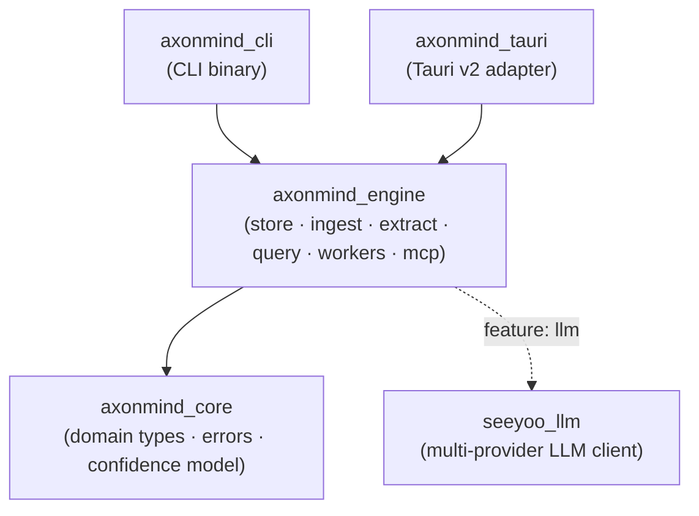
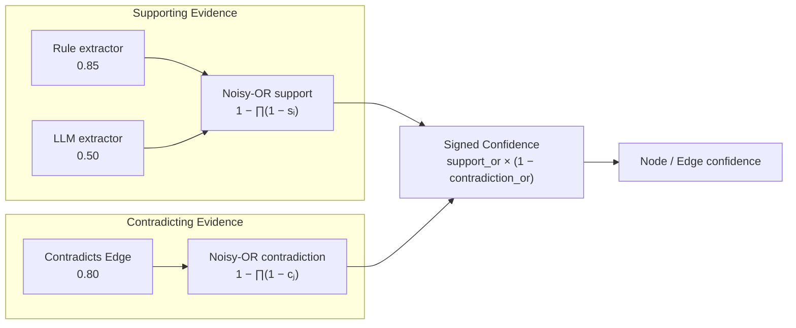
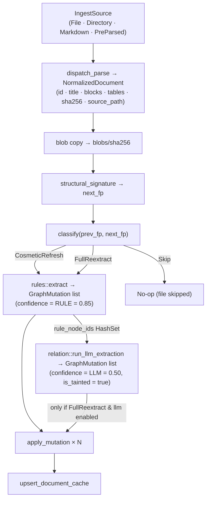
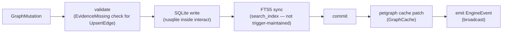
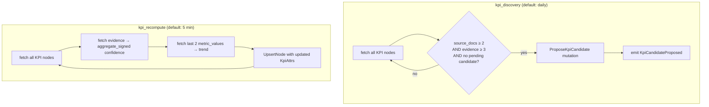
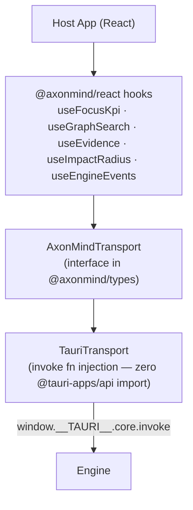
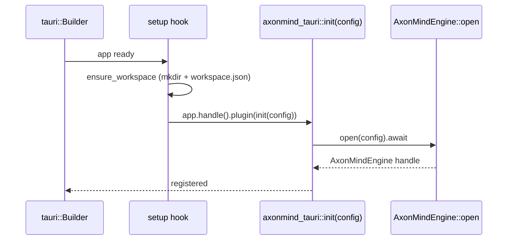
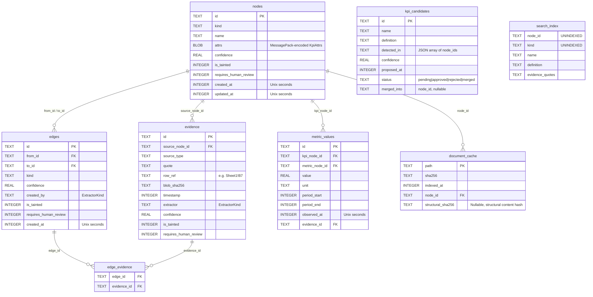

# AxonMind Architecture

`axonmind-open` is a standalone, embeddable Rust engine and TypeScript SDK for a local-first business knowledge graph. It is not a desktop product, not SaaS, and carries no network dependency beyond optional LLM calls.

---

## Crate Dependency DAG



`axonmind_engine` must never depend on any host-specific crate (Tauri, Axum, etc.) — that is its portability guarantee. `seeyoo_llm` is a standalone utility crate.

---

## Repository Tree

```text
axonmind-open/
├── Cargo.toml                  # workspace root (edition 2024)
├── migrations/
│   ├── 001_initial.sql         # embedded at compile time (v1)
│   └── 002_structural_sha256.sql # structural change tracking (v2)
├── crates/
│   ├── seeyoo_llm/             # multi-provider LLM client
│   │   └── src/
│   │       ├── lib.rs          # client entrypoint
│   │       ├── api_mod.rs      # ApiProvider trait + ProviderMessage
│   │       ├── types.rs        # ToolDefinition and common types
│   │       ├── factory.rs      # provider factory (Anthropic, Gemini, OpenAI, etc.)
│   │       ├── retry.rs        # backoff and retry helper
│   │       ├── local_detect.rs # local server capability detection
│   │       ├── errors.rs       # provider errors
│   │       ├── anthropic_api.rs
│   │       ├── gemini_api.rs
│   │       ├── openai_api.rs
│   │       ├── ollama_api.rs
│   │       └── codex_api.rs
│   ├── axonmind_core/          # domain types only — no storage deps
│   │   └── src/
│   │       ├── lib.rs          # re-exports all domain types
│   │       ├── confidence.rs   # Confidence newtype, noisy-OR + signed aggregate
│   │       ├── error.rs        # AxonMindError enum (thiserror)
│   │       ├── node.rs         # Node + NodeKind (17 kinds) + NodeId
│   │       ├── edge.rs         # Edge + EdgeKind (17 kinds) + EdgeId
│   │       ├── evidence.rs     # Evidence + ExtractorKind + SourceType
│   │       └── kpi.rs          # KpiAttrs, KpiStatus, KpiTrend, Period, KpiUnit
│   ├── axonmind_engine/        # all business logic
│   │   └── src/
│   │       ├── lib.rs          # AxonMindEngine handle + ingest_sync / query routes
│   │       ├── config.rs       # EngineConfig, WorkerConfig, WorkspaceManifest
│   │       ├── events.rs       # EngineEvent broadcast enum
│   │       ├── store/
│   │       │   ├── mod.rs      # GraphStore, GraphMutation, GraphCache, MetricValue, KpiCandidate
│   │       │   ├── sqlite.rs   # all SQL + FTS5 sync helper
│   │       │   └── migrations.rs
│   │       ├── ingest/
│   │       │   ├── mod.rs      # IngestSource, NormalizedDocument, dispatch_parse, DocumentBlock, NormalizedTable, SourceSpan
│   │       │   ├── markdown.rs # markdown → NormalizedDocument
│   │       │   ├── pdf.rs      # pdf → NormalizedDocument
│   │       │   ├── docx.rs     # Word/Powerpoint (.docx/.pptx) parser
│   │       │   ├── html.rs     # HTML web documents parser
│   │       │   ├── image.rs    # Image OCR parser (Tesseract OCR)
│   │       │   ├── spreadsheet.rs # Excel/CSV (.xlsx/.csv/etc.) parser
│   │       │   ├── txt.rs      # Plain text parser
│   │       │   └── queue.rs    # Ingest task queue
│   │       ├── extract/
│   │       │   ├── mod.rs
│   │       │   ├── rules.rs    # rule-based entity extraction
│   │       │   ├── relation.rs # LLM-assisted relation extraction
│   │       │   ├── llm.rs      # LlmProvider trait
│   │       │   ├── openai.rs   # OpenAiProvider
│   │       │   ├── seeyoo.rs   # SeeyooAdapter using seeyoo_llm
│   │       │   ├── fingerprint.rs # structural fingerprinting & change-classification
│   │       │   └── value_parse.rs # metric cell parser helper
│   │       ├── query/
│   │       │   ├── mod.rs      # all I/O structs + GraphExportV1 + EdgeWithNodes
│   │       │   ├── focus.rs    # focus_kpi
│   │       │   ├── evidence.rs # explain_kpi, get_evidence
│   │       │   ├── impact.rs   # impact_radius, trace_decision, suggest_actions
│   │       │   └── search.rs   # graph_search (FTS5)
│   │       ├── workers/
│   │       │   ├── mod.rs      # start_workers
│   │       │   ├── kpi_discovery.rs
│   │       │   └── kpi_recompute.rs
│   │       └── mcp/            # MCP tool server
│   ├── axonmind_tauri/         # Tauri v2 adapter
│   │   └── src/
│   │       ├── lib.rs          # init() → tauri::plugin::Builder
│   │       ├── commands.rs     # #[tauri::command] shims
│   │       ├── events.rs       # Tauri event forwarding
│   │       └── lifecycle.rs    # EngineState lifecycle management
│   └── axonmind_cli/           # CLI binary
│       └── src/
│           └── main.rs         # clap subcommands
├── packages/
│   ├── types/                  # TypeScript types (ts-rs generated)
│   │   └── src/
│   │       ├── index.ts
│   │       ├── transport.ts    # AxonMindTransport interface
│   │       └── index.test.ts   # type vitest tests
│   └── react/                  # React hooks + TauriTransport
│       └── src/
│           ├── index.ts
│           ├── context.tsx     # AxonMindProvider + useAxonMind
│           ├── context.test.tsx
│           ├── hooks/
│           │   ├── useFocusKpi.ts
│           │   ├── useFocusKpi.test.tsx
│           │   ├── useGraphSearch.ts
│           │   ├── useGraphSearch.test.tsx
│           │   ├── useEvidence.ts
│           │   ├── useImpactRadius.ts
│           │   └── useEngineEvents.ts
│           └── transport/
│               └── tauri.ts    # TauriTransport (invoke fn injection)
├── src/                        # Vite dev harness (App.tsx)
└── docs/
    └── architecture.md
```

---

## Core Domain (`axonmind_core`)

No storage dependencies. Contains only types, errors, and the confidence model.

### Kinds and Enums
*   **NodeKind** (17 variants): `Kpi`, `Metric`, `Objective`, `Initiative`, `Risk`, `Opportunity`, `Decision`, `Insight`, `Document`, `Person`, `Team`, `Customer`, `Product`, `Market`, `Process`, `System`, `Action`.
*   **EdgeKind** (17 variants): `Influences`, `Causes`, `CorrelatesWith`, `DependsOn`, `Blocks`, `Improves`, `Degrades`, `OwnedBy`, `MeasuredBy`, `EvidencedBy`, `MentionedIn`, `DecidedBy`, `AssignedTo`, `Impacts`, `NextAction`, `Contradicts`, `Corroborates`.
*   **ExtractorKind**: `Manual` (1.00), `Connector` (0.95), `Rule` (0.85), `Llm` (0.50), `Calculated` (inherits).
*   **SourceType**: `Document`, `Table`, `Note`, `Meeting`, `Manual`, `System`.

### Structs

| Type | Description |
|---|---|
| `Node` | Graph vertex: `id`, `kind`, `name`, `attrs` (`serde_json::Value`), `confidence`, timestamps, `is_tainted`, `requires_human_review` |
| `Edge` | Graph edge: `id`, `from` (`NodeId`), `to` (`NodeId`), `kind`, `evidence` (`Vec<EvidenceRef>`), `confidence`, timestamps, `created_by`, `is_tainted`, `requires_human_review` |
| `Evidence` | Source quote backing a node or edge: `id`, `source_node_id`, `source_type`, `quote`, `row_ref`, `blob_sha256`, `timestamp`, `extractor`, `confidence`, `is_tainted`, `requires_human_review` |
| `KpiAttrs` | Typed attrs inside `nodes.attrs` for KPI nodes: `value`, `unit` (`KpiUnit`), `period` (`Period`), `status` (`KpiStatus`), `trend` (`KpiTrend`), `target`, `owner_node_id`, `definition`, `source_refs`, `explanation`, `last_recomputed_at` |
| `Confidence` | Newtype `f32 ∈ [0,1]`. Default constants for extractors (e.g., `RULE = 0.85`, `LLM = 0.50`, `MANUAL = 1.0`). |

### Confidence Model

AxonMind supports **contradiction-aware signed aggregation**. While normal evidence aggregates via standard noisy-OR, contradicting evidence (incoming edges of kind `Contradicts`) acts as a dampener.



*   **Noisy-OR:** `aggregate(slice) = 1 − ∏(1 − cᵢ)`
*   **Signed Noisy-OR:** `aggregate_signed(support, contradiction) = support_or × (1 − contradiction_or)`
*   If any contradiction is present, the KPI node is marked `requires_human_review = true`.

---

## Engine (`axonmind_engine`)

### AxonMindEngine handle

```rust
pub struct AxonMindEngine {
    pub(crate) store: Arc<GraphStore>,
    pub(crate) graph_cache: Arc<RwLock<GraphCache>>,
    pub(crate) event_tx: broadcast::Sender<EngineEvent>,
    pub(crate) config: EngineConfig,
    pub(crate) llm_provider: Option<Arc<dyn LlmProvider>>,
}
```

Clone-safe via `Arc` internals. Obtain via `AxonMindEngine::open(config)`.

---

## Ingest Pipeline

The ingest pipeline transforms documents into graph mutations. It includes a **change-classification** step using structural fingerprinting to skip redundant LLM extractions.



### Fingerprinting Decisions
*   **Skip:** If content bytes are identical, the file is skipped.
*   **CosmeticRefresh:** If content differs but the structural signature (headings and table shapes) matches, LLM extraction is skipped. Deterministic rules still re-run to refresh quotes.
*   **FullReextract:** If the structural signature has changed (or no cached entry exists), both rules and LLM extractions run.

---

## Mutation Pipeline

All writes flow through a single path. No code may write to SQLite outside `GraphStore::apply_mutation`.



### GraphMutation variants

| Variant | Key constraint |
|---|---|
| `UpsertNode { node }` | Inserts or replaces; FTS5 sync required |
| `UpsertEvidence { evidence }` | Inserts evidence; recomputes FTS for source node and all edge endpoints linked to it |
| `UpsertEdge { edge, evidence_ids }` | Rejected with `EvidenceMissing` if `evidence_ids` is empty or any ID is absent |
| `DeleteNode { node_id }` | FK cascade removes edges + evidence; FTS5 entry must be deleted manually (virtual table, no FK cascade) |
| `DeleteEdge { edge_id }` | Removes edge row; recomputes FTS for both endpoint nodes |
| `RecordMetricValue { value }` | Appends to `metric_values`; no FTS sync |
| `ProposeKpiCandidate { candidate }` | Inserts into `kpi_candidates` with `status = Pending` |
| `ResolveKpiCandidate { candidate_id, resolution }` | Only valid on `Pending` candidates; `resolution` is `Approve \| Reject \| Merge { into }` |

---

## Extraction Pipelines

### Rule extraction (`extract/rules.rs`)
Scans `NormalizedDocument.blocks` and `tables` for pattern-matched entities. Heading-based matching extracts KPIs. Tables extract metrics (via `value_parse::parse_metric_cell` for numeric cell validation). Paragraphs detect influences or blocks based on linking verbs. Produces `UpsertNode` + `UpsertEvidence` + `MentionedIn` edge mutations at `Confidence::RULE`.

### LLM extraction (`extract/relation.rs`)
Integrates via a pluggable `LlmProvider` trait (defined in `extract/llm.rs`).
*   `OpenAiProvider` speaks standard OpenAI chat format (guarantees JSON outputs).
*   `SeeyooAdapter` bridges the system to `seeyoo_llm`'s native provider structures, enabling Anthropic, Gemini, OpenAI, Ollama, and Codex integrations.

*Key Invariant:* LLM extraction receives the set of node IDs already upserted by rule extraction. For matching IDs, LLM skips `UpsertNode` (avoids downgrading confidence from 0.85 → 0.50) and only creates new evidence.

---

## Query Tools

Eight async methods on `AxonMindEngine` expose read-only and import/export operations:

| Method | Description |
|---|---|
| `focus_kpi(input)` | Returns driver/blocker/risk edges and owner for a KPI node |
| `explain_kpi(input)` | Evidence quotes → LLM-generated analysis (falls back to concatenation) |
| `get_evidence(input)` | Fetches raw evidence records by node or edge ID |
| `impact_radius(input)` | BFS from a node up to configurable traversal depth |
| `trace_decision(input)` | Path trace: decision node → caused_by and next_actions |
| `suggest_actions(input)` | Derives action nodes from graph neighborhood, filtering by status |
| `graph_search(input)` | FTS5 full-text search across nodes + evidence |
| `import_export(input)` | Replays exported JSON rows as mutations in dependency order |

---

## Background Workers

Workers hold `Arc` clones of store, cache, and event sender, avoiding circular engine ownership.



### Discovery Worker
Proposes `KpiCandidate`s when a KPI is detected in $\ge 2$ documents and backed by $\ge 3$ evidence quotes, assuming no active candidate with the same name already exists.

### Recompute Worker
Computes KPI confidence using `Confidence::aggregate_signed` over supporting vs. contradicting evidence. Computes trend (`Up` / `Down` / `Flat` / `Unknown`) from the two most recent metric values. Updates `requires_human_review = true` if contradictions are detected.

---

## TypeScript SDK



`TauriTransport` constructor injects the host's `invoke` and `listen` functions, enabling the SDK package to remain bundling-agnostic with zero direct Tauri dependencies.

---

## Tauri Host App (`src-tauri/`)



`axonmind_tauri::lifecycle::EngineState` holds the engine instance within Tauri's app state. Event broadcasting is mapped to Tauri's global event emitter (`axonmind://event`).

---

## SQLite Schema (ER diagram)



*   `search_index` is an FTS5 virtual table. It is **not trigger-maintained** — every write path that touches `nodes` or `evidence` manually syncs it (see `store/sqlite.rs`).
*   WAL mode is set on connection initialization. SQLite connections run inside `conn.interact()` closures using `deadpool-sqlite`.

---

## ID Strategy

| Object | Format |
|---|---|
| Canonical business nodes | Deterministic slug: `"kpi.revenue_growth"`, `"team.engineering"` |
| Document nodes | `"doc." + &sha256[..8]` |
| Evidence, candidates, metric values, edges | `uuid::Uuid::new_v4().to_string()` |

All ID types are `pub struct FooId(pub String)` newtypes.

---

## Key Invariants

1.  **Every edge needs $\ge 1$ evidence.** `UpsertEdge` with empty `evidence_ids` is rejected with `AxonMindError::EvidenceMissing`.
2.  **All writes through `GraphMutation`.** No direct SQLite writes outside `GraphStore::apply_mutation`.
3.  **FTS5 is manually synced.** FTS virtual tables lack foreign key cascades — node deletions/evidence additions must manually delete/sync the FTS entries.
4.  **Blob retention.** Ingested files are copied to `blobs/<sha256>` before parsing.
5.  **LLM confidence never downgrades rule confidence.** Rule-extracted node IDs are tracked in a `HashSet` and skipped during LLM `UpsertNode`.
6.  **Contradictions require review.** KPI nodes with an incoming `Contradicts` edge have their confidence dampened via signed noisy-OR and are marked `requires_human_review = true`.

---

## Testing

| Suite | Count | Scope |
|---|---|---|
| `axonmind_core` unit | 20 | Confidence model, type exports |
| `seeyoo_llm` unit | 13 | Multi-provider parsers, tool definitions, retries, capabilities |
| `axonmind_engine` unit | 56 | Graph mutations, cache patching, FTS5 sync, fingerprint classification |
| `axonmind_engine` integration | 10 | Ingest → query end-to-end, skipping unchanged files |
| `axonmind_engine` query | 24 | Query functions, traversal depth limits, error bounds |
| TypeScript Types | 1 | TypeScript bindings compile verification |
| React SDK Hooks | 4 | Context guards, state update hooks, hook cleanup |

CI runs cargo tests and bun frontend tests on every PR.

---

## Build Reference

```bash
# check + test
cargo check --workspace
cargo test --workspace                             # runs all Rust tests

# with LLM feature
cargo test --workspace --features llm

# CLI demo runs
cargo run -p axonmind_cli -- init --workspace ./demo
cargo run -p axonmind_cli -- index ./fixtures --workspace ./demo
cargo run -p axonmind_cli -- query --workspace ./demo --json focus-kpi kpi.revenue_growth

# Tauri host app
bun run tauri dev
bun run tauri build

# TypeScript workspace
bun install
bun run typecheck
bun run test                                       # runs vitest suites
```

---

## Implementation Status

| Phase | Status | Deliverable |
|---|---|---|
| 0 — Scaffold | ✅ Done | Workspace, crate skeleton, migrations, CI |
| 1 — Core engine | ✅ Done | GraphStore, ingest, rule extraction, 8 query tools, CLI |
| 2 — Tauri host | ✅ Done | `axonmind_tauri` adapter + React SDK integrated and verified |
| 3 — LLM extraction | ✅ Done | `seeyoo_llm` integration, relation extraction, `explain_kpi` rationale |
| 4 — Workers | ✅ Done | `kpi_discovery`, `kpi_recompute` background workers |
| 5 — Release | ⏳ Waiting | v0.1.0 on crates.io + npm |
