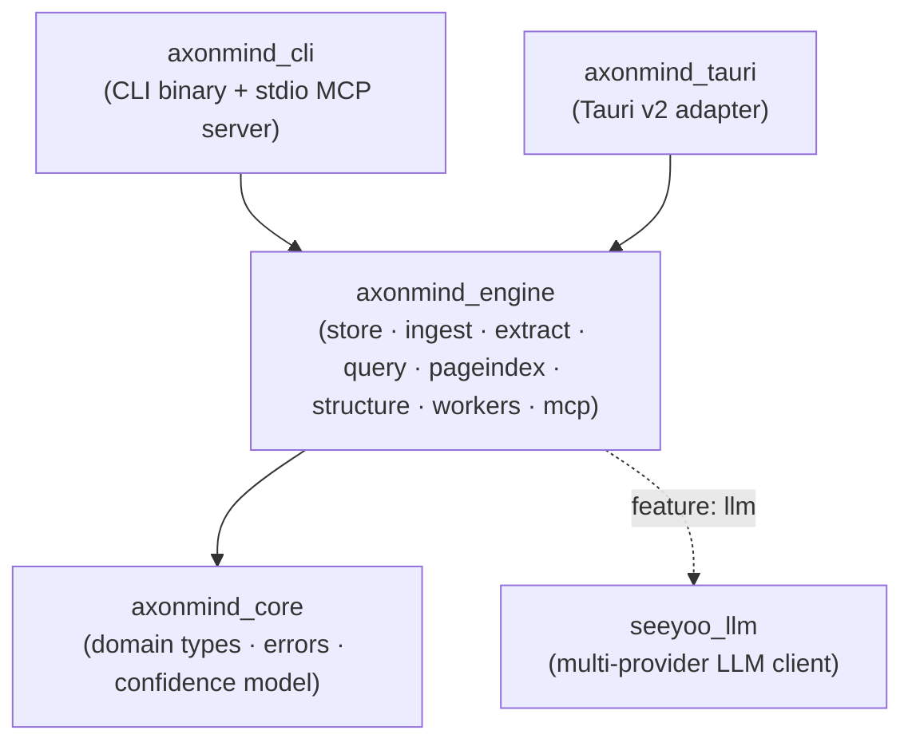
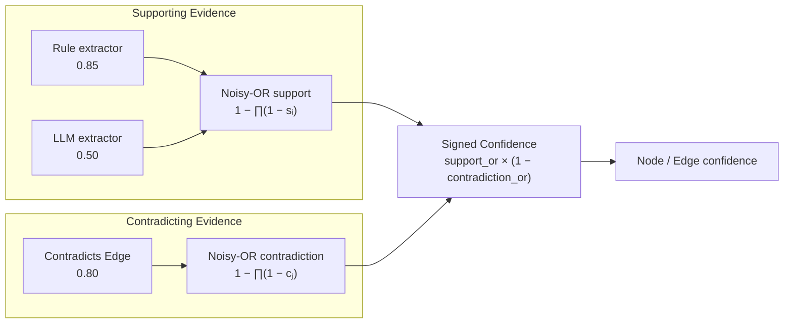
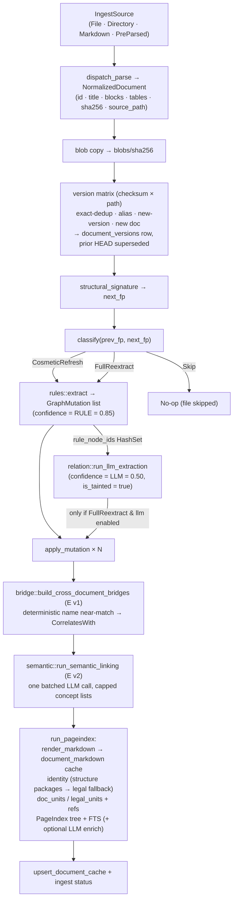
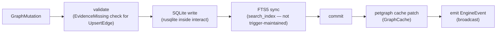
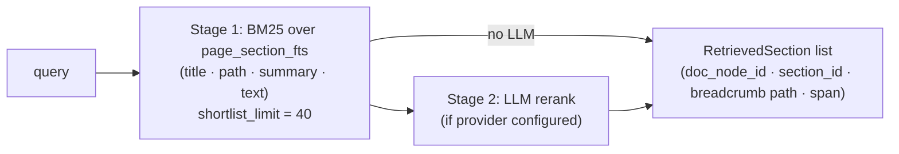
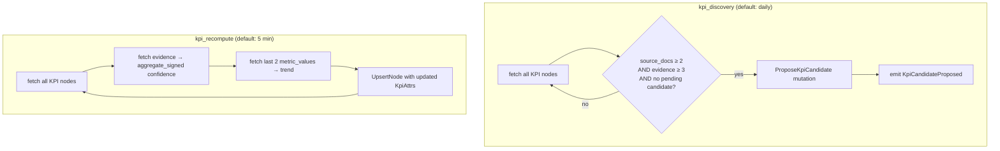
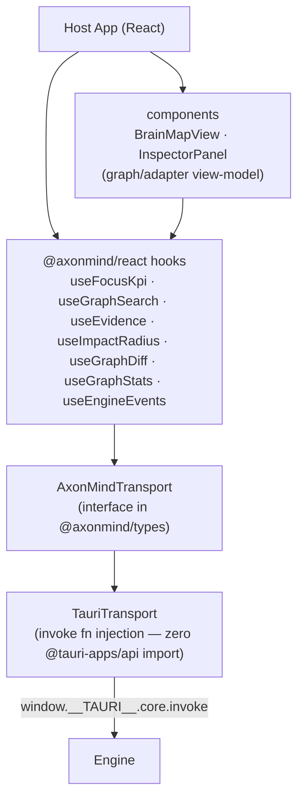
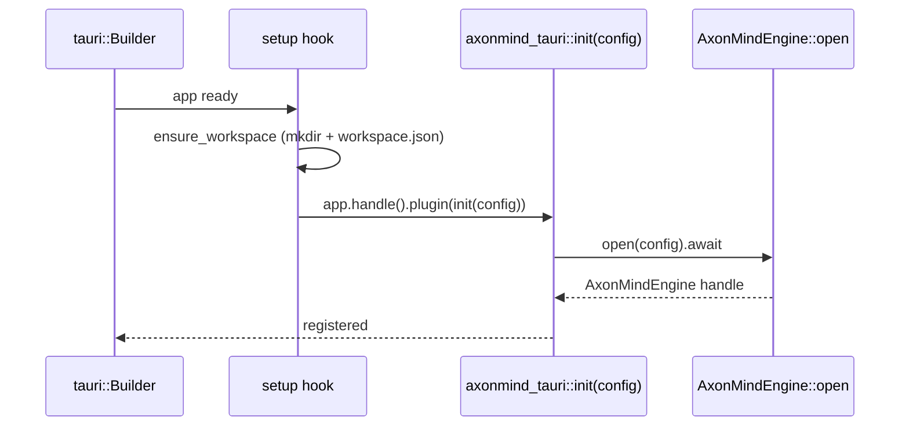
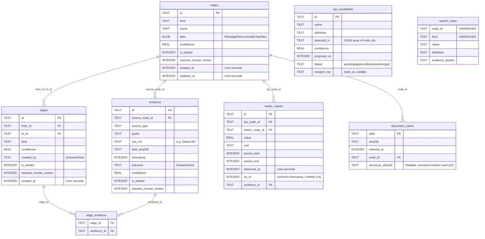

# AxonMind Architecture

`axonmind-open` is a standalone, embeddable Rust engine and TypeScript SDK for a local-first business knowledge graph. It is not a desktop product, not SaaS, and carries no network dependency beyond optional LLM calls.

---

## Crate Dependency DAG


```mermaid
graph TD
    CLI["axonmind_cli<br/>(CLI binary + stdio MCP server)"]
    Tauri["axonmind_tauri<br/>(Tauri v2 adapter)"]
    Engine["axonmind_engine<br/>(store · ingest · extract · query · pageindex · structure · workers · mcp)"]
    Core["axonmind_core<br/>(domain types · errors · confidence model)"]
    LLM["seeyoo_llm<br/>(multi-provider LLM client)"]

    CLI --> Engine
    Tauri --> Engine
    Engine --> Core
    Engine -.->|feature: llm| LLM
```

`axonmind_engine` must never depend on any host-specific crate (Tauri, Axum, etc.) — that is its portability guarantee. `seeyoo_llm` is a standalone utility crate.

---

## Repository Tree

```text
axonmind-open/
├── Cargo.toml                  # workspace root (edition 2024)
├── migrations/                 # embedded at compile time, applied by schema_version
│   ├── 001_initial.sql         # nodes, edges, evidence, metric_values, kpi_candidates, FTS5
│   ├── 002_structural_sha256.sql   # structural change tracking on document_cache
│   ├── 003_generations.sql         # generation snapshots + per-path source versioning
│   ├── 004_metric_values_as_of.sql # business reporting timestamp (as_of) on metric_values
│   ├── 005_llm_review_flag_backfill.sql # clear blanket review flags on legacy LLM nodes
│   ├── 006_page_index.sql          # PageIndex: page_tree, page_sections, page_section_fts
│   ├── 007_document_versions.sql   # per-logical-document version lineage log
│   ├── 008_ingest_status_and_trash.sql # ingest job status + document trash/restore
│   ├── 009_document_markdown.sql   # cached render_markdown output per blob sha256
│   ├── 010_document_identity_and_locators.sql # document identity, aliases, legal units/refs
│   └── 011_structure_packages.sql  # generic structure packages: profiles, rules, doc_units
├── crates/
│   ├── seeyoo_llm/             # multi-provider LLM client
│   │   └── src/
│   │       ├── lib.rs          # client entrypoint
│   │       ├── api_mod.rs      # ApiProvider trait + ProviderMessage
│   │       ├── types.rs        # ToolDefinition and common types
│   │       ├── factory.rs      # provider factory (Anthropic, Gemini, OpenAI, etc.)
│   │       ├── retry.rs        # backoff and retry helper
│   │       ├── local_detect.rs # local server capability detection
│   │       ├── errors.rs       # provider errors
│   │       ├── anthropic_api.rs
│   │       ├── gemini_api.rs
│   │       ├── openai_api.rs
│   │       ├── ollama_api.rs
│   │       └── codex_api.rs
│   ├── axonmind_core/          # domain types only — no storage deps
│   │   └── src/
│   │       ├── lib.rs          # re-exports all domain types
│   │       ├── confidence.rs   # Confidence newtype, noisy-OR + signed aggregate
│   │       ├── error.rs        # AxonMindError enum (thiserror)
│   │       ├── node.rs         # Node + NodeKind (18 kinds) + NodeId
│   │       ├── edge.rs         # Edge + EdgeKind (20 kinds) + EdgeId
│   │       ├── evidence.rs     # Evidence + ExtractorKind + SourceType
│   │       └── kpi.rs          # KpiAttrs, KpiStatus, KpiTrend, Period, KpiUnit
│   ├── axonmind_engine/        # all business logic
│   │   └── src/
│   │       ├── lib.rs          # AxonMindEngine handle: ingest, versioning, query routes
│   │       ├── config.rs       # EngineConfig (incl. pageindex_* knobs), WorkerConfig, WorkspaceManifest
│   │       ├── events.rs       # EngineEvent broadcast enum (graph + ingest lifecycle)
│   │       ├── util.rs         # slugify + shared helpers
│   │       ├── brain_map.rs    # brain-map summary/lens config + scoped summary cache
│   │       ├── legal.rs        # transitional: hardcoded legal identity catalog + parsers
│   │       ├── store/
│   │       │   ├── mod.rs      # GraphStore, GraphMutation, records (DocumentVersion, IngestStatusRow, TrashRow, DocumentIdentityRecord, LegalUnitRecord, …)
│   │       │   ├── sqlite.rs   # all SQL + FTS5 sync helper
│   │       │   ├── graph_cache.rs # petgraph in-memory cache
│   │       │   ├── generations.rs # generation snapshots + source_version log
│   │       │   └── migrations.rs
│   │       ├── ingest/
│   │       │   ├── mod.rs      # IngestSource, NormalizedDocument, dispatch_parse, render_markdown
│   │       │   ├── markdown.rs # markdown → NormalizedDocument
│   │       │   ├── pdf.rs      # pdf → NormalizedDocument
│   │       │   ├── docx.rs     # Word/PowerPoint (.docx/.pptx) parser
│   │       │   ├── html.rs     # HTML web documents parser
│   │       │   ├── image.rs    # Image OCR parser (Tesseract OCR)
│   │       │   ├── spreadsheet.rs # Excel/CSV (.xlsx/.csv/etc.) parser
│   │       │   ├── txt.rs      # Plain text parser
│   │       │   └── queue.rs    # Ingest task queue (job control + cancellation)
│   │       ├── extract/
│   │       │   ├── mod.rs
│   │       │   ├── rules.rs    # rule-based entity extraction
│   │       │   ├── relation.rs # LLM-assisted relation extraction
│   │       │   ├── normalize.rs # canonicalize LLM kind strings → engine enums
│   │       │   ├── bridge.rs   # E v1: deterministic cross-document name bridging
│   │       │   ├── semantic.rs # E v2: LLM cross-document semantic linking
│   │       │   ├── summarize.rs # brain-map categorization (≤10 categories)
│   │       │   ├── prompts/    # PromptLibrary — tunable system-prompt fragments
│   │       │   ├── llm.rs      # LlmProvider trait
│   │       │   ├── openai.rs   # OpenAiProvider
│   │       │   ├── seeyoo.rs   # SeeyooAdapter using seeyoo_llm
│   │       │   ├── fingerprint.rs # structural fingerprinting & change-classification
│   │       │   ├── insurance_toy.rs # toy domain extractor (demo/fixture support)
│   │       │   └── value_parse.rs # metric cell parser helper
│   │       ├── pageindex/      # vectorless retrieval (BM25 → LLM rerank)
│   │       │   ├── mod.rs      # index_document + PageIndexSearchCfg
│   │       │   ├── tree.rs     # PageSection tree build/flatten, PersistTree, SectionRow
│   │       │   ├── store.rs    # PageIndexStore (page_tree/page_sections/page_section_fts)
│   │       │   ├── search.rs   # reasoning_search funnel
│   │       │   └── enrich.rs   # optional bottom-up LLM section summaries
│   │       ├── structure/      # generic structure packages (data-driven parsing)
│   │       │   ├── mod.rs
│   │       │   ├── model.rs    # PackageManifest, ProfileDefinition, IdentityRule, CorpusBinding
│   │       │   ├── identity.rs # derive_identity from installed identity rules
│   │       │   ├── parse.rs    # parse_document → ParsedDocumentIndex (doc_units)
│   │       │   └── registry.rs # install/list/remove packages, retro-apply
│   │       ├── query/
│   │       │   ├── mod.rs      # all I/O structs + GraphExportV1 + EdgeWithNodes
│   │       │   ├── focus.rs    # focus_kpi
│   │       │   ├── evidence.rs # explain_kpi, get_evidence
│   │       │   ├── impact.rs   # impact_radius, trace_decision, suggest_actions
│   │       │   ├── search.rs   # graph_search (FTS5)
│   │       │   ├── conflicts.rs # find_conflicts (positive vs negative edge polarity)
│   │       │   ├── diff.rs     # graph_diff between two GraphExportV1 snapshots
│   │       │   ├── reasoning.rs # reasoning_search I/O types
│   │       │   └── legal.rs    # document_resolve/search/read_section/quote I/O types
│   │       ├── workers/
│   │       │   ├── mod.rs      # start_workers
│   │       │   ├── kpi_discovery.rs
│   │       │   └── kpi_recompute.rs
│   │       └── mcp/            # MCP tool definitions + dispatch (15 tools)
│   │           ├── mod.rs
│   │           ├── schemas.rs  # tool_defs() — names, descriptions, JSON schemas
│   │           └── tools.rs    # dispatch into engine methods
│   ├── axonmind_tauri/         # Tauri v2 adapter
│   │   └── src/
│   │       ├── lib.rs          # init() → tauri::plugin::Builder
│   │       ├── commands.rs     # #[tauri::command] shims
│   │       ├── events.rs       # Tauri event forwarding
│   │       ├── cli_auth.rs     # CLI-based provider auth helpers
│   │       └── lifecycle.rs    # EngineState lifecycle management
│   └── axonmind_cli/           # CLI binary
│       └── src/
│           ├── main.rs         # clap subcommands (init, index, query, search, export/import,
│           │                   #  rebuild-search-index, rebuild-page-index, documents,
│           │                   #  regenerate, remove, stats, diff, mcp)
│           └── mcp_server.rs   # stdio JSON-RPC MCP server wrapping engine mcp tools
├── packages/
│   ├── types/                  # TypeScript types (ts-rs generated)
│   │   └── src/
│   │       ├── index.ts
│   │       ├── transport.ts    # AxonMindTransport interface
│   │       └── index.test.ts   # type vitest tests
│   └── react/                  # React hooks + components + TauriTransport
│       └── src/
│           ├── index.ts
│           ├── context.tsx     # AxonMindProvider + useAxonMind
│           ├── components/
│           │   ├── BrainMapView.tsx    # radial brain-map summary view
│           │   └── InspectorPanel.tsx  # node/edge/evidence inspector
│           ├── graph/
│           │   └── adapter.ts  # graph data → view-model adapter
│           ├── hooks/
│           │   ├── useFocusKpi.ts
│           │   ├── useGraphSearch.ts
│           │   ├── useEvidence.ts
│           │   ├── useImpactRadius.ts
│           │   ├── useGraphDiff.ts
│           │   ├── useGraphStats.ts
│           │   └── useEngineEvents.ts
│           └── transport/
│               └── tauri.ts    # TauriTransport (invoke fn injection)
├── src/                        # Vite dev harness (App.tsx, AppShell.tsx)
└── docs/
    └── architecture.md
```

---

## Core Domain (`axonmind_core`)

No storage dependencies. Contains only types, errors, and the confidence model.

### Kinds and Enums
*   **NodeKind** (18 variants): `Kpi`, `Metric`, `Objective`, `Initiative`, `Risk`, `Opportunity`, `Decision`, `Insight`, `Document`, `Person`, `Team`, `Customer`, `Function`, `Product`, `Market`, `Process`, `System`, `Action`.
*   **EdgeKind** (20 variants): `Influences`, `Causes`, `CorrelatesWith`, `DependsOn`, `DerivedFrom`, `Blocks`, `Improves`, `Degrades`, `OwnedBy`, `MeasuredBy`, `EvidencedBy`, `MentionedIn`, `DecidedBy`, `AssignedTo`, `InFunction`, `ForProduct`, `Impacts`, `NextAction`, `Contradicts`, `Corroborates`.
*   **ExtractorKind**: `Manual` (1.00), `Connector` (0.95), `Rule` (0.85), `Llm` (0.50), `Calculated` (inherits).
*   **SourceType**: `Document`, `Table`, `Note`, `Meeting`, `Manual`, `System`.

### Structs

| Type | Description |
|---|---|
| `Node` | Graph vertex: `id`, `kind`, `name`, `attrs` (`serde_json::Value`), `confidence`, timestamps, `is_tainted`, `requires_human_review` |
| `Edge` | Graph edge: `id`, `from` (`NodeId`), `to` (`NodeId`), `kind`, `evidence` (`Vec<EvidenceRef>`), `confidence`, timestamps, `created_by`, `is_tainted`, `requires_human_review` |
| `Evidence` | Source quote backing a node or edge: `id`, `source_node_id`, `source_type`, `quote`, `row_ref`, `blob_sha256`, `timestamp`, `extractor`, `confidence`, `is_tainted`, `requires_human_review` |
| `KpiAttrs` | Typed attrs inside `nodes.attrs` for KPI nodes: `value`, `unit` (`KpiUnit`), `period` (`Period`), `status` (`KpiStatus`), `trend` (`KpiTrend`), `target`, `owner_node_id`, `definition`, `source_refs`, `explanation`, `last_recomputed_at` |
| `Confidence` | Newtype `f32 ∈ [0,1]`. Default constants for extractors (e.g., `RULE = 0.85`, `LLM = 0.50`, `MANUAL = 1.0`). |

### Confidence Model

AxonMind supports **contradiction-aware signed aggregation**. While normal evidence aggregates via standard noisy-OR, contradicting evidence (incoming edges of kind `Contradicts`) acts as a dampener.


```mermaid
graph LR
    subgraph Support ["Supporting Evidence"]
        R["Rule extractor<br/>0.85"] --> SN["Noisy-OR support<br/>1 − ∏(1 − sᵢ)"]
        L["LLM extractor<br/>0.50"] --> SN
    end
    subgraph Contradiction ["Contradicting Evidence"]
        C1["Contradicts Edge<br/>0.80"] --> CN["Noisy-OR contradiction<br/>1 − ∏(1 − cⱼ)"]
    end
    SN --> Final["Signed Confidence<br/>support_or × (1 − contradiction_or)"]
    CN --> Final
    Final --> Node["Node / Edge confidence"]
```

*   **Noisy-OR:** `aggregate(slice) = 1 − ∏(1 − cᵢ)`
*   **Signed Noisy-OR:** `aggregate_signed(support, contradiction) = support_or × (1 − contradiction_or)`
*   If any contradiction is present, the KPI node is marked `requires_human_review = true`.

---

## Engine (`axonmind_engine`)

### AxonMindEngine handle

```rust
pub struct AxonMindEngine {
    pub(crate) store: Arc<GraphStore>,
    pub(crate) graph_cache: Arc<RwLock<GraphCache>>,
    pub(crate) event_tx: broadcast::Sender<EngineEvent>,
    pub(crate) config: EngineConfig,
    pub(crate) llm_provider: Arc<RwLock<Option<Arc<dyn LlmProvider>>>>,
    ingest_jobs: Arc<Mutex<HashMap<String, IngestJobControl>>>,
    ingest_permit: Arc<Semaphore>,
}
```

Clone-safe via `Arc` internals. Obtain via `AxonMindEngine::open(config)`. The LLM provider is hot-swappable at runtime (`update_llm_provider`). Ingest runs as cancellable background jobs (`start_ingest` / `cancel_ingest` / `list_ingest_status`) gated by a semaphore; `ingest_sync` remains for CLI/tests.

`EngineConfig` gained PageIndex knobs: `pageindex_enabled` (default true), `pageindex_enrich` (default false), `pageindex_enrich_concurrency` (4), `pageindex_shortlist_limit` (40).

---

## Ingest Pipeline

The ingest pipeline transforms documents into graph mutations plus derived indexes. It layers **document versioning**, **change-classification** (structural fingerprinting), **cross-document linking**, and **PageIndex construction** on top of parsing + extraction.


```mermaid
flowchart TD
    S["IngestSource<br/>(File · Directory · Markdown · PreParsed)"]
    D["dispatch_parse → NormalizedDocument<br/>(id · title · blocks · tables · sha256 · source_path)"]
    B["blob copy → blobs/sha256"]
    V["version matrix (checksum × path)<br/>exact-dedup · alias · new-version · new doc<br/>→ document_versions row, prior HEAD superseded"]
    FP["structural_signature → next_fp"]
    CL["classify(prev_fp, next_fp)"]
    R["rules::extract → GraphMutation list<br/>(confidence = RULE = 0.85)"]
    L["relation::run_llm_extraction<br/>(confidence = LLM = 0.50, is_tainted = true)"]
    BR["bridge::build_cross_document_bridges (E v1)<br/>deterministic name near-match → CorrelatesWith"]
    SEM["semantic::run_semantic_linking (E v2)<br/>one batched LLM call, capped concept lists"]
    M["apply_mutation × N"]
    PI["run_pageindex:<br/>render_markdown → document_markdown cache<br/>identity (structure packages → legal fallback)<br/>doc_units / legal_units + refs<br/>PageIndex tree + FTS (+ optional LLM enrich)"]
    C["upsert_document_cache + ingest status"]

    S --> D --> B --> V --> FP --> CL
    CL -->|Skip| Skip["No-op (file skipped)"]
    CL -->|CosmeticRefresh| R
    CL -->|FullReextract| R
    R -->|"rule_node_ids HashSet"| L
    R --> M
    L -->|only if FullReextract & llm enabled| M
    M --> BR --> SEM --> PI --> C
```

### Fingerprinting Decisions
*   **Skip:** If content bytes are identical, the file is skipped.
*   **CosmeticRefresh:** If content differs but the structural signature (headings and table shapes) matches, LLM extraction is skipped. Deterministic rules still re-run to refresh quotes.
*   **FullReextract:** If the structural signature has changed (or no cached entry exists), both rules and LLM extractions run.

### Document versioning & lifecycle

*   Every logical document gets a stable `ldoc.<uuidv4>` id at first ingest. Each re-ingest with changed content appends a row to `document_versions` (1-based `version_no`, `previous_node_id` chain); the prior HEAD is marked `superseded = 1` and its PageIndex entries are dropped. HEAD is derived (max `version_no`), never stored.
*   `backfill_document_versions` runs at `open()` and seeds v1 rows for pre-migration documents, logging backfilled/skipped counts. Past lineage is never fabricated.
*   Ingest jobs write per-file rows to `document_ingest_status` (`Processing / Stalled / Failed / Interrupted` × phase `Reading / Copying / …`) so interrupted runs are visible after restart.
*   Documents can be soft-deleted to a **trash** (`trash_document` / `restore_document` / `delete_document_permanently` / `empty_trash`); trash rows retain the blob shas needed for restore.
*   `list_documents` returns `DocumentSummary` (concept/evidence counts, `logical_doc_id`, `version_no`, `version_count`); `list_document_versions` returns the lineage newest→oldest.

### Cross-document linking

*   **Bridge (E v1, deterministic):** after extraction, new concept names are compared against existing concept names; high-precision near-matches produce `CorrelatesWith` edges at confidence 0.5 with backing evidence, flagged for review.
*   **Semantic linking (E v2, LLM):** one batched call per ingest asks the LLM for meaningful relations between the new document's concepts and existing ones (both lists capped at 40). Raw kind strings pass through `normalize.rs` — canonical variants always parse, ambiguous/direction-inverting strings are dropped rather than guessed.

---

## Mutation Pipeline

All writes flow through a single path. No code may write to SQLite outside `GraphStore::apply_mutation`.


```mermaid
flowchart LR
    MUT["GraphMutation"] --> VAL["validate<br/>(EvidenceMissing check for UpsertEdge)"]
    VAL --> SQL["SQLite write<br/>(rusqlite inside interact)"]
    SQL --> FTS["FTS5 sync<br/>(search_index — not trigger-maintained)"]
    FTS --> CMT["commit"]
    CMT --> PET["petgraph cache patch<br/>(GraphCache)"]
    PET --> EVT["emit EngineEvent<br/>(broadcast)"]
```

### GraphMutation variants

| Variant | Key constraint |
|---|---|
| `UpsertNode { node }` | Inserts or replaces; FTS5 sync required |
| `UpsertEvidence { evidence }` | Inserts evidence; recomputes FTS for source node and all edge endpoints linked to it |
| `UpsertEdge { edge, evidence_ids }` | Rejected with `EvidenceMissing` if `evidence_ids` is empty or any ID is absent |
| `DeleteNode { node_id }` | FK cascade removes edges + evidence; FTS5 entry must be deleted manually (virtual table, no FK cascade) |
| `DeleteEdge { edge_id }` | Removes edge row; recomputes FTS for both endpoint nodes |
| `RecordMetricValue { value }` | Appends to `metric_values`; no FTS sync. `as_of` (business timestamp) optional, resolver falls back to `observed_at` |
| `ProposeKpiCandidate { candidate }` | Inserts into `kpi_candidates` with `status = Pending` |
| `ResolveKpiCandidate { candidate_id, resolution }` | Only valid on `Pending` candidates; `resolution` is `Approve \| Reject \| Merge { into }` |

Derived stores (PageIndex tables, `document_markdown`, identity/locator tables, `document_versions`, ingest status, trash, generations) are **not** graph state and are written through their own store methods — they never bypass `apply_mutation` for graph tables.

---

## Extraction Pipelines

### Rule extraction (`extract/rules.rs`)
Scans `NormalizedDocument.blocks` and `tables` for pattern-matched entities. Heading-based matching extracts KPIs. Tables extract metrics (via `value_parse::parse_metric_cell` for numeric cell validation). Paragraphs detect influences or blocks based on linking verbs. Produces `UpsertNode` + `UpsertEvidence` + `MentionedIn` edge mutations at `Confidence::RULE`.

### LLM extraction (`extract/relation.rs`)
Integrates via a pluggable `LlmProvider` trait (defined in `extract/llm.rs`).
*   `OpenAiProvider` speaks standard OpenAI chat format (guarantees JSON outputs).
*   `SeeyooAdapter` bridges the system to `seeyoo_llm`'s native provider structures, enabling Anthropic, Gemini, OpenAI, Ollama, and Codex integrations.
*   `normalize.rs` canonicalizes near-miss LLM kind strings (`"drives"` → `Influences`); strings whose meaning would invert edge direction (`"owns"` vs `OwnedBy`) are dropped, never flipped.
*   Prompts are assembled from `extract/prompts` (`PromptLibrary`) so system prompts are tunable in one place.

*Key Invariant:* LLM extraction receives the set of node IDs already upserted by rule extraction. For matching IDs, LLM skips `UpsertNode` (avoids downgrading confidence from 0.85 → 0.50) and only creates new evidence.

### Brain-map summarization (`extract/summarize.rs` + `brain_map.rs`)
Organizes the existing graph into ≤10 labeled categories for the first-glance radial view. LLM-suggested when a provider is configured; deterministic group-by-kind fallback otherwise (the view always renders). It only groups and labels existing nodes — it never invents facts. `brain_map.rs` holds the summary/lens configuration (persisted per workspace) and a scoped summary cache keyed by graph content hash.

---

## Retrieval: PageIndex (vectorless)

A derived, per-document retrieval index — **separate from the semantic graph tables**. No embeddings; a two-stage BM25 → LLM funnel.


```mermaid
flowchart LR
    Q["query"] --> BM["Stage 1: BM25 over page_section_fts<br/>(title · path · summary · text)<br/>shortlist_limit = 40"]
    BM --> RR["Stage 2: LLM rerank<br/>(if provider configured)"]
    BM -->|no LLM| OUT
    RR --> OUT["RetrievedSection list<br/>(doc_node_id · section_id · breadcrumb path · span)"]
```

*   At ingest, `pageindex::index_document` builds a section tree from the normalized document (skipped when the stored sha256 matches — no-op on unchanged re-ingest) and persists it via `PageIndexStore` (`page_tree`, `page_sections`, `page_section_fts`; FTS manually synced).
*   Optional enrichment (`pageindex_enrich`) runs bottom-up LLM section summaries before persist, feeding FTS vocabulary and Stage-2 reranking.
*   `reasoning_search` exposes the funnel; its output reports `reasoning_applied` so callers know whether results are BM25-only or LLM-reranked.
*   `document_markdown` caches `render_markdown(&NormalizedDocument)` per blob sha256 so section reads and re-indexing never re-parse the source file.

---

## Document Identity & Structure Packages

Ingested documents get an **identity record** (canonical title, language, jurisdiction, domain, instrument type, corpus, aliases, confidence) stored in `document_identity` / `document_aliases` and searchable via `document_identity_fts`. Identity powers `document_resolve` ("GDPR" → `doc.xxxx`).

Two resolution paths, in priority order:

1.  **Structure packages (`structure/`)** — data-driven, installable packages (migration 011). A package bundles identity rules, parser profiles, and corpus bindings; `derive_identity` matches documents against installed rules, and `parse_document` produces generic `doc_units` (+ locators + cross-references) using the matched profile. Packages are managed at runtime: `install_structure_package[_from_dir|_from_files]`, `list_structure_packages`, `remove_structure_package_source`, `retro_apply_structure_packages`.
2.  **Legacy legal catalog (`legal.rs`)** — transitional fallback with a hardcoded EU-privacy catalog (GDPR, EDPB guidelines, …) and three parser profiles (`eu_regulation_en`, `it_statute`, `edpb_guidance_en`) producing `legal_units` / `legal_unit_refs` (article/recital/section/paragraph locators). Scheduled to be fully replaced by structure packages.

`pinned_profile` on `document_identity` is reserved for an explicit user pin that survives re-ingestion — automated classification never writes it.

Locator-aware query tools built on top:

| Method | Description |
|---|---|
| `document_resolve` | Alias/corpus query → ranked `ResolvedDocument` list |
| `document_search` | Full-text search within resolved documents |
| `document_read_section` | Read a unit/section by locator (article, recital, section, paragraph, page) |
| `document_quote` | Exact quote with citation (canonical title + locator path + span) |

---

## Query Tools

Read-only and import/export methods on `AxonMindEngine` (all also exposed over MCP except `import_export`):

| Method | Description |
|---|---|
| `focus_kpi(input)` | Returns driver/blocker/risk edges and owner for a KPI node |
| `explain_kpi(input)` | Evidence quotes → LLM-generated analysis (falls back to concatenation) |
| `get_evidence(input)` | Fetches raw evidence records by node or edge ID |
| `impact_radius(input)` | BFS from a node up to configurable traversal depth |
| `trace_decision(input)` | Path trace: decision node → caused_by and next_actions |
| `suggest_actions(input)` | Derives action nodes from graph neighborhood, filtering by status |
| `graph_search(input)` | FTS5 full-text search across nodes + evidence |
| `reasoning_search(input)` | PageIndex BM25 → LLM rerank over document sections |
| `document_resolve / document_search / document_read_section / document_quote` | Identity + locator tools (see previous section) |
| `find_conflicts(input)` | Node pairs holding contradictory claims: positive-polarity edges (Improves, Corroborates) vs negative (Degrades, Blocks, Contradicts), each with backing evidence |
| `graph_stats()` | Node/edge/evidence counts and health metrics |
| `graph_diff(before, after)` | Structural diff of two `GraphExportV1` snapshots keyed by logical identity (`kind:slug`, `from->to:kind`), with per-field change lists |
| `import_export(input)` | Replays exported JSON rows as mutations in dependency order |

Management APIs (not MCP tools): document lifecycle (`list_documents`, `list_document_versions`, `get_document_content`, trash/restore, `regenerate_document`, `enrich_document`), **generations** (`create_generation[_from_paths]`, `list_generations`, `export_generation` — named snapshots binding paths to content shas, backed by per-path `source_version` numbering), brain-map config/summary resolution, and structure-package management.

---

## MCP Server

`axonmind_engine::mcp` defines 15 tools (`schemas.rs` → `tool_defs()`, `tools.rs` → dispatch):

`focus_kpi`, `explain_kpi`, `get_evidence`, `impact_radius`, `trace_decision`, `suggest_actions`, `graph_search`, `reasoning_search`, `document_resolve`, `document_search`, `document_read_section`, `document_quote`, `graph_stats`, `graph_diff`, `find_conflicts`.

`axonmind_cli mcp --workspace <dir>` runs a stdio JSON-RPC MCP server (`cli/src/mcp_server.rs`) wrapping those tools, so any MCP client (Claude Desktop, etc.) can query a local workspace.

---

## Background Workers

Workers hold `Arc` clones of store, cache, and event sender, avoiding circular engine ownership.


```mermaid
flowchart TD
    subgraph Discovery ["kpi_discovery (default: daily)"]
        D1["fetch all KPI nodes"]
        D2{"source_docs ≥ 2<br/>AND evidence ≥ 3<br/>AND no pending candidate?"}
        D3["ProposeKpiCandidate mutation"]
        D4["emit KpiCandidateProposed"]
        D1 --> D2 -->|yes| D3 --> D4
        D2 -->|no| D1
    end

    subgraph Recompute ["kpi_recompute (default: 5 min)"]
        R1["fetch all KPI nodes"]
        R2["fetch evidence → aggregate_signed confidence"]
        R3["fetch last 2 metric_values → trend"]
        R4["UpsertNode with updated KpiAttrs"]
        R1 --> R2 --> R3 --> R4 --> R1
    end
```

### Discovery Worker
Proposes `KpiCandidate`s when a KPI is detected in $\ge 2$ documents and backed by $\ge 3$ evidence quotes, assuming no active candidate with the same name already exists.

### Recompute Worker
Computes KPI confidence using `Confidence::aggregate_signed` over supporting vs. contradicting evidence. Computes trend (`Up` / `Down` / `Flat` / `Unknown`) from the two most recent metric values (preferring `as_of` over `observed_at`). Updates `requires_human_review = true` if contradictions are detected.

---

## TypeScript SDK


```mermaid
graph TD
    App["Host App (React)"]
    Trans["AxonMindTransport<br/>(interface in @axonmind/types)"]
    Tauri["TauriTransport<br/>(invoke fn injection — zero @tauri-apps/api import)"]
    Hooks["@axonmind/react hooks<br/>useFocusKpi · useGraphSearch · useEvidence · useImpactRadius · useGraphDiff · useGraphStats · useEngineEvents"]
    Comp["components<br/>BrainMapView · InspectorPanel<br/>(graph/adapter view-model)"]

    App --> Hooks
    App --> Comp
    Comp --> Hooks
    Hooks --> Trans
    Trans --> Tauri
    Tauri -->|"window.__TAURI__.core.invoke"| Engine
```

`TauriTransport` constructor injects the host's `invoke` and `listen` functions, enabling the SDK package to remain bundling-agnostic with zero direct Tauri dependencies.

---

## Tauri Host App (`src-tauri/`)


```mermaid
sequenceDiagram
    participant App as tauri::Builder
    participant Setup as setup hook
    participant Plugin as axonmind_tauri::init(config)
    participant Engine as AxonMindEngine::open

    App->>Setup: app ready
    Setup->>Setup: ensure_workspace (mkdir + workspace.json)
    Setup->>Plugin: app.handle().plugin(init(config))
    Plugin->>Engine: open(config).await
    Engine-->>Plugin: AxonMindEngine handle
    Plugin-->>App: registered
```

`axonmind_tauri::lifecycle::EngineState` holds the engine instance within Tauri's app state. Event broadcasting is mapped to Tauri's global event emitter (`axonmind://event`). `cli_auth.rs` adds helpers for CLI-based LLM provider authentication.

---

## SQLite Schema

### Core graph tables (migration 001, ER diagram)


```mermaid
erDiagram
    nodes {
        TEXT id PK
        TEXT kind
        TEXT name
        BLOB attrs "MessagePack-encoded KpiAttrs"
        REAL confidence
        INTEGER is_tainted
        INTEGER requires_human_review
        INTEGER created_at "Unix seconds"
        INTEGER updated_at "Unix seconds"
    }
    edges {
        TEXT id PK
        TEXT from_id FK
        TEXT to_id FK
        TEXT kind
        REAL confidence
        TEXT created_by "ExtractorKind"
        INTEGER is_tainted
        INTEGER requires_human_review
        INTEGER created_at "Unix seconds"
    }
    evidence {
        TEXT id PK
        TEXT source_node_id FK
        TEXT source_type
        TEXT quote
        TEXT row_ref "e.g. Sheet1!B7"
        TEXT blob_sha256
        INTEGER timestamp
        TEXT extractor "ExtractorKind"
        REAL confidence
        INTEGER is_tainted
        INTEGER requires_human_review
    }
    edge_evidence {
        TEXT edge_id FK
        TEXT evidence_id FK
    }
    metric_values {
        TEXT id PK
        TEXT kpi_node_id FK
        TEXT metric_node_id FK
        REAL value
        TEXT unit
        INTEGER period_start
        INTEGER period_end
        INTEGER observed_at "Unix seconds"
        INTEGER as_of "business timestamp, nullable (v4)"
        TEXT evidence_id FK
    }
    kpi_candidates {
        TEXT id PK
        TEXT name
        TEXT definition
        TEXT detected_in "JSON array of node_ids"
        REAL confidence
        INTEGER proposed_at
        TEXT status "pending|approved|rejected|merged"
        TEXT merged_into "node_id, nullable"
    }
    document_cache {
        TEXT path PK
        TEXT sha256
        INTEGER indexed_at
        TEXT node_id FK
        TEXT structural_sha256 "Nullable, structural content hash (v2)"
    }
    search_index {
        TEXT node_id "UNINDEXED"
        TEXT kind "UNINDEXED"
        TEXT name
        TEXT definition
        TEXT evidence_quotes
    }

    nodes ||--o{ edges : "from_id / to_id"
    nodes ||--o{ evidence : "source_node_id"
    edges ||--o{ edge_evidence : "edge_id"
    evidence ||--o{ edge_evidence : "evidence_id"
    nodes ||--o{ metric_values : "kpi_node_id"
    nodes ||--o{ document_cache : "node_id"
```

### Supporting tables by migration

| Migration | Tables | Purpose |
|---|---|---|
| 003 | `generation`, `generation_source`, `source_version` | Named snapshots (path+sha per generation); content-keyed per-path version numbering |
| 006 | `page_tree`, `page_sections`, `page_section_fts` (FTS5) | PageIndex retrieval; FTS manually synced by `PageIndexStore` |
| 007 | `document_versions` | Per-logical-document version lineage; HEAD derived, `superseded` flag |
| 008 | `document_ingest_status`, `document_trash`, `document_trash_blob` | Ingest job status/phase per file; soft-delete trash with restorable blob refs |
| 009 | `document_markdown` | Cached markdown render per blob sha256 |
| 010 | `document_identity`, `document_aliases`, `legal_units`, `legal_unit_refs`, `document_identity_fts` (FTS5) | Document identity + legacy legal locators |
| 011 | `structure_packages`, `structure_package_sources`, `structure_profiles`, `identity_rules`, `corpus_bindings`, `doc_units`, `doc_unit_locators`, `doc_unit_refs` | Generic structure packages + parsed unit storage; adds `pinned_profile` to `document_identity` |

*   `search_index`, `page_section_fts`, and `document_identity_fts` are FTS5 virtual tables. None are trigger-maintained — every write path syncs them manually.
*   WAL mode is set on connection initialization. SQLite connections run inside `conn.interact()` closures using `deadpool-sqlite`. Migrations are embedded at compile time and gated by `schema_version` (current: 11).

---

## ID Strategy

| Object | Format |
|---|---|
| Canonical business nodes | Deterministic slug: `"kpi.revenue_growth"`, `"team.engineering"` |
| Document nodes (per version) | `"doc." + &sha256[..8]` |
| Logical documents (across versions) | `"ldoc." + uuidv4` |
| Legal/structure units | `"<doc_node_id>:<label_norm>"` (e.g. `doc.ab12cd34:art.33.p1`) |
| PageIndex sections | `"<doc_node_id>#NNNN"` (ordinal) |
| Evidence, candidates, metric values, edges, generations, jobs | `uuid::Uuid::new_v4().to_string()` |

All ID types are `pub struct FooId(pub String)` newtypes.

---

## Key Invariants

1.  **Every edge needs $\ge 1$ evidence.** `UpsertEdge` with empty `evidence_ids` is rejected with `AxonMindError::EvidenceMissing`.
2.  **All graph writes through `GraphMutation`.** No direct SQLite writes to graph tables outside `GraphStore::apply_mutation`. Derived stores (PageIndex, identity, versions, trash, generations) have their own store methods but never touch graph tables.
3.  **FTS5 is manually synced.** All three FTS virtual tables (`search_index`, `page_section_fts`, `document_identity_fts`) lack triggers — every write path syncs them explicitly.
4.  **Blob retention.** Ingested files are copied to `blobs/<sha256>` before parsing. Recomputation and section reads go through blobs / `document_markdown`, never original file paths.
5.  **LLM confidence never downgrades rule confidence.** Rule-extracted node IDs are tracked in a `HashSet` and skipped during LLM `UpsertNode`.
6.  **Contradictions require review.** KPI nodes with an incoming `Contradicts` edge have their confidence dampened via signed noisy-OR and are marked `requires_human_review = true`.
7.  **LLM edge kinds are normalized, never guessed.** Unmappable or direction-inverting kind strings drop the edge rather than fabricate a relation.
8.  **Version lineage is append-only.** `document_versions` rows are never rewritten; HEAD is derived; backfill never fabricates unrecoverable history.
9.  **Automated identity never pins.** `document_identity.pinned_profile` is written only by explicit user action; re-ingestion preserves it.

---

## Testing

Counts as of 2026-07-07 (`cargo test --workspace --no-fail-fast`):

| Suite | Count | Scope |
|---|---|---|
| `axonmind_core` unit | 20 | Confidence model, type exports |
| `seeyoo_llm` unit | 13 | Multi-provider parsers, tool definitions, retries, capabilities |
| `axonmind_engine` unit | 140 | Graph mutations, cache patching, FTS5 sync, fingerprinting, normalize, bridge, brain map, structure parsing |
| `axonmind_engine` integration | 20 | Ingest → query end-to-end, versioning, skip/re-extract |
| `axonmind_engine` query | 24 | Query functions, traversal depth limits, error bounds |
| `axonmind_engine` conflicts / diff | 5 / 10 | Conflict pairing polarity; snapshot diff identity keys |
| `axonmind_engine` pageindex | 11 | Tree build, FTS sync, reasoning search funnel |
| `axonmind_engine` ingest_with_content / structure_packages | 4 / 2 | Single-call parse+index; package install & retro-apply |
| `axonmind_engine` mcp | 8 | Tool defs, schema drift guard, dispatch |
| `axonmind_cli` unit | 10 | stdio MCP server handshake and tool listing |
| `axonmind_tauri` unit | 4 | Command shims, lifecycle |
| TypeScript Types | 1 | TypeScript bindings compile verification |
| React SDK | 5+ | Context guards, hooks, graph adapter |

> ⚠️ Known-stale as of 2026-07-07: 3 tests fail because tool-count/schema expectations lag the MCP surface (now 15 tools) — `mcp.rs: tool_defs_count_and_names` (expects 11), `mcp.rs: schema_drift_guard` (`document_search` fixture missing `query`), and `axonmind_cli mcp_server: initialize_then_tools_list_returns_eight_tools`. These are test-expectation bugs, not engine regressions.

CI runs cargo tests and bun frontend tests on every PR.

> For CI on GitHub: `cargo check --workspace` compiled `src-tauri` (`axonmind-host`), which brings in Tauri v2 → WebKitGTK → GTK3 → glib-2.0. That system library isn't installed on the ubuntu-latest runner. Need to adds `--exclude axonmind-host` to all three cargo commands. `cargo fmt --all` is left unchanged — it only checks formatting and doesn't build, so it doesn't trigger glib's build script.

---

## Build Reference

```bash
# check + test
cargo check --workspace
cargo test --workspace                             # runs all Rust tests

# with LLM feature
cargo test --workspace --features llm

# CLI demo runs
cargo run -p axonmind_cli -- init --workspace ./demo
cargo run -p axonmind_cli -- index ./fixtures --workspace ./demo
cargo run -p axonmind_cli -- query --workspace ./demo --json focus-kpi kpi.revenue_growth
cargo run -p axonmind_cli -- mcp --workspace ./demo   # stdio MCP server

# Tauri host app
bun run tauri dev
bun run tauri build

# TypeScript workspace
bun install
bun run typecheck
bun run test                                       # runs vitest suites
```

---

## Implementation Status

| Phase | Status | Deliverable |
|---|---|---|
| 0 — Scaffold | ✅ Done | Workspace, crate skeleton, migrations, CI |
| 1 — Core engine | ✅ Done | GraphStore, ingest, rule extraction, query tools, CLI |
| 2 — Tauri host | ✅ Done | `axonmind_tauri` adapter + React SDK integrated and verified |
| 3 — LLM extraction | ✅ Done | `seeyoo_llm` integration, relation extraction, normalization, cross-doc bridging (E v1) + semantic linking (E v2), `explain_kpi` rationale |
| 4 — Workers | ✅ Done | `kpi_discovery`, `kpi_recompute` background workers |
| 5 — Release | ⏳ Waiting | v0.1.0 on crates.io + npm |

Post-Phase-4 feature tracks landed since the original plan:

| Track | Status | Notes |
|---|---|---|
| Generations & source versioning (v3–v4) | ✅ | Named snapshots, per-path content versions, `as_of` metric timestamps |
| PageIndex vectorless retrieval (v6) | ✅ | BM25 → LLM funnel, optional enrichment, `reasoning_search` |
| Document versioning & lifecycle (v7–v9) | ✅ | `ldoc` lineage, ingest status, trash/restore, markdown cache |
| Document identity & legal locators (v10) | ✅ | `document_resolve/search/read_section/quote`; `legal.rs` catalog is transitional (hardcoded, to be replaced) |
| Structure packages (v11) | ✅ | Data-driven identity rules + parser profiles + generic `doc_units`; runtime install/retro-apply |
| Conflicts, diff, stats | ✅ | `find_conflicts`, `graph_diff`, `graph_stats` |
| Brain map | ✅ | Summary/lens config, LLM categorization with deterministic fallback, React `BrainMapView` |
| MCP server | ✅ | 15 tools in-engine + `axonmind_cli mcp` stdio server |
